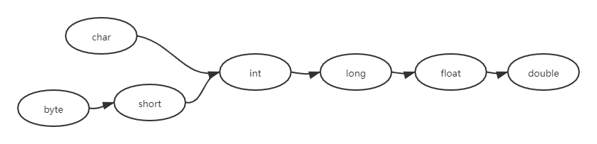

## 基本类型转换

### 一、自动类型转换

- 如果系统支持把某种基本类型的值直接赋值给另一种基本类型的变量，这种方式成为自动类型转换；
- 规则：当把一个表示范围小的数值或变量直接赋值给另一个表示范围大的变量时，系统将可以进行自动类型转换，否则需要强制转换；



```java
int a = 6;
// int 类型可以自动转换为float类型
float f = a;
// 下面将输出6.0
System.out.println(f); // 6.0

// 定义一个byte类型的整数变量
byte b = 9;
// 下面代码出错，byte类型不能自动类型转换成char类型
// char c = b;

// byte类型变量可以自动类型转换为double类型
double d = b;
// 下面将输出9.0
System.out.println(d); // 9.0
```

>当把任何基本类型的值和字符串值进行连接运算时，基本类型的值将自动类型转换为字符串类型。因此，**如果希望吧基本类型的值转换为字符串时，可以把基本类型的值和一个空字符串进行连接。**

```java
// 下面代码是错误的，因为5是一个整数，不能直接赋给一个字符串
// String str1 = 5;

// 一个基本类型的值和字符串进行连接运算时，基本类型的值自动转换为字符串
String str2 = 3.5f + "";
// 输出3.5
System.out.println(str2); // 3.5

// 输出7Hello!
System.out.println(3 + 4 + "Hello! ");

// 输出Hello!34
System.out.println("Hello! " + 3 + 4 +'!');
```

### 二、强制类型转换

- 强制类型转换语法：`（targetType）value`；
- 强制类型转换会造成精度丢失；

```java
int iValue = 233;
// 强制把一个int类型的值转换为byte类型的值
byte bValue = (byte)iValue;

// 将输出-23
System.out.println(bValue);

double dValue = 3.98;
// 强制把一个double类型的值转换为int类型的值
int toI = (int)dValue;
// 将输出3
System.out.println(toI); // 3
```

```java
// 功能：生成一个6为的随机字符串

// 定义一个空字符串
String result = "";

// 进行6次循环
for (int i = 0; i < 6; i++){
    // 生成一个97~122之间的int类型整数
    int intVal = (int)(Math.random() * 26 + 97);
    // 将intValue强制转换为char类型后连接到result后面
    result = result + (char)intVal;
}

// 输出随机字符串
System.out.println(result);
```

>**注意：直接将一个小数赋值给float类型变量会发生错误，因为这个小数是double类型**
>
>错误形势：`float a = 5.6;` 
>
>正确形势：`float a = 5.6f;` 
>
>正确形势：`float a = (float)5.6;` 

- 字符串不能直接转换为基本类型，但是能通过包装类来完成转换

```java
String a = "45";
// 使用Interger的方法将一个字符串转换成int类型
int iValue = Interger.parseInt(a); // 45
```

### 三、表达式类型的自动提升

- 当一个算术表达式中包含多个基本类型的值时，整个算术表达式的数据类型会发生自动提升，规则：
- 所有的`byte`类型、`short`类型、`char`类型将被提升到`int`类型；
- 整个算术表达式的数据类型自动提升到与表达式中最高等级操作数同样的类型

```java
// 定义一个short类型变量
short sValue = 5;
// 表达式中的sValue奖自动提升到int类型，则右边的表达式类型为int
// 将一个int类型值赋给short类型变量将发生错误
// sValue = sValue - 2; // 发生错误  short <- int

byte b = 40;
char c = 'a';
int i = 23;
double d = .314;
// 右边表达式中最高等级操作数为d(double类型)
// 则右边表达式的类型为double类型，故赋值给double类型变量
double result = b + c + i * d;
// 将输出144.222
System.out.println(result);

// 输出字符串Hello!a7
System.out.println("Hello!" + 'a' + 7);
// 输出字符串104Hello!
System.out.println('a' + 7 + "Hello!");
```

## links

- #### [目录](<README.md>)

- #### 上一节: [基本数据类型](<01.5.md>)

- #### 下一节: [直接量](<01.7.md>)