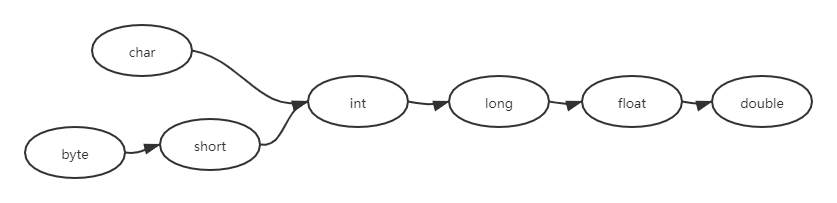

# 数据类型和运算符

## 标识符和关键字

### 分隔符

#### 分号

- 每个`Java`语句必须使用分号作为结尾；
- `Java`程序一行书写多个语句，每个语句之间以分号隔开即可；
- 一个语句也可以跨越多行，只要在最后结束的地方使用分号结束；

```java
int age = 25; String name = "李刚";
String hello = "你好" + 
    "java";
```

- **`Java`语句可以跨越多行书写，但一个字符串、变量名不能跨越多行**；

```java
//字符串不能跨越多行
String a = "ddddddd
    xxxxxxxx";
String na
    me = "李刚";
```

#### 花括号

代码块`{}`，在逻辑上就是一个整体；

类定义部分必须放在一个代码块中，方法体部分也必须放在一个代码块里；


## 标识符规则

- 标识符必须以字母、下划线（_）、美元符号（$）开头，后面可以跟任意数目的字母、数字、下划线和美元符，字母并不局限于26个英文字母，甚至可以包含中文字符、日文字符等；

- `Java`是区分大小写的，因此`abc`和`Abc`是两个不同的标识符；
- `Java9`规定，不允许使用单独的下划线（_）作为标识符，下划线必须与其他字符组合在一起才能作为标识符；
- 标识符不能是`Java`关键字和保留字，但可以包含关键字和保留字；
- 标识符不能包含空格；

## 关键字

- `Java`的所有关键字都是小写的，`TRUE`、`FALSE`、`NULL`都不是`Java`关键字；

| abstract    | continue    | for            | new           | switch           |
| ----------- | ----------- | -------------- | ------------- | ---------------- |
| **assert**  | **default** | **if**         | **package**   | **synchronized** |
| **boolean** | **do**      | **goto**       | **private**   | **this**         |
| **break**   | **double**  | **implements** | **protected** | **throw**        |
| **byte**    | **else**    | **import**     | **public**    | **throws**       |
| **case**    | **enum**    | **instanceof** | **return**    | **transient**    |
| **catch**   | **extends** | **int**        | **short**     | **try**          |
| **char**    | **final**   | **interface**  | **static**    | **void**         |
| **class**   | **finally** | **long**       | **strictfp**  | **volatile**     |
| **const**   | **float**   | **native**     | **super**     | **while**        |

- `Java`还提供了三个特殊的直接量（`literal`），`Java`标识符也不能使用这三个特殊的直接量：
  - `true`
  - `false`
  - `null`


## 数据类型分类

- `Java`是强类型语言（`strongly typed`）：
  - 所有的变量必须先声明后使用；
  - 指定类型的变量只能接受类型与之匹配的值；
- 声明方法：

```java
type varName[ = 初始值];
```

- `Java`语言支持两种类型分类：
  - 基本类型（`Primitive Type`）：
    - 整数类型
    - `byte`
    - `short`
    - `int`
    - `long`
    - `char `实际上相当于无符号整数类型
  - 浮点类型
    - `float`
    - `double`
  - 引用类型（`Reference Type`），引用类型实际上是一个指针：
  - 类
  - 接口
  - 数组
  - `null `
    - null类型没有名称，所以不可能声明一个`null`类型的变量或者转换到`null`类型；
    - 空引用（`null`）是`null`类型变量唯一的值；
    - 空引用（`null`）可以转换为任何引用类型；
    - 空引用（`null`）只能被转换成引用类型，不能转换成基本类型，因此不要把一个`null`值赋给基本数据类型的变量；


## 基本数据类型

### 分类

- 整数类型
  - 1个字节 `byte`
  - 2个字节 `short`
  - 4个字节 `int`
  - 8个字节 `long`
- 字符类型
  - 2个字节 `char`
- 浮点类型
  - 4个字节 `float`
  - 8个字节 `double`
- 布尔类型 `boolean`

### 整型

- `int`是最常用的整数类型，因此直接给出一个整数值默认就是`int`类型
- 如果直接将一个较小的整数值（在`byte`或`short`类型的表示范围内）赋给一个`byte`或`short`变量，系统会自动把这个整数值当成`byte`或者`short`类型来处理；
- 如果使用一个巨大的整数值（超出了`int`类型的表示范围时），`Java`不会自动把这个整数值当成`long`类型来处理，如果希望系统当做`long`类型处理，应在这个整数值后面增加`l`或`L`作为后缀，通常建议使用大写`L`；

```java
//这句正确，系统会自动把56当成byte类型处理
byte a = 56;
//这句错误，999999999999超出int表示范围，应该加L
//long bigValue = 999999999999;
long bigValue2 = 93182391839819859L;
```

>可以把一个较小的整数值（在`int`类型的表示范围内）直接赋值给一个`long`类型的变量，这并不是因为`Java`会把这个较小的整数值当成`long`类型来处理，`Java`依然把这个整数值当成`int`类型来处理，只是因为`int`类型的值会自动类型转换到`long`类型。

进制：0b(B) 二进制、0 八进制、0x(X)十六进制、十进制

```java
// 以0开头的整数值是八进制的整数
int octalValue = 013;
// 以0x或0X开头的整数值是十六进制的整数
int hexValue1 = 0x13;
int hexValue2 = 0XaF;

// 定义两个8位的二进制整数
int binVal1 = 0b11010100;
byte binVal2 = 0B01101001;
// 定义一个32位的二进制整数，最高位是符号位
int binVal3 = 0B10000000000000000000000000000011;

System.out.println(binVal1); // 212
System.out.println(binVal2); // 105
System.out.println(binVal3); // -2147483645

/*
定义一个8位的二进制整数，该数值默认占32位，因此它是一个正数
只是强制类型转换成byte时产生了溢出，最终导致binVal4变成-23
*/
byte binVal4 = (byte)0b11101001; // -23

/*
定义一个32位的二进制整数，最高位是1
但由于数值后添加了L后缀，因此该整数实际占64位，第32位的1不是符号位
*/
long binVal5 = 0B10000000000000000000000000000011L; // 2147483651
```

>所有数字在计算机底层都是以二进制形式存在的，原码是直接将一个数值换算成二进制数。但计算机以补码的形式保存所有的整数。
>
>补码的计算规则：正数的补码和原码完全相同，负数的补码是其反码加1
>
>反码是对原码按位取反，只是最高位（符号位）保持不变                                                                                               

### 字符型

字符型表示单个字符，必须用单引号（`）括起来；

>**什么是字符集？**
>
>计算机只能保存二进制，对于字符，当计算机要保存某个字符时，只要将该字符的编号转换位二进制码，然后保存起来即可。
>
>字符集，就是给所有字符的编号组成总和；
>
>`ASCII`字符集，用一个字节位表示，也就是只支持`256`个字符编号；
>
>`Unicode`字符集，用两个字节位表示，支持`65535`个字符编号；

- 字符型 值有如下三种表示方式
  - 直接通过单个字符来指定字符型值，如'`A`'、'`9`'等；
  - 通过转义字符表示特殊字符型值，如'`\n`'、'`\t'`;
  - 直接用`Unicode`值来表示字符型值，格式为'`\uXXXX`'，其中`XXXX`代表一个十六进制的整数

| 转义字符 | 说明   | Unicode表示方式 |
| -------- | ------ | --------------- |
| \b       | 退格符 | \u0008          |
| \n       | 换行符 | \u000a          |
| \r       | 回车符 | \u0009          |
| \t       | 制表符 | \u0009          |
| \"       | 双引号 | \u0022          |
| \'       | 单引号 | \u0027          |
| \\       | 反斜线 | \u005c          |

- 由于计算机底层保存字符时，实际是保存该字符对应的编号，因此`char`类型的值可以直接作为整型值来使用，它相当于一个`16`位的无符号整数，表示范围`0 ~ 65535`

```java
public class CharTest {
    public static void main (String[] args) {
        // 直接指定单个字符作为字符值
        char aChar = 'a';
        
        // 使用转义字符作为字符值
        char enterChar = '\r';
        
        // 使用Unicode编码值来指定字符值，代表香字
        char ch = '\u9999';
        
        // 定义一个 疯 字符值
        char zhong = '疯';
        
        // 直接将一个char变量当成int类型变量使用
        int zhongValue = zhong;
        
        // 直接把一个0~65535范围内的int整数赋给一个char变量
        char c = 97;
    }
}
```

### 浮点型

- `Java`浮点类型：`float`、`double`；
- `Java`的浮点类型有固定的表示范围和字段长度，与机器无关；
- 浮点数遵循`IEEE 754`标准，采用二进制数据的科学计数法来表示浮点数
  - 对于`float`型数值，第1位是符号位，接下来8位表示指数，在接下来23位表示尾数；
  - 对于`double`型数值，第1位是符号位，接下来11位表示指数，再接下来52位表示尾数；

>`Java`浮点数使用二进制数据的科学计数法来表示浮点数，因此可能不能精确表示一个浮点数。
>
>而使用`double`类型的浮点数比float类型的浮点数更精确，但如果浮点数的精度足够高，依然会发生这种情况。
>
>**如果开发者需要精确保存一个浮点数，则可以考虑使用`BigDecimal`类。**

- `Java`语言的浮点默认类型为`double`类型，如果希望`Java`把一个浮点类型值当成`float`类型处理，应该在这个浮点类型值后紧跟`f`或`F`。
- `Java`提供三个特殊的浮点数：正无穷大、负无穷大、非数，用于表示溢出和出错。
  - 正无穷大通过`Double`或`Float`类的`POSITIVE_INFINITY`表示；
  - 负无穷大通过`Double`或`Float`类的`NEGATIVE_INFINITY`表示；
  - 非数通过`Double`或`Float`类的`NaN`表示；
  - 所有的无穷大数值都是相等的，而`NaN`不予任何数值相等，甚至和`NaN`都不相等；

>**只有浮点数除以0才可以得到正负无穷大**，因为`Java`语言会自动把浮点数运算的0（整数）当成0.0（浮点数）处理。如果一个整数值除以0，则会抛出一个异常：`ArithmeticException:/by zero`。

```java
public class FloatTest {
    public static void main(String[] args) {
        float af = 5.2345556f;
        // af的值发生了改变
        System.out.println(af); // 
        
        double a = 0.0;
        double c = Double.NEGATIVE_INFINITY;
        float d = Float.NEGATIVE_INFINITY;
        
        // 看到float和double的负无穷大是相等的
        System.out.println(c == d);
        
        // 0.0除以0.0将出现非数
        System.out.println(a / a);
        
        // 两个非数之间是不相等的
        System.out.println(a / a == Float.NaN);
        
        // 所有正无穷大都是相等的
        System.out.println(6.0 / 0 == 555.0 / 0);
        
        // 负数除以0.0得到负无穷大
        System.out.println(-8 / a);
        
        // 下面代码将抛出除以0的异常
        System.out.println(0 / 0);      
    }
}
Exception in thread "main" java.lang.ArithmeticException: / by zero
/*
output:
    5.2345557
    true
    NaN
    false
    true
    -Infinity
    Exception in thread "main" java.lang.ArithmeticException: / by zero
*/
```

### 数值中使用下划线分隔

- 通过下划线分隔，可以更直观地分辨数值中到底包含多少位；

```java
public class UnderscoreTest {
    public static void main(String[] args) {
        // 定义一个32位的二进制数，最高位是符号位
        int binVal = 0B1000_0000_0000_0000_0000_0000_0000_0011;
        double pi = 3.14_15_92_65_36;
        System.out.println(binVal);
        System.out.println(pi);
        double height = 8_8_4_8.23;
        System.out.println(height);
    }
}
/*
output:
    -2147483645
    3.1415926536
    8848.23
*/
```

### 布尔型

在Java中，boolean类型的数值只能是true和false，不能用0或者非0来代表；

其他基本数据类型的值也不能转换成boolean类型；

```java
boolean b1 = true;
boolean b2 = false;

// 字符串"true"和"false"不会直接转换成boolean
// 但使用boolean类型的值和字符串进行连接运算，boolean类型的值会自动转换成字符串
String str = true + "";
System.out.println(str); // true
```


## 基本类型转换

### 自动类型转换

- 如果系统支持把某种基本类型的值直接赋值给另一种基本类型的变量，这种方式成为自动类型转换；
- 规则：当把一个表示范围小的数值或变量直接赋值给另一个表示范围大的变量时，系统将可以进行自动类型转换，否则需要强制转换；



```java
int a = 6;
// int 类型可以自动转换为float类型
float f = a;
// 下面将输出6.0
System.out.println(f); // 6.0

// 定义一个byte类型的整数变量
byte b = 9;
// 下面代码出错，byte类型不能自动类型转换成char类型
// char c = b;

// byte类型变量可以自动类型转换为double类型
double d = b;
// 下面将输出9.0
System.out.println(d); // 9.0
```

>当把任何基本类型的值和字符串值进行连接运算时，基本类型的值将自动类型转换为字符串类型。因此，**如果希望吧基本类型的值转换为字符串时，可以把基本类型的值和一个空字符串进行连接。**

```java
// 下面代码是错误的，因为5是一个整数，不能直接赋给一个字符串
// String str1 = 5;

// 一个基本类型的值和字符串进行连接运算时，基本类型的值自动转换为字符串
String str2 = 3.5f + "";
// 输出3.5
System.out.println(str2); // 3.5

// 输出7Hello!
System.out.println(3 + 4 + "Hello! ");

// 输出Hello!34
System.out.println("Hello! " + 3 + 4 +'!');
```

### 强制类型转换

- 强制类型转换语法：`（targetType）value`；
- 强制类型转换会造成精度丢失；

```java
int iValue = 233;
// 强制把一个int类型的值转换为byte类型的值
byte bValue = (byte)iValue;

// 将输出-23
System.out.println(bValue);

double dValue = 3.98;
// 强制把一个double类型的值转换为int类型的值
int toI = (int)dValue;
// 将输出3
System.out.println(toI); // 3
```

```java
// 功能：生成一个6为的随机字符串

// 定义一个空字符串
String result = "";

// 进行6次循环
for (int i = 0; i < 6; i++){
    // 生成一个97~122之间的int类型整数
    int intVal = (int)(Math.random() * 26 + 97);
    // 将intValue强制转换为char类型后连接到result后面
    result = result + (char)intVal;
}

// 输出随机字符串
System.out.println(result);
```

>**注意：直接将一个小数赋值给float类型变量会发生错误，因为这个小数是double类型**
>
>错误形势：`float a = 5.6;` 
>
>正确形势：`float a = 5.6f;` 
>
>正确形势：`float a = (float)5.6;` 

- 字符串不能直接转换为基本类型，但是能通过包装类来完成转换

```java
String a = "45";
// 使用Interger的方法将一个字符串转换成int类型
int iValue = Interger.parseInt(a); // 45
```

### 表达式类型的自动提升

- 当一个算术表达式中包含多个基本类型的值时，整个算术表达式的数据类型会发生自动提升，规则：
- 所有的`byte`类型、`short`类型、`char`类型将被提升到`int`类型；
- 整个算术表达式的数据类型自动提升到与表达式中最高等级操作数同样的类型

```java
// 定义一个short类型变量
short sValue = 5;
// 表达式中的sValue奖自动提升到int类型，则右边的表达式类型为int
// 将一个int类型值赋给short类型变量将发生错误
// sValue = sValue - 2; // 发生错误  short <- int

byte b = 40;
char c = 'a';
int i = 23;
double d = .314;
// 右边表达式中最高等级操作数为d(double类型)
// 则右边表达式的类型为double类型，故赋值给double类型变量
double result = b + c + i * d;
// 将输出144.222
System.out.println(result);

// 输出字符串Hello!a7
System.out.println("Hello!" + 'a' + 7);
// 输出字符串104Hello!
System.out.println('a' + 7 + "Hello!");
```


## 直接量

- 直接量是指在城中通过源代码直接给出的值，如`int a =5;`，其中5就是一个直接量；
- 并不是所有的数据类型都可以指定直接量，能指定直接量的通常只有三种类型：基本类型、字符串类型、`null`类型；
- **`null`类型是一种特殊类型，它只有一个值：`null`，而且这个直接量可以赋值给任何引用类型的变量，用以表示这个引用类型变量中保存的地址为空，即还未指向任何有效对象；**
- `String`类型的直接量不能赋给其他类型的的变量；
- `boolean`类型的直接量只能赋给`boolean`类型的变量，不能赋给其他任何类型的变量；

>1. 当程序第一次使用某个字符串直接量时，`Java`会使用常量池（`constant pool`）来缓存该字符串直接量，如果程序后面的部分需要用到该字符串直接量时，`Java`会直接使用常量池中的字符串直接量。
>
>2. **注意**：由于`String`类是一个典型的不可变类，因此`String`对象创建出来就不可能被改变，因此无须担心共享`String`对象会导致混乱。
>3. 常量池指的是在编译期间被确定，并被保存在已编译的`.class`文件中的一些数据。它包括关于类、方法、接口中的常量，也包括字符串直接量。

- `Java`会确保每个字符串常量只有一个，不会产生多个副本，所以下面的`s0`、`s1`、`s2`中的"`hello`"在编译期就已经确定了，所以它们引用的是同一个直接量；

```java
String s0 = "hello";
String s1 = "hello";
String s2 = "he" + "llo";
System.out.println(s0 == s1); // true
System.out.println(s1 == s2); // true
```


## 运算符

### 算术运算符

- `+、-、*、/`

>**注意：**
>
>`0 / 0` 发生除`0`异常
>
>`0 / 0.0 `或 `double / 0 `不会发生异常，得到结果正无穷大或者负无穷大

```java
double a = 5.2;
double b = 3.1;
double div = a / b;
System.out.println(div); // 1.677419354838

// 输出正无穷大：Infinity
System.out.println(5/0.0);

// 除0异常
// java.lang.ArithmeticException: / by zero
System.out.println(-5 / 0);
```

- `%`

>1. 求模运算符，其结果不一定总是整数，它的计算结果是使用第一个操作数除以第二个操作数，得到一个整除的结果后剩下的值就是余数。
>2. 由于求模运算也需要进行除法运算，因此如果求模运算的两个操作数都是整数类型，则求模运算的第二个操作数不能是`0`，否则将引发除以`0`异常；
>3. 如果求模运算的两个操作数中有一个或者两个都是浮点数，则允许第二个操作数是`0`或`0.0`，只是求模运算的结果是非数：`NaN`。
>4. `0`或`0.0`对`0`以外的任何数求模都将得到`0`或`0.0`。

```java
double a = 5.2;
double b = 3.1;
double mod = a % b;
System.out.println(mod); // 5.2 - 3.1 = 2.1
System.out.println(5 % 0.0); // 输出非数, NaN 
System.out.println(0 % 5.0); // 0.0 
System.out.println(0 % 0.0); // 输出非数, NaN

// 出现异常;java.lang.ArithmeticException: / by zero
// System.out.println(-5 % 0); 
```

- `a++、a--、++a、--a`

>**自加和自减只能用于操作变量，不能用于操作数值直接量、变量或表达式。**

- `Math类`

```java
double a = 3.2; // 定义变量a为3.2

// 求a得5次方
double b = Math.pow(a, 5);
System.out.println(b);

// 求a得平方根
double c = Math.sqrt(a);
System.out.println(c);

// 计算随机数，返回一个0~1之间的伪随机数
double d = Math.random();
System.out.println(d);

// 求1.57的sin函数值:1.57被当成弧度数
double e = Math.sin(1.57);
System.out.println(e); // 输出接近1
```

- `= 赋值运算符`

### 位运算符

- `&` 按位与，当两位同时为1时才返回1；
- `|`按位或，只要有一位为1即可返回1；
- `~ `按位非，单目运算符，将操作数的每个位（包括符号位）全部去反；
- `^` 按位异或，当两位相同时返回0，不同时返回1；
- `<<` 左移运算符；
  - 左移运算符是将操作数的二进制码整体左移指定位数，左移后右边空出来的位以0填充；
- `>>` 右移运算符；
  - 把第一个操作数的二进制码右移指定位数后，左边空出来的位以原来的符号位填充；
  - 即原来第一个操作数原来是正数，则左边补0，如果第一个操作数是负数，则左边补1；
- `>>>` 无符号右移运算符；
  - 它把第一个操作数的二进制码右移指定位数后，左边空出来的位总是以0填充；
- 位运算符只能操作整数类型的变量或值；

```java
System.out.println(5 & 9); // 输出1
System.out.println(5 | 9); // 输出13
System.out.println(~-5); // 输出4
System.out.println(5 ^ 9); // 输出12 
System.out.println(5 << 2); // 输出20
System.out.println(-5 << 2); // 输出-20
System.out.println(-5 >> 2); // 输出-2
System.out.println(-5 >>> 2); // 输出1073741822
```

>**注意：进行移位运算时还要遵循如下规则**
>
>- 对于低于`int`类型（如`byte`、`short`、`char`）的操作数总是先自动类型转换为int类型后再移位。
>- 对于`int`类型的整数移位`a>>b`，当`b>32`时，系统先用`b`对`32`求模（因为`int`类型只有`32`位），得到的结果才是整整移位的位数。例如，`a>>33`和`a>>1`的结果完全一样，而`a>>32`的结果和`a`相同。
>- 对于`long`类型的整数移动`a>>b`，当`b>64`时，总是先用`b`对`64`求模（因为`long`类型是`64`位），得到的结果才是真正移位的位数。

>**注意：**
>
>当进行移位运算时，只要被移位的二进制码没有发生有效位的数字丢失（对于正数而言，通常指被溢出的位全部都是0），可以发现**左移n为就相当于乘以2的n次方，右移n位则是除以2的n次方**。
>
>不仅如此，进行移位运算不会改变操作数本身，只是得到了一个新的运算结果，而原来的操作数本身不会改变。

### 扩展后的赋值运算符

`+=、-=、*=、/=、%=、&=、|=、^=、<<=、>>=、>>>=`

```java
// 定义一个byte类型的变量
byte a = 5;

// 下面语句出错，因为5默认是int类型，a+5就是int类型
// 把int类型赋给byte类型的变量，所以出错
// a = a + 5;

// 定义一个byte类型的变量
byte b = 5;
// 下面语句不会出现错误
b += 5;

// a = a + 5 和 a += 5虽然结果一样，但是底层得运行机制不同，存在一定得差异
```


### 比较运算符

- 比较运算符用于判断两个变量或常量的大小，结果是一个布尔值（`true`或`false`）
  - `>`
  - `>=`
  - `<`
  - `<=`
  - `==`
  - `!=`

>**注意：**
>
>基本类型的变量、值不能和引用类型的变量、值使用`==`进行比较；
>
>`boolean`类型的变量、值不能与其他任意类型的变量、值使用`==`比较；
>
>如果两个引用类型之间没有父子继承关系，那么它们的变量也不能使用`==`进行比较；

```java
System.out.println("5是否大于 4.0: " + (5 > 4.0)); // 输出true
System.out.println("5和5.0是否相等： " + (5 == 5.0)); // 输出true
System.out.println("97和'a'是否相等：" + (97 == 'a')); // 输出true
System.out.println("true和false是否相等： " + (true == false)); // 输出false

// 创建两个Test对象，分别赋值给t1和t2两个引用
Test t1 = new Test();
Test t2 = new Test();
// t1和t2是同一个类的两个实例的引用，所以可以比较
// 但t1和t2引用不同对象，所以返回false
System.out.println("t1是否等于t2: " + (t1 == t2));

// 直接将t1的值赋值给t3,即让t3指向t1指向的对象
Test t3 = t1;
// t1和t3指向同一个对象，所以返回true
System.out.println("t1是否等于t3: " + (t1 == t3));
```

### 逻辑运算符

| 符号 | 中文     | 作用                                                         |
| ---- | -------- | ------------------------------------------------------------ |
| `&&` | 与       | 前后两个操作数必须都是`true`才返回`true`，否则返回`false`    |
| `&`  | 不短路与 | 作用于`&&`相同，但不会短路                                   |
| `||` | 或       | 只要两个操作数中有一个是`true`，就可以返回`true`，否则返回`false` |
| `|`  | 不短路或 | 作用于与`||`相同，但不会短路                                 |
| `!`  | 非       | 只要一个操作数                                               |
| `^`  | 异或     | 当两个操作数不同时才返回`true`，如果两个操作数相同则返回`false` |

```java
// 直接对false求非运算，将返回true
System.out.println(!false);

// 5>3返回true,'6'转换为整数54,'6'>10返回true,求与后返回true
System.out.println(5 > 3 && '6' > 10);

// 4>=5返回false,'c'>'a'返回true,求或后返回true
System.out.println(4 >= 5 || 'c' > 'a');

// 4>=5返回false,'c'>'a'返回true,两个不同的操作数求异或返回true
System.out.println(4 >= 5 ^ 'c' > 'a');
```

```java
// 不短路逻辑或
int a = 5;
int b = 10;
// 对a>4和b++>10求或运算
if (a > 4 | b++ > 10) {
    // 输出a的值为5,b的值为11
    System.out.println("a = " + a + " b = " + b); // a=5,b=11
}

// 短路逻辑或
int c = 5;
int d = 10;
if (c > 4 || d++ > 10) {
    System.out.println("c = " + c + " d = " + d); // c=5,d=10
}
```

### 三目运算符

- 三目运算符` ？:`
- 语法（`expression）? if-true-statement : if-fasle-statement;`

```java
String str = 5 > 3 ? "5大于3" : "5不大于3";
System.out.println(str); // 输出"5大于3"

// 嵌套的三目运算符
int a = 11;
int b = 12;
System.out.println(a>b ? "a大于b" : (a<b? "a小于b" : "a等于b"));
```

### 运算符的结合性和优先级

- `Java`中除了`单目运算符`、`赋值运算符`、`三目运算符`是从右向左结合，其他运算符都是从左向右结合；

| 运算符说明         | Java运算符                              |
| ------------------ | --------------------------------------- |
| 分隔符             | . [] () {} , ;                          |
| 单目运算符         | ++ -- ~ ！                              |
| 强制类型转换运算符 | (type)                                  |
| 乘法/除法/求模     | * / %                                   |
| 加法/减法          | + -                                     |
| 移位运算符         | << >> >>>                               |
| 关系运算符         | < <= >= > instanceof                    |
| 等价运算符         | &                                       |
| 按位与             | &                                       |
| 按位异或           | ^                                       |
| 按位或             | \|                                      |
| 条件与             | &&                                      |
| 条件或             | \|\|                                    |
| 三目运算符         | ? :                                     |
| 赋值               | = += -= *= /= &= \|= ^= %= <<= >>= >>>= |


## 练习题

1、使用8中基本数据类型晟敏多个变量，并使用不同方式为8中基本类型的变量赋值，熟悉每种数据类型的赋值规则和表示方式；

```java
Scanner read = new Scanner(System.in);//类名 对象名=new 类名（）;
byte a = read.nextByte();//输入语句
System.out.println("基本类型：byte a=" + a);//输出语句

short b = read.nextShort();
System.out.println("基本类型：short b=" + b);

int c = read.nextInt();
System.out.println("基本类型：int c=" + c);

long d = read.nextLong();
System.out.println("基本类型：long d=" + d);

float e = read.nextFloat();
System.out.println("基本类型：float e=" + e);

double f = read.nextDouble();
System.out.println("基本类型：double f=" + f);

String s = read.next();
char g = s.charAt(0);
System.out.println("基本类型：char g=" + g);

boolean h = read.hasNextBoolean();
System.out.println("基本类型：boolean h=" + h);

/*
output:
    8
    基本类型：byte a=8
    23
    基本类型：short b=23
    156
    基本类型：int c=156
    26535
    基本类型：long d=26535
    123.326
    基本类型：float e=123.326
    2335.65464
    基本类型：double f=2335.65464
    p
    基本类型：char g=p
    false
    基本类型：boolean h=true
*/
```

2、在数值型的变量之间进行类型转换，包括低位向高位的自动转换，高位向低位的强制转换。

```java
int it = 123456;
long lt  = it;//自动转换
double dt = 2.13;
float ft = (float)dt;//强制转换
System.out.println("OK");
```

3、使用数学运算符、逻辑运算符编写40个表达式，先自行计算各表达式的值，然后通过程序输出进行对比。

```java
int i1, i2;
i1=1;i2=2;
System.out.println("i1+i2="+(i1+i2));
System.out.println("i1-i2="+(i1-i2));
System.out.println("i1*i2="+(i1*i2));
System.out.println("i1/i2="+(i1/i2));
double d1= 1.1;double d2 = 1.2;
System.out.println("d1+d2="+(d1+d2));
System.out.println("d1-d2="+(d1-d2));
System.out.println("d1*d2="+(d1*d2));
System.out.println("d1/d2="+(d1/d2));
```

