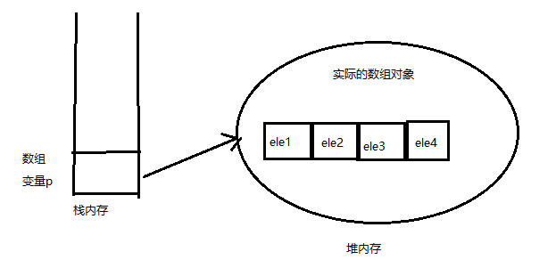

## 深入数组

- 数组是一种引用数据类型，数组引用变量只是一个引用，数组元素和数组变量在内存里是分开存放的。


### 一、内存中的数组

- **只有当该引用指向有效内存后，才可通过该数组变量来访问数组元素；**

- **引用变量是访问真实对象的根本方式，如果希望在程序中访问数组对象本身，则只能通过这个数组的引用变量来访问它；**

- **实际的数组对象被存储在堆（`heap`）内存中；**

- **如果引用该数组对象的数组引用变量是一个局部变量，那么它被存储在栈（`stack`）内存中。如果需要访问堆内存中的数组元素，则程序中只能通过`p[index]`的形式实现。**

  

>**为什么有栈内存和堆内存之分？**
>
>1. 当一个方法执行时，每个方法都会建立自己的内存栈，在这个方法内定义的变量将会逐个放入这个栈内存中，随着方法的执行结束，这个方法的内存栈也将自然销毁。因此，所有在方法中定义的局部变量都是放在栈内存中的；
>
>2. 在程序中创建一个对象时，这个对象将被保存到运行时数据区中，以便反复利用（因为对象的创建成本比较大），这个运行时数据区就是堆内存。堆内存中的对象不会随方法的结束而销毁，即使方法结束后，这个对象还可能被另一个引用变量所引用（在方法的参数传递时很常见），则这个对象依然不会被销毁，只有当一个对象没有任何引用变量引用它时，系统的垃圾回收器才会在合适的时候回收它。
>
>3. 为了让垃圾回收机制回收一个数组所占用的内存空间，可以将该数组变量赋值为`null`，也就切断了数组引用变量和实际数组之间的引用关系，实际的数组也就成为了垃圾。

```java
// 定义并初始化数组，使用静态初始化
int[] a = {5, 7, 20};
// 定义并初始化数组，使用动态初始化
int[] b = new int[4];
// 输出b数组的长度
System.out.println("b数组的长度为：" + b.length);

// 循环输出a数组的元素
for (int i = 0, len = a.length; i < len; i++) {
    System.out.println(a[i]);
}

// 循环输出b数组的元素
for (int i = 0, len = b.length; i < len; i++) {
    System.out.println(b[i]);
}

// 因为a是int[]类型，b是int[]类型，所以可以将a的赋值给b
// 也就是让b引用指向a引用指向的数组
b = a;
// 再次输出b数组的长度
System.out.println("b数组的长度为: " + b.length);

/*
output:
    b数组的长度为：4
    5
    7
    20
    0
    0
    0
    0
    b数组的长度为: 3
*/
```

### 二、基本类型数组的初始化

- 对于基本类型数组而言，数组元素的值直接存储在对应的数组元素中，因此，初始化数组时，先为该数组分配内存空间，然后直接将数组元素的值存入对应数组元素中；

```java
// 定义一个int[]类型的数组变量
int[] iArr;
// 动态初始化数组，数组长度为5
iArr = new int[5];

// 采用循环方式为每个数组元素赋值
for (int i = 0; i < iArr.length; i++)
{
    iArr[i] = i + 10;
}
```

### 三、引用类型数组的初始化

- 引用类型数组的数组元素时引用，每个数组元素里存储的还是引用，它指向另一块内存，这块内存里存储了有效数据；

```java
public class Person {
    public int age; // 年龄
    public double height; // 身高

    // 定义一个info方法
    public void info() {
        System.out.println("我的年龄是: " + age + ", 我的身高是: " + height);
    }
}

public class Test {
    public static void main(String[] args) {
        // 定义一个students数组变量，其类型是Person[]
        Person[] students;
        // 执行动态初始化
        students = new Person[2];
        // 创建一个Person实例，并将这个Person实例赋值给zhang变量
        Person zhang = new Person();
        // 为zhang所引用的Person对象age、height赋值
        zhang.height = 158;
        zhang.age = 15;
        // 创建一个Person实例，并将这个Person实例付给lee变量
        Person lee = new Person();
        // 为lee所引用的Person对象的age、height赋值
        lee.height = 161;
        lee.age = 16;
        // 将zhang变量的值赋值给第一个数组元素
        students[0] = zhang;
        // 将lee变量的值赋值给第二个数组元素
        students[1] = lee;

        // 下面两行结果一样，因为lee和students[1]指向的是同一个Person类
        lee.info();
        students[1].info();
    }
}
/*
output:
    我的年龄是: 16, 我的身高是: 161.0
    我的年龄是: 16, 我的身高是: 161.0
*/
```

### 四、多维数组

- 定义二维数组 `type[][] arrName;`；
- 初始化二维数组 `arrName = new type[lenght][];`；
- 可以把二维数组当成一维数组处理；

```java
// 定义一个二维数组
int[][] a;
// 把a当成一维数组进行初始化，初始化a是一个长度为4的数组
// a数组的数组元素又是引用类型
a = new int[4][];

// 把a当做一维数组，遍历a数组的每个数组元素
for (int i = 0, len = a.length; i < len; i++){
    System.out.println(a[i]);
}

// 初始化a数组的第一个元素
a[0] = new int[2];
// 访问a数组的第一个元素所指数组的第二个元素
a[0][1] = 6;
// a数组的第一个元素是一个一维数组，遍历这个一维数组
for (int i = 0, len = a[0].length; i < len; i++) {
    System.out.println(a[0][i]);
}
/*
output:
    null
    null
    null
    null
    0
    6
*/
```

- 同时初始化二维数组的两个维度 `int[][] b = new int[3][4];`，这个数组变量`b`指向一个长度为`3`的数组，这个数组的每个数组元素又是一个数组类型，它们哥指向对应的长度为`4`的`int[]`数组，每个数组元素的值为`0`；
- 可以使用静态初始化方式来初始化二维数组。使用静态初始化方式来初始化二维数组时，二维数组的每个数组元素都是一维数组，因此必须制定多个一位数组作为二维数组的初始化值。

```java
// 使用静态初始化语法来初始化一个二维数组
String[][] str1 = new String[][] {new String[3], new String[]{"hello"}};

// 使用简化的静态初始化语法来初始化二维数组
String[][] str2 = {new String[3], new String[]{"hello"}};
```

### 六、Java8增强的工具类：Arrays

- `Arrays`类里包含几个`static`修饰的方法（`static`修饰的方法可以直接通过类名调用）；
  - `int binarySearch(type[] a, type key):` 使用二分法查询`key`元素值在`a`数组中出现的索引。如果`a`数组不包含`key`元素值，则返回负数。调用该方法时要求数组中元素已经按升序排列，这样才能得到正确的结果；
  - `int binarySearch(type[] a, int fromIndex, int toIndex, type key): `这个方法只搜索`a`数组中`fromIndex`到`toIndex`索引的元素。调用该方法时要求数组中元素已经按升序排列，这样才能得到结果；
  - `type[] copyOf(type[] original, int length):` 这个方法将会把`original`数组复制成一个新数组，其中`length`是新数组的长度。如果length小于`original`数组的长度，则新数组就是原数组的前面`length`个元素；如果`length`大于`original`数组的长度，则新数组的前面元素就是原数组的所有元素，后面补充`0`（数值类型）、`false`（布尔类型）或者`null`（引用类型）；
  - `type[] copyOfRange(type[] original, int from, int to): `这个方法与前面类似，就是只复制`original`数组的`from`索引到`to`索引的元素；
  - `boolean equals(type[] a, tpye[] a2): `如果`a`数组和`a2`数组的长度相等，而且`a`数组和`a2`数组的数组元素也一一相同，该方法将返回`true`；
  - `void fill(type[] a, type val): `该方法会把`a`数组的所有元素都赋值为`val`;
  - `void fill(tpye[] a, int fromIndex, int toIndex, type val):` 该方法与前一个方法作用相同，区别只是该方法仅仅将`a`数组的`fromindex`到`toIndex`索引的数组元素赋值为`val`;
  - `void sort(type[] a): `该方法对`a`数组的数组元素进行排序；
  - `void sort(type[] a, int fromIndex, int toIndex): `该方法相同，区别是对`fromIndex`到`toIndex`之间元素进行排序；
  - `String toString(type[] a): `该方法将一个数组转换成为一个字符串，该方法按顺序将多个数组元素连缀在一起，多个数组元素使用英文逗号（`，`）和空格隔开；

```java
// 定义一个a数组
int[] a = new int[]{3, 4, 5, 6};
// 定义一个a2数组
int[] a2 = new int[]{3, 4, 5, 6};
// a数组和a2数组的长度相等，每个元素依次相等，将输出true
System.out.println("a数组和a2数组是否相等："
                  + Arrays.equals(a, a2));

// 通过复制a数组，生成一个新的b数组
int[] b = Arrays.copyOf(a, 6);
System.out.println("a数组和b数组是否相等：" 
                  + Arrays.equals(a, b));

// 输出b数组的元素，将输出[3, 4, 5, 6, 0, 0]
System.out.println("b数组的元素为： "
                  + Arrays.toString(b));

// 将b数组的第3个元素（包括）到第5个元素（不包括）赋值为1
Arrays.fill(b, 2, 4, 1);
// 输出b数组的元素，将输出[3, 4, 1, 1, 0, 0]
System.out.println("b数组的元素为： "
                  + Arrays.toString(b));

// 对数组b进行排序
Arrays.sort(b);
// 输出b数组的元素，将输出[0, 0, 1, 1, 3, 4]
System.out.println("b数组的元素为： "
                  + Arrays.toString(b));
/*
output:
    a数组和a2数组是否相等：true
    a数组和b数组是否相等：false
    b数组的元素为： [3, 4, 5, 6, 0, 0]
    b数组的元素为： [3, 4, 1, 1, 0, 0]
    b数组的元素为： [0, 0, 1, 1, 3, 4]
*/
```

- 在`System`类里也包含了一个`static void arraycopy(Object src, int srcPos, Object dest, int destPos, int length)`方法，该方法可以将`src`数组里的元素值赋给`dest`数组的元素，其中`srcPos`指定从`src`数组的第几个元素开始赋值，`length`参数指定将`src`数组的多少个元素赋值给`dest`数组的元素；
- `Java 8`增强了`Arrays`类的功能，可以充分利用多`CPU`并行的能力来提高设值、排序的性能；

```java
int[] arr1 = new int[]{3, -4, 25, 16, 30, 18};
// 对数组arr1进行并发排序
Arrays.parallelSort(arr1);
System.out.println(Arrays.toString(arr1));

int[] arr2 = new int[]{3, -4, 25, 16, 30, 18};
Arrays.parallelPrefix(arr2, new IntBinaryOperator(){
    // left代表数组中前一个索引处的元素，计算第一个元素时，left为1
    // right代表数组中当前索引处的元素
    public int applyAsInt(int left, int right){
        return left * right;
    }
});

System.out.println(Arrays.toString(arr2));

int[] arr3 = new int[5];
Arrays.parallelSetAll(arr3, new IntUnaryOperator(){
    // operand代表正在计算的元素索引
    public int applyAsInt(int operand){
        return operand * 5;
    }
});

System.out.println(Arrays.toString(arr3));

/*
output:
    [-4, 3, 16, 18, 25, 30]
    [3, -12, -300, -4800, -144000, -2592000]
    [0, 5, 10, 15, 20]
*/
```


### 七、数组的应用

- 将一个浮点数转换成人民币读法字符串

```java
public class Num2Rmb {
    private String[] hanArr = {"零", "壹", "贰", "叁", "肆", "伍", "陆", "柒", "捌", "玖"};

    private String[] unitArr = {"十", "百", "千"};

    /**
     * 把一个浮点数分解成整数部分喝小数部分字符串
     *
     * @param num 需要被分解的浮点数
     * @return 分解出来的整数部分喝小数部分。第一各数组元素是整数部分，第二数组元素是小数部分
     */
    private String[] divide(double num) {
        // 将一个浮点数强制类型转换为long类型,即得到它的整数部分
        long zheng = (long) num;
        // 浮点数减去整数部分，得到小数部分，小数部分乘以100后再取整得到2为小数
        long xiao = Math.round((num - zheng) * 100);
        // 使用两种方法把整数转换为字符串
        return new String[]{zheng + "", String.valueOf(xiao)};
    }

    /**
     * 把一个四位的数字字符串变成汉字字符串
     *
     * @param numStr 需要被转换的四位的数字字符串
     * @return 四位的数字字符串被转换成汉字字符串
     */
    private String toHanStr(String numStr) {
        String result = "";
        int numLen = numStr.length();

        // 依次遍历数字字符串的每一位数字
        for (int i = 0; i < numLen; i++) {
            // 把char型数字转换成为int型数字，因为她们的ASCII码值恰好相差48
            // 因此把char型数字减去48得到int型数字，例如'4'被转成4
            int num = numStr.charAt(i) - 48;
            // 如果不是最后一位数字，而且数字不是0,则需要添加单位（千、百、十）
            if (i != numLen - 1 && num != 0) {
                result += hanArr[num] + unitArr[numLen - 2 - i];
            } else {
                // 否则不用添加单位
                result += hanArr[num];
            }
        }
        return result;
    }

    public static void main(String[] args) {
        Num2Rmb nr = new Num2Rmb();
        // 测试把一个浮点数分解成整数部分和小数部分
        System.out.println(Arrays.toString(nr.divide(236711125.123)));
        // 测试把一个四位的数字字符串变成汉字字符串
        System.out.println(nr.toHanStr("6109"));
    }
}
```

- 二维数组实现五子棋

```java
import java.io.BufferedReader;
import java.io.InputStreamReader;

// 定义棋盘的大小
public class Gobang {
    // 定义棋盘的大小
    private static int BOARD_SIZE = 15;
    // 定义一个二维数组来充当棋盘
    private String[][] board;

    public void initBoard() {
        // 初始化棋盘数组
        board = new String[BOARD_SIZE][BOARD_SIZE];
        // 把每个元素赋给"✚"，用于在控制台上画出棋盘
        for (int i = 0; i < BOARD_SIZE; i++) {
            for (int j = 0; j < BOARD_SIZE; j++) {
                board[i][j] = "✚";
            }
        }
    }

    // 在控制台输出棋盘的方法
    public void printBoard() {
        // 打印每个数组元素
        for (int i = 0; i < BOARD_SIZE; i++) {
            for (int j = 0; j < BOARD_SIZE; j++) {
                // 打印数组元素后不换行
                System.out.print(board[i][j]);
            }
            // 每打印完一行数组元素后输出一个换行符
            System.out.println();
        }
    }

    public static void main(String[] args) throws Exception {
        Gobang gb = new Gobang();
        gb.initBoard();
        gb.printBoard();
        // 这是用于获取键盘输入的方法
        BufferedReader br = new BufferedReader(new InputStreamReader(System.in));
        String inputStr = null;

        // br.readLine(): 每当在键盘上输入一行内容后按回车键，刚输入的内容将被br读取到
        while ((inputStr = br.readLine()) != null) {
            // 将用户输入的字符串以逗号（,），分隔成2个字符串
            String[] posStrArr = inputStr.split(",");
            // 将2个字符串转换成用户下棋的坐标
            int xPos = Integer.parseInt(posStrArr[0]);
            int yPos = Integer.parseInt(posStrArr[1]);
            // 把对应的数组元素赋为"●"
            gb.board[yPos - 1][xPos - 1] = "●";

            /*
            电脑随机生成2个整数，作为电脑下棋的坐标，赋给board数组
            还涉及
                1.坐标的有效性，只能是数字，不能超出棋盘范围
                2.下的棋的点，不能重复下棋
                3.每次下棋后，需要扫描谁赢了
             */
            
            gb.printBoard();
            System.out.println("请输入您下棋的坐标,应x,y的格式: ");
        }
    }
}
```

## links

- #### [目录](<README.md>)

- #### 上一节: [数组类型](<02.5.md>)

- #### 下一节: [面向对象](<03.0.md>)