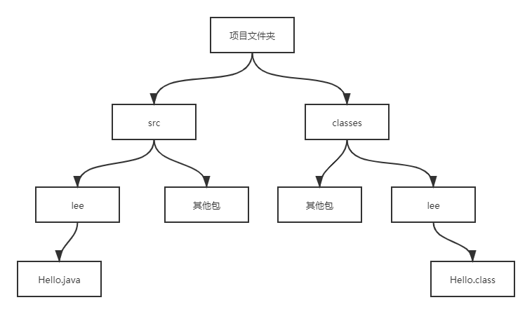

## 隐藏和封装

### 一、封装

- 封装（`Encapsulation`），它是指将对象的状态信息隐藏在对象内部，不允许外部程序直接访问对象内部信息，而是通过该类所提供的方法来实现对内部信息的操作和访问；

- 封装是面向对象编程语言对客观世界的模拟，在客观世界里，对象的状态信息都被隐藏在对象内部，外界无法直接操作和修改。


- **对一个类或对象实现良好的封装，可以实现以下目的：**
  - 隐藏类的实现细节；
  - 让使用者只能通过事先预定的方法来访问数据，从而可以在该方法里加入控制逻辑，限制对成员变量的不合理访问；
  - 可进行数据检查，从而有利于保证对象信息的完整性；
  - 便于修改，提高代码的可维护性；

**为了实现良好的封装，需要从两方面考虑：**

- 将对象的成员变量和实现细节隐藏起来，不允许外部直接访问；
- 把方法暴露出来，让方法来控制对这些成员变量进行安全的访问和操作；


### 二、使用访问控制符

- `Java`有4个访问控制符等级，从访问控制级别有小到大为 `private -> default -> protected -> public`，其中`default`并没有对应的访问控制符，当不使用任何访问控制符来修饰类或类成员时，系统默认使用该访问控制级别；

#### 1、private（当前类访问权限）

- 如果类里的一个成员（包括成员变量、方法和构造器等）使用`private`访问控制符来修饰，则这个成员只能在当前类的内部被访问。

- 因此，这个访问控制符用于修饰成员变量最合适，使用它来修饰成员变量就可以把成员变量隐藏在该类的内部；


#### 2、default（包访问权限）

- 如果类里的一个成员（包括成员变量、方法和构造器等）或者一个外部类不使用任何访问控制符修饰，就称它是包访问权限的，`default`访问控制的成员或外部类可以被相同包下的其他类访问；


#### 3、protected（子类访问权限）

- 如果一个成员（包括成员变量、方法和构造器等）使用`protected`访问控制符修饰，那么这个成员既可以被同一个包中的其他类访问，也可以被不同包中的子类访问。

- 在通常情况下，如果使用`protected`来修饰一个方法，通常是希望其子类来重写这个方法；


#### 4、public（公共访问权限）

- 如果一个成员（包括成员变量、方法和构造器等）或者一个外部类使用`public`访问控制符修饰，那么这个成员或外部类就可以被所有类访问，不管访问类和被访问类是否处于同一个包中，是否具有父子继承关系；


|                | private | default | protected | public |
| :------------: | ------- | ------- | --------- | ------ |
| **同一个类中** | ✔       | ✔       | ✔         | ✔      |
| **同一个包中** |         | ✔       | ✔         | ✔      |
|   **子类中**   |         |         | ✔         | ✔      |
| **全局范围内** |         |         |           | ✔      |

#### 5、局部变量

- 对于局部变量而言，其作用域就是它所在的方法，不可能被其他类访问，因此不能使用访问控制符来修饰；


#### 6、外部类

- 外部类只能有两种访问控制级别：`public`和默认；


- 外部类不能使用`private`和`protected`修饰，因为外部类没有处于任何类的内部，也就没有其所在类的内部，所在类的子类两个范围；


- 外部类使用`public`修饰可以被所有类使用，如声明变量、创建实例；

- 不使用任何访问控制符修饰的外部类只能被同一个包的其他类使用；


>注意：
>
>1. 如果一个Java源文件里定义的所有类都没有使用public修饰，则这个Java源文件的文件名可以是一切合法的文件名；
>
>2. 但如果一个Java源文件里定义了一个public修饰的类，则这个源文件的文件名必须与public修饰的类名相同；

#### 7、良好封装示例

```java
/*
定义了Person类后，该类的name和age两个成员变量只有在Person类内才可以操作和访问，在Person类之外只能通过各自对应的setter和getter方法来操作和访问它们
*/

public class Person {
    // 使用private修饰成员变量，将这些成员变量隐藏起来
    private String name;
    private int age;

    // 提供方法来操作name成员变量
    public void setName(String name) {
        // 执行合理性校验，要求用户名必须在2～6为之间
        if (name.length() > 6 || name.length() < 2) {
            System.out.println("您设置的人名不符合要求");
            return;
        } else {
            this.name = name;
        }
    }

    public String getName() {
        return this.name;
    }

    // 提供方法来操作age成员变量
    public void setAge(int age) {
        // 执行合理性校验，要求用户年龄必须在0～100之间
        if (age > 100 || age < 0) {
            System.out.println("您的年龄不合法");
            return;
        } else {
            this.age = age;
        }
    }

    public int getAge() {
        return this.age;
    }
}
```

>**Java类里实例变量的setter和getter方法有非常重要的意义；**
>
>- 如：某个类里包含了一个名为abc的实例变量，则其对应的setter和getter方法名应为setAbc()和getAbc()（即**将原实例变量的首字母大写，并在前面分别增加set和get动词，就变成setter和getter方法名**）。
>
>- 如果一个Java类的每个实例变量都被使用private修饰，并为每个实例变量都提供了public修饰setter和getter方法，那么这个类就是一个符合JavaBean规范的类；
>
>- **JavaBean总是一个封装良好的类；**

```java
// 创建Person对象，访问该对象的age和name两个实例变量
public static void main(String[] args) {
    Person p = new Person();
    // 因为age成员变量已被隐藏，所以下面语句将出现编译错误
    // p.age = 1000;
    // 下面语句编译不会出现错误，但运行时会提示"您设置的年龄不合法"
    // 程序不会修改p的age成员变量
    p.setAge(1000);
    
    // 访问p的age成员变量也必须通过其对应的getter方法
    // 因为上面从未成功设置p的age成员变量，故此处输出0
    System.out.println("未能设置age成员变量是：" + p.getAge());
    
    // 成功修改p的age成员变量
    p.setAge(30);
    // 因为上面成功设置了p的age成员变量，故此处输出30
    System.out.println("成功设置age成员变量后 " + p.getAge());
    
    // 不能直接操作p的name成员变量，只能通过其对应的setter方法
    // 因为"我大意了"字符串满足了2~6，所以可以成功设置
    p.setName("我大意了");
    System.out.println("成功设置name成员变量后 " + p.getName());
}
```

>进行程序设计时，应尽量避免一个模块直接操作和访问另一个模块的数据，模块设计追求高内聚（尽可能把模块的内部数据、功能实现细节隐藏在模块内部独立完成，不允许外部直接干预）、低耦合（仅暴露少量的方法给外部使用）

#### **8、访问控制符基本原则**

- 类里的绝大部分成员变量都应该使用`private`修饰，只有一些`static`修饰的、类似全局变量的成员变量，才可能考虑使用`public`修饰。除此之外，有些方法只用于辅助实现该类的其他方法，这些方法称为工具方法，工具方法也应该使用`private`修饰；
- 如果某个类主要用作其他类的父类，该类里包含的大部分方法可能仅希望被其子类重写，而不想被外界直接调用，则应该用`protected`修饰这些方法；
- 希望暴露出来给其他类自由调用的方法应该使用`public`修饰。因此，类的构造器通过使用`public`修饰，从而允许在其他地方创建该类的实例。因为外部类通常都希望被其他类自由使用，所以大部分外部类都是用`public`修饰；


### 三、package、import和import static

- 引入包（`package`）机制，提供了类的多层命名空间，用于解决类的命名冲突、类文件管理等问题；

- 格式 `package packageName;`

- 一旦在`Java`源文件中使用了这个`package`语句，就意味着该文件里定义的所有类都属于这个包。位于包中的每个类的完整类名都应该是包名和类名的组合，如果其他人需要使用该包下的类，也应该使用包名加类名的组合；


```java
// 定义一个Java类
package lee;
public class Hello {
    public static void main(Stirng[] args) {
        System.out.println("hello world");
    }
}
```

#### 1、编译

- 上面程序表示把`Hello`类放在`lee`包空间下。可以放在lee包空间下的任意位置，然后使用`javac -d . Hello.java`来编译这个`Java`文件；

- 编译完之后当前目录会多出一个`lee`文件夹，文件夹里有`Hello.class`文件；


- **位于包中的类，在文件系统中也必须有与包名层次相同的目录结构；**
- 如果直接`javac Hello.java`会在当前目录生成`Hello.class`，而不会有`lee`文件夹，这样以后有可能会发生冲突，因此建议编译时加上`-d`参数；


#### 2、运行

- `java lee.Hello`即可运行`Hello`类；
- 当虚拟机要装在`lee.Hello`类时，它会以此搜索`CLASSPATH`环境变量所指定的系列路径，查找这些路径下是否包含`lee`路径，并在`lee`路径下查找是否包含`Hello.class`文件。虚拟机在装载带包名的类时，会先搜索`CLASSPATH`环境变量指定的目录，然后在这些目录中按与包名对应的目录结构去查找`class`文件；

- 同一个包中的类不必位于相同的目录下，例如有`lee.Person`和`lee.PersonTest`两个类，它们完全可以一个位于`C`盘、一个位于`D`盘，只要让`CLASSPATH`环境变量里包含这两个路径即可，虚拟机会自动搜索`CLASSPATH`下的子路径，把他们当成同一个包下的类来处理；

- **建议将`Java`源文件和`Class`文件分开存放**，如下图；



>**注意：**
>
>- 并不是把生成的`class`文件放在某个目录下，这个目录名就成了这个类的包名。
>
>- 为`Java`类添加包必须在`Java`源文件中通过`package`语句指定，单靠目录名是没法指定的；
>
>- `Java`的包机制需要两个方面保证：
> - 源文件里使用`package`语句指定包名；
> - `class`文件必须放在对应的路径下；

#### 3、包规范

- 包名必须是有效的标识符；

- 包名应该全部是小写字母，而且应该由一个或多个有意义的单词连缀而成；

- 为了避免不同公司之间类名的重复，`Oracle`建议使用公司`Internet`域名倒写来作为包名，例如公司的`Internet`域名是`crazyit.org`，则公司的所有类都应该放在`org.crazyit`包及其子包下；

- `package`必须作为源文件的第一条非注释性语句，一个源文件只能指定一个包，该源文件可以定义多个类，这些类全部位于该包下；
- **同一个包下的类可以自由访问；**

- **只要包路径不同，导入包都需要完整路径，即父包和子包在用法上不存在任何关系，如果父包中的类需要使用子包中的类，则必须使用子包的全名，而不能省略父包部分；**

#### 4、包导入

- 如果创建处于其他包下类的实例，则在调用构造器时也需要使用包前缀；


```java
// 调用构造器时需要在构造器前增加包前缀
lee.sub.Apple a = new lee.sub.Apple();
```

- 这样很麻烦，因此`Java`引入了`import`关键字，`import`可以向某个`Java`文件种导入指定包层次下某个类或全部类，`import`语句应该出现在`package`语句（如果有的话）之后、类定义之前；

- 一个`Java`源文件只能包含一个`package`语句，但可以包含多个`import`语句，多个`import`语句用于导入多个包层次下的类；

- 直接导入指定`Java`类 `import package.subpackage...ClassName;`

- 使用`import`语句导入指定包下全部类的用法 `import package.subpackage...*;`

- 上面的*只能代表类，不能代表包。因此使用import lee.*\*;时，它表明导入`lee`包下的所有类，即`Hello`类和`HelloTest`类，而`lee`包下`sub`子包内的类则不会被导入。如需导入`lee.sub.Apple`类，则可以使用`import lee.sub.\*;`语句来导入；


```java
package lee;
// 使用import导入lee.sub.Apple类
import lee.sub.Apple;
public class HelloTest {
    public static void main(String[] args) {
        Hello h = new Hello();
        // 使用类全名的写法
        lee.sub.Apple a  = new lee.sub.Apple();
        // 如果使用import语句来导入Apple类，就可以不再使用类全名了
        Apple aa = new Apple();
    }
}
```

>1. `Java`默认为所有源文件导入`java.lang`包下的所有类，因此前面使用到的`String`、`System`类时都无法使用`import`语句来导入这些类。
>
>2. 但是`Arrays`类，其位于`java.util`包下，则必须使用`import`语句来导入该类；

#### 5、包导入极端情况

- 在一些极端情况下，`import`语句也帮不了我们，此时只能在源文件中使用类全名；


- 如需要在程序中使用`java.sql`包下的类，也需要使用`java.util`包下的类，如果使用两条`import`语句


```java
import java.util.*;
import java.sql.*;

// 如果接下来在程序中需要使用Date类，则会引起编译错误
// HelloTest.java 对Date的引用不明确
// java.sql中的类java.sql.Date 和 java.util中的类 java.util.Date 都匹配
```

- **这种情况下只能使用该类的全名；**

```java
// 为了让引用更加明确，即使使用了import语句，也还是需要使用类的全名
java.sql.Date d = new java.sql.Date();
```

#### 6、静态导入

- `JDK1.5`以后增加了一种静态导入的语法，它用于导入指定类的某个静态成员变量、方法或全部的静态成员变量、方法；
- 静态导入有两种语法：
  - 导入指定类的单个静态成员变量
    -  `import static package.subpackage...ClassName.fieldName | methodName;`
  - 导入指定类的全部静态成员变量、方法
    - `import static package.subpackage...ClassName.*;` \*代表静态成员变量或方法名

>**`import`和`import static`的区别：**
>
>- 使用`import`可以省略写包名；
>
>- 使用`import static`可以连类名都省略；

```java
import static java.lang.System.*;
import static java.lang.Math.*;

public class StaticImportTest {
    public static void main(String[] args) {
        // out是java.lang.System类的静态成员变量，代表标准输出
        // PI是java.lang.Math类的静态成员变量，表示π常量
        out.println(PI);
        out.println(sqrt(256));
    }
}
```

#### 7、Java源文件结构总结

```java
package packageName; // 0个或1个，必须放在文件开始
import | import static 语句; // 0个或多个，必须放在所有类定义之前
```

### 

### 四、Java的常用包

常用包：

- `java.lang`：这个包下包含了`Java`语言的核心类，如`String`、`Math`、`System`和`Thread`类等，使用这个包下的类无需使用`import`语句导入，系统会自动导入这个包下的所有类；
- `java.util`：这个包下包含了`Java`大量工具类/接口和集合框架类/接口，例如`Arrays`和`List`、`Set`等；
- `java.net`：这个包下包含了一些`Java`网络编程相关的类/接口；
- `java.io`：这个包下包含了一些`Java`输入/输出编程相关的类/接口；
- `java.text`：这个包下包含了一些`Java`格式化相关的类；
- `java.sql`：这个包下包含了`Java`进行`JDBC`数据库编程的相关类/接口；

## links

- #### [目录](<README.md>)

- #### 上一节: [成员变量和局部变量](<03.03.md>)

- #### 下一节: [深入构造器](<03.05.md>)

