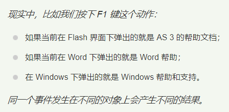

## 多态

- `Java`引用变量有两个类型：一个是编译时类型，一个是运行时类型。编译时类型由**声明该变量时使用的类型**决定，运行时类型由**实际赋给该变量的对象**决定。如果编译时类型和运行时类型不一致，就可能出现所谓的多态（`Ploymorphism`）；

### 一、多态性

```java
class BaseClass {
    public int book = 6;

    public void base() {
        System.out.println("父类的普通方法");
    }

    public void test() {
        System.out.println("父类的被覆盖的方法");
    }
}

public class SubClass extends BaseClass {
    // 重新定一个book实例变量隐藏父类的book实例变量
    public String book = "hello book";

    public void test() {
        System.out.println("子类的覆盖父类的方法");
    }

    public void sub() {
        System.out.println("子类的普通方法");
    }

    public static void main(String[] args) {
        // 下面编译时类型和运行时类型完全一样，不存在多态
        BaseClass bc = new BaseClass();
        // 输出6
        System.out.println(bc.book);
        // 下面两次调用将执行BaseClass的方法
        bc.base();
        bc.test();

        // 下面编译时类型和运行时类型完全一样，因此不存在多态
        SubClass sc = new SubClass();
        System.out.println(sc.book);
        // 下面调用将执行父类继承到的base()方法
        sc.base();
        // 下面调用将执行当前类的test()方法
        sc.test();

        // 下面编译时类型和运行时类型不一样，多态发生
        BaseClass ploymophicBc = new SubClass();
        // 输出6,表明访问的是父类对象的实例变量
        System.out.println(ploymophicBc.book);
        // 下面调用将执行从父类继承到的base()方法
        ploymophicBc.base();
        // 下面调用将执行当前类的test()方法
        ploymophicBc.test();
        // 因为ploymophicBc的编译时类型是BaseClass
        // BaseClass类没有提供sub()方法，所以下面代码编译时会出现错误
//       ploymophicBc.sub();
    }
}
/*
output:
    6
    父类的普通方法
    父类的被覆盖的方法
    hello book
    父类的普通方法
    子类的覆盖父类的方法
    6
    父类的普通方法
    子类的覆盖父类的方法
*/
```

- 上例中的`ploymophicBc`编译时类型是`BaseClass`，而运行时类型是`SubClass`，当调用该引用变量的`test()`方法（`BaseClass`类中定义了该方法，子类`SubClass`覆盖了父类的该方法时），实际执行的是`SubClass`类中覆盖后的`test()`方法，这就可能出现多态了；
- 子类其实是一种特殊的父类，因此`Java`允许把一个子类对象直接赋给一个父类引用变量，无须任何类型转换，或者被称为向上转型（`upcasting`），**向上转型由系统自动完成**；
- 当把一个子类对象直接赋给父类引用变量时，如上的`BaseClass ploymophicBc = new SubClass();`，这个`ploymophicBc `引用变量的编译时类型是`BaseClass`，而运行时类型是`SubClass`，当运行时调用该引用变量的方法时，其方法行为总是表现出子类方法的行为特征，而不是父类方法的行为特征，这就可能出现：相同类型的变量，调用同一个方法时呈现出多种不同的行为特征，这就是多态；

- 注释`ploymophicBc.sub();`的原因，这行代码会在编译时引发错误。虽然`ploymophicBc`引用变量实际上确实包含`sub()`方法，但因为它的编译时类型为`BaseClass`，因此编译时无法调用`sub()`方法；
- 与方法不同的是，对象的实例变量则不具备多态性。如`ploymophicBc`引用变量，程序中输出它的`book`实例变量时，并不是输出`SubClass`类里定义的实例变量，而是输出`BaseClass`类的实例变量；

>- 引用变量在编译阶段只能调用其编译时类型所具有的方法，但运行时则执行它运行时类型所具有的方法。
>- 因此，编写Java代码时，引用变量只能调用声明该变量时所用类里包含的方法。
>- 如，`Object p = new Person();`代码里定义一个变量p，则这个p只能调用Object类的方法，而不能调用Person类里定义的方法。
>- 通过引用变量来访问其包含的实例变量时，系统总是试图访问它编译时类型所定义的成员变量，而不是它运行时类型所定义的成员变量。

- 多态性是对象多种表现形式的体现




- **多态存在的三个必要条件**
  - 继承
  - 重写
  - 父类引用指向子类对象


### 二、引用变量的强制类型转换

- 如果需要让引用变量调用它运行时类型的方法，则必须把他强制类型转换成运行时类型；
- **强制类型转换不是万能的，当进行强制类型转换是需要注意**：
- 基本类型之间的转换只能在数值类型之间进行，数值类型包括整数型、字符型和浮点型，而数值类型和布尔类型之间不能进行类型转换；
- 引用类型之间的转换只能在具有继承关系的两个类型之间进行，如果是两个没有任何继承关系的类型，则无法进行类型转换，否则编译时就会出现错误。如果试图把一个父类实例转换成子类类型，则这个对象必须实际上是子类实例才行（即编译时类型为父类类型，而运行时类型是子类类型），否则将在运行时引发`ClassCastException`异常；

```java
public class ConversionTest {
    public static void main(String[] args) {
        double d = 13.4;
        long l = (long) d;
        System.out.println(l);

        int in = 5;
        // 试图把一个数值类型的变量转换为boolean类型，下面代码编译出错
        // 编译时会提醒：不可转换的类型
//        boolean b = (boolean) in;

        Object obj = "Hello";
        // obj变量的编译时类型为Object,Object与String存在继承关系，可以强制类型转换
        // 而且obj变量的实际类型是String，所以运行时也可通过
        String objStr = (String) obj;
        System.out.println(objStr);

        // 定义一个objPri变量,编译是类型为Object,实际类型为Interger
        Object objPri = Integer.valueOf(5);
        // objPri变量的编译石磊型为Object，objPri的运行时类型为Integer
        // Object与Integer存在继承关系
        // 可以强制类型转换，而objPri变量的实际类型是Integer
        // 所以下面代码运行时引发ClassCastException异常
        // 因为String和Integer不存在父子关系
        String str = (String) objPri;
    }
}
/*
output:
    13
    Hello
    Exception in thread "main" java.lang.ClassCastException:
*/
```

- 因此在进行强制类型转换之前，先用`instanceof`运算符判断是否可以成功转换，从而避免出现`ClassCastException`异常，这样可以保证程序更加健壮；

>- 当把子类对象赋给父类引用变量时，被称为向上转型（upcasting），这种转型总是可以成功的，这也从另一个侧面证实了子类是一种特殊的父类；
>- 这种转型只是表明这个引用变量的编译时类型是父类，但实际执行它的方法时，依然表现出子类对象的行为方法；
>- 但把一个父类对象赋给子类引用变量时，就需要进行强制类型转换，而且还可能在运行时产生ClassCastException异常，使用instanceof运算符可以让强制类型转换更安全；


### 三、instanceof运算符

- `instanceof`用于判断前面的对象是否是后面的类，或者其子类、实现类的实例。如果是，则返回`true`，否则返回`false`；
- `instanceof`运算符前面操作数的额编译时类型要么与后面的类型相同，要么与后面的类具有父子继承关系，否则会引起编译错误；

```java
public class InstanceofTest {
    public static void main(String[] args) {
        // 声明hello时使用Object类，则hello的编译类型是Object
        // Object是所有类的父类，但hello变量的实际类型是String
        Object hello = "Hello";
        // String与Object类存在继承关系，可以进行instanceof运算。返回true
        System.out.println("字符串是否是Object类的实例：" + (hello instanceof Object));
        System.out.println("字符串是否是String类的实例：" + (hello instanceof String));
        // Math与Object类存在继承关系，可以进行instanceof运算
        System.out.println("字符串是否是Math类的实例：" + (hello instanceof Math)); // fasle
        // String实现了Comparable接口，所以返回true
        System.out.println("字符串是否是Comparable接口的实例：" + (hello instanceof Comparable));

        String a = "Hello";
        // String类与Math类没有继承关系，所以代码编译无法通过
//        System.out.println("字符串是否是Math类的实例：" + (a instanceof Math));
    }
}
```

## links

- #### [目录](<README.md>)

- #### 上一节: [类的继承](<03.06.md>)

- #### 下一节: [继承与组合](<03.08.md>)