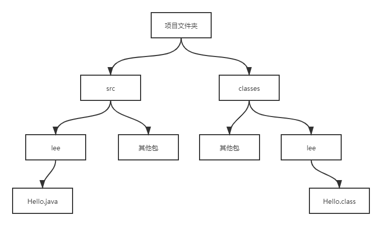
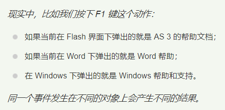

# 面向对象

## 类和对象

### 一、定义类

- **Java里定义类的语法**：

```java
[修饰符] class 类名
{
    零个到多个构造器定义...
    零个到多个成员变量...
    零个到多个方法...    
}
```

- 修饰符可以是`public`、`final`、`abstract`或者完全省略；

- 类名是有意义的一个或多个单词，每个单词首字母大写，其他字母都小写，单词之间不用使用分隔符；

- 类里各成员之间的定义顺序没有任何影响，各成员之间可以相互调用，但需要指出的是，`static`修饰的成员不能访问没有`static`修饰的成员；


#### 1、构造器

- 构造器用于构造该类的实例，`Java`语言通过`new`关键字来调用构造器，从而返回该类的实例；

- 构造器是一个类创建对象的根本途径，如果一个类没有构造器，这个类通常无法创建实例；

- 如果程序员没有为一个类编写构造器，则系统会为该类提供一个默认的构造器，一旦为一个类提供了构造器，系统将不再为该类提供构造器；


- **定义构造器格式：**

  ```java
  [修饰符] 构造器名(形参列表)
  {
      // 由零条到多条可执行语句组成的构造器执行体
  }
  ```
  - **修饰符**：修饰符可以省略，有`public`、`protected`、`private`；
  - **构造器名**：<u>构造器名必须和类名相同</u>
    - 构造器既不能定义返回值类型，也不能使用`void`声明构造器没有返回值。如果构造器定义了返回值类型，或使用了`void`声明构造器没有返回值，编译时不会出错，但`Java`会把这个（伪）构造器当成方法来处理，即它根本不是构造器；

>**构造器没有返回值，为什么不能用`void`声明?**
>
>1. 这是`Java`语法的规定。实际上，类的构造器是有返回值的，当使用`new`关键字来调用构造器时，构造器返回该类的实例，因此构造器的返回值类型总是当前类，无需定义返回值类型。
>
>2. **但必须注意，不要在构造器里显示使用`return`来返回当前类的对象，因为构造器的返回值是隐式的。**

#### 2、定义成员变量

- **语法** `[修饰符] 类型 成员变量名 [= 默认值];`
- **修饰符**：修饰符可以省略，有`public`、`protected`、`private`、`static`、`final`，其中`public`、`protected`、`private`三个最多只能出现其中之一，可以与`static`、`final`组合起来修饰成员变量；
- **成员变量名**：有意义的单词或词组，第一个单词首字母小写，后面每个单词首字母大写，其他字母全部小写，成员变量用于描述类或对象包含的状态数据；

#### 3、定义方法

- **语法** 

  ```java
  [修饰符] 方法返回值类型 方法名(形参列表)
  {
      // 由零条到多条可执行语句组成的方法体
  }
  ```
  - **修饰符**：可以省略，有`public`、`protected`、`private`、`static`、`final`、`abstract`，其中`public`、`protected`、`private`三个最多只能出现其中之一。`final`和`abstract`最多只能出现其中之一，它们可与`static`组合起来修饰方法；
  - **方法名**：方法用于描述该类或该类的实例的行为特征或功能实现，建议方法名以英文动词开头；

#### 4、static关键字

- `static`用于修饰方法、成员变量等成员；
- `static`修饰的成员表明它属于这个类本身，而不属于该类的单个实例，因为通常把`static`修饰的成员变量和方法也成为类变量、类方法；
- 不使用`static`修饰的普通方法、成员变量则属于该类的单个实例，而不属于该类，通常把不使用static修饰的成员变量和方法称为实例变量、实例方法；

- `static`修饰的成员变量和方法也成为静态变量和静态方法，静态成员不能直接访问非静态成员；


### 二、对象的产生和使用

- 创建对象的根本途径是构造器，通过new关键字来调用某个类的构造器既可创建这个类的实例；


```java
public class Person {
    // 定义两个成员变量
    public String name;
    public int age;
    // 定义一个say()方法
    public void say(String content) {
        System.out.println(content);
    }
}

// main方法中
// 使用Person类定义一个Person类型的变量
Person p;
// 通过new关键字调用Person类的构造器，返回一个Person实例
p = new Person();

// 定义p变量的同时并为p变量赋值
Person p = new Person();
```

- `static`修饰的方法和成员变量，既可通过类来调用，也可通过实例来调用；
- 没有使用`static`修饰的普通方法和成员变量，只可通过实例来调用；


```java
// 访问p的name实例变量，直接为该变量赋值
p.name = "caibi";
// 调用p的say()方法，声明say()方法时定义了一个形参
// 调用该方法必须为形参指定一个值
p.say("Java easy");
// 直接输出p的name实例变量
System.out.println(p.name);
```

- 类定义的是多个实例的特征，因此类不是一种具体存在，实例才是具体存在；


### 三、对象、引用和指针

- 语法 `Person p = new Person();`
  - 程序中定义的`Person`类型的变量实际上是一个引用，它被存放在栈内存里，指向实际的`Person`对象，而真正的`Person`对象则存放在堆（`heap`）内存中；
- 当一个对象被创建成功后，这个对象将保存在堆内存中，`Java`程序不允许直接访问堆内存中对象，只能通过该对象的引用操作该对象。也就是说，不管是数组还是对象，都只能通过引用来访问它们；
- 不管是数组还是对象，当程序访问引用变量的成员变量或方法时，实际上访问该引用变量所引用的数组、对象的成员变量或方法；
- 如果堆内存里的对象没有任何变量指向该对象，那么程序将无法再访问该对象，这个对象也就变成了垃圾，`Java`的垃圾回收机制将回收该对象，释放该对象所占的内存区；
- 如果希望通知垃圾回收机制回收某个对象，只需切断该对象的所有引用变量和它之间的关系即可，也就是把这些引用变量赋值为`null`；


### 四、对象的this引用

- `this`关键字总是指向调用该方法的对象；
- **`this`的两种使用：**
  - 构造器中引用该构造器正在初始化的对象；
  - 在方法中引用调用该方法的对象；

- `this`关键字最大的作用就是让类中一个方法，访问该类里的另一个方法或实例变量；

```java
// 没有采用this的情况
public class Dog{
    // 定义一个jump()方法
    public void jump() {
        System.out.println("正在执行jump方法");
    }
    
    // 定义一个run()方法，run()方法需要借助jump()方法
    public void run() {
        Dog d = new Dog();
        d.jump();
        System.out.println("正在执行run方法");
    }
}

public class DodTest {
    public static void main(String[] args) {
        // 创建Dog对象
        Dog dog = new Dog();
        dog.run();
    }
}
```

> 1. 上述程序中，一共产生了两个`Dog`对象，在`Dog`类的`run()`方法中，程序创建了一个`Dog`对象，并使用名为`d`的引用变量来指向该`Dog`对象，在`DogTest`的`main()`方法中，程序再次创建了`Dog`对象，并使用名为`dog`的引用变量指向该`Dog`对象，这里产生了两个问题：
>
> 2. **问题一：在`run()`方法中调用`jump()`方法时是否一定需要一个`Dog`对象?**
>
>    这是肯定的，因为没有使用`static`修饰的成员变量和方法都必须使用对象来调用。
>
> 3. **问题二：是否一定需要重新创建一个`Dog`对象？**
>
>    这是否定的，因为当程序调用`run()`方法时，一定会提供一个`Dog`对象，这样就可以直接使用这个已经存在的`Dog`对象，而无须重新创建新的`Dog`对象了。

- <u>`this`可以代表任何对象，当`this`出现在某个方法体中时，它所代表的对象是不确定的，但它的类型是确定的：它所代表的只能是当前类的实例；</u>
- <u>只有当这个方法被调用时，它所代表的对象才被确定下来：谁在调用这个方法，`this`就代表谁；</u>

```java
// 采用this的情况
public class Dog{
    // 定义一个jump()方法
    public void jump() {
        System.out.println("正在执行jump方法");
    }
    
    // 定义一个run()方法，run()方法需要借助jump()方法
    public void run() {
        // 使用this引用调用run()方法的对象
        this.jump();
        System.out.println("正在执行run方法");
    }
}

public class DodTest {
    public static void main(String[] args) {
        // 创建Dog对象
        Dog dog = new Dog();
        dog.run();
    }
}
```

- `Java`允许对象的一个成员直接调用另一个成员，可以省略this前缀；

```java
public void run() {
    jump();
    System.out.println("正在执行run方法");
}
```

>对于`static`修饰的方法而言，则可以使用类来直接调用该方法，如果在`static`修饰的方法中`this`关键字，则这个关键字就无法指向合适的对象。所以，`static`修饰的方法中不能使用`this`引用。由于`static`修饰的方法不能使用this引用，所以`static`修饰的方法不能访问不使用static修饰的普通成员。
>
>因此`Java`语法规定：**静态成员不能直接访问非静态成员**

- 静态方法直接访问非静态方法时引发的错误：


```java
public class StaticAccessNonStatic {
    public void info() {
        System.out.println("简单的info方法");
    }

    public static void main(String[] args) {
        // 因为main()方法是静态方法，而info()是非静态方法
        // 调用main()方法是该类本身，而不是该类的实例
        // 因此this无法指向有效的对象
//        this.info();
//        info();
    }
}
```

- 上面编译错误是因为`info()`方法时属于实例的方法，而不是属于类的方法，因此必须使用对象来调用该方法。在上面的`main()`方法中直接调用`info()`方法时，系统相当于使用`this`作为该方法的调用者，而`main()`方法时一个`static`修饰的方法，`static`修饰的方法属于类，而不属于对象，因此调用`static`修饰的方法的主调总是类本身；如果允许在`static`修饰的方法中出现`this`引用，那将导致`this`无法引用有效的对象，因此上述程序会发生编译错误；


>`Java`支持对象调用`static`修饰的成员变量、方法，但是尽量不要使用对象去调用`static`修饰的成员变量、方法，而是应该使用类去调用`static`修饰的成员变量、方法！
>
>如果确实要再静态方法中访问另一个普通方法，则只能重新创建一个对象!

- `this`引用也可以用于构造器中作为默认使用，由于构造器是直接使用`new`关键字来调用，而不是使用对象来调用的，所以`this`在构造器中代表该构造器正在初始化对象。

```java
public class ThisInConstructor {
    // 定义一个名为foo的成员变量
    public int foo;
    public ThisInConstructor()
    {
        // 在构造器里定义一个foo变量
        int foo = 0;
        // 使用this代表该构造器正在初始化对象
        this.foo = 6;
    }
    
    public static void main(String[] args){
        // 所有使用ThisInConstructor创建的对象的foo成员变量都被设置为6
        System.out.println(new ThisInConstructor().foo);
    }
}
```

- 当`this`作为对象的默认引用使用时，程序可以像访问普通引用变量一样来访问这个`this`引用，甚至可以把`this`当成普通方法的返回值；


```java
public class ReturnThis {
    public int age;
    public ReturnThis grow() {
        age++;
        // return this 返回调用该方法的对象
        return this;
    }
    public static void main(String[] args) {
        ReturnThis rt = new ReturnThis();
        // 可以连续调用同一个方法
        rt.grow().grow().grow();
        System.out.println("rt的age成员变量值为： " + rt.age);
    }
}
```


## 方法

- **<u>`Java`里的方法不能独立存在，所有的方法都必须定义在类中，方法的逻辑要么属于类，要么属于对象；</u>**
- 如果方法使用了`static`修饰，则这个方法属于这个类，否则这个方法属于这个类的实例；

- `Java`语言是静态的，一个类定义完成后，只要不在重新编译这个类文件，该类和该类的对象所有的方法都是固定的，永远都不会改变；

>**同一个类里面不同的方法之间相互调用，为什么可以直接调用？**
>
>1. 因为同一个类的一个方法调用另一个方法时，如果被调方法是普通方法，则默认使用this作为调用者；
>
>2. 如果被调方法时静态方法，则默认使用类作为调用者；
>
>3. 即表面上看起来这些方法可以被独立执行，但实际上还是使用this或者类来作为调用者；

### 一、方法的参数传递机制

- `Java`的实参值是如何传入方法的？这是由`Java`方法的参数传递机制来控制的，`Java`里方法的参数传递方式只有一种：**<u>值传递</u>**。值传递，就是将实际参数值的副本（复制品）传入方法内，而参数本身不会受到任何影响。

```java
public class PrimitiveTransferTest {
    public static void swap(int a, int b) {
        // 下面三行代码实现a、b变量的值交换
        // 定义一个临时变量来保存a变量的值
        int temp = a;
        a = b;
        b = temp;
        System.out.println("在swap方法里，a的值为：" + a + "; b的值为： " + b);
    }

    public static void main(String[] args) {
        int a = 6;
        int b = 9;
        swap(a, b);
        System.out.println("交换结束后，变量a的值是： " + a + "; 变量b的值为: " + b);
    }
}
/*
output:
    在swap方法里，a的值为：9; b的值为： 6
    交换结束后，变量a的值是： 6; 变量b的值为: 9
*/
```

- **<u>*基本类型的参数传递是值传递，引用类型的参数传递，同样也是值传递方法！*</u>**

```java
public class ReferenceTransferTest {
    public static void swap(DataWrap dw) {
        // 下面三行代码实现dw的a、b两个成员变量的值交换
        // 定义一个临时变量来保存dw对象的a成员变量的值
        int tmp = dw.a;
        dw.a = dw.b;
        dw.b = tmp;
        System.out.println("在swap方法中，a成员的变量的值为： " + dw.a + "; b成员变量的值为: " + dw.b);
        dw = null; //证明是值传递
    }

    public static void main(String[] args) {
        DataWrap dw = new DataWrap();
        dw.a = 6;
        dw.b = 9;
        swap(dw);
        System.out.println("交换结束后，a成员变量的值为： " + dw.a + "; b成员变量的值为： " + dw.b);
    }
}
/*
output:
    在swap方法中，a成员的变量的值为： 9; b成员变量的值为: 6
    交换结束后，a成员变量的值为： 9; b成员变量的值为： 6
*/
```

>发现程序结果中值确实被交换了，**这里的值传递指的是"引用"的值传递**；
>
>1、`main()`方法刚开始创建了一个`DataWrap`对象，`dw`是引用变量指向`DataWrap`对象；
>
>2、`main()`方法执行到`swap()`方法时，传入的是`dw`这个引用变量的复制品，这就是值传递；
>
>3、`swap()`中`dw`接收到到的是`main()`中`dw`复制品的值，而`dw`本身就是一个引用变量，它保存了`DataWrap`对象的地址，即复制品也保存了这个对象的地址，因此`swap()`中的引用变量`dw`也指向相同的这个`DataWrap`对象；
>
>4、注意，`main()`中`dw`只是一个引用变量，所以系统只是复制了`dw`变量，但并未复制`DataWrap`对象；
>
>5、因此不管是操作`main()`方法里的`dw`变量，还是操作`swap()`方法里的`dw`参数，其实都是操作它们所引用的同一个`DataWrap`对象；
>
>6、可以在`swap()`方法最后一行加入`dw = null;`来证明两个`dw`是不同的两个变量。由于`swap()`方法中的`dw`变量不再指向任何有效内存，`main()`方法调用了`swap()`方法后，再次访问`dw`变量的`a`、`b`两个成员变量，依然可以输出9、6。可见`main()`方法中的`dw`变量没有收到任何影响。实际上，当`swap()`方法中增加`dw = null;`后，`swap()`方法失去了`DataWrap`的引用，不能再访问堆内存中的`DataWrap`对象。但`main()`方法中的`dw`变量不受任何影响，依然引用`DataWrap`对象，所以依然可以输出`DataWrap`对象的`a`、`b`成员变量的值；

### 二、形参个数可变的方法

- `Java`允许定义形参个数可变的参数，从而允许为方法指定数量不确定的形参；

```java
public class Varargs {
    // 定义了形参个数可变的方法
    public static void test(int a, String... books) {
        // books被当成数组处理
        for (String book : books) {
            System.out.println(book);
        }
        // 输出整数变量a的值
        System.out.println(a);
    }

    public static void main(String[] args) {
        // 调用test方法
        test(5, "java难啊", "太难了");
    }
}
/*
output:
    java难啊
    太难了
    5
*/
```

- 形参个数可变的参数参数本质就是一个数组参数，所以以下两种方法等价；


```java
// 可变参数
public static void test(int a, String ... books);
// 数组
public static void test(int a, String[] books);

// 可变参数调用(更容易)
test(5, "java难啊", "太难了");
// 数组调用
test(5, new String[]{"java难啊", "太难了"});
```

>可变形参规则：
>
>1. 个数可变的形参只能处于形参列表的最后。
>2. 一个方法中最多只能包含一个个数可变的形参。
>3. 个数可变的形参本质就是一个数组类型的形参，因此调用包含个数可变形参的方法时，该个数可变的形参既可以传入多个参数，也可以传入一个数组。

### 三、递归方法

- 一个方法的方法体实现了再次调用了方法本身，就是递归方法；


### 四、方法重载

- `Java`允许同一个类里定义多个同名方法，只要形参列表不同就行。如果同一个类中包含了两个或两个以上的方法的方法名相同，但形参列表不同，则被称为方法重载；
- **注意**：同一个类中方法名相同，参数列表不同。至于方法的其他部分，如方法返回值类型、修饰符等，与方法重载没有任何关系；

```java
public class Overload {
    // 下面定义了两个test()方法，但方法的形参列表不同
    // 系统可以区分这两个方法，这杯称为方法重载
    public void test() {
        System.out.println("无参数");
    }
    public void test(String msg) {
        System.out.println("重载的test方法: " + msg);
    }
    
    public static void main(String[] args) {
        Overload o1 = new Overload();
        // 调用test()时没有传入参数，因此系统调用上面没有参数的test()方法
        o1.test();
        // 调用test()时传入了一个字符串参数
        // 因此系统调用上面带一个字符串参数的test()方法
        o1.test("hello");
    }
}
```

>**为什么方法的返回值不能用于区分重载的方法？**
>
>1. 对于`int f() {}`和`void f(){}`两个方法，如果这样调用`int result = f();`，系统可以识别是调用返回值类型为int的方法；
>
>2. 但Java调用方法时可以忽略方法的返回值，如果采用如下方法来调用`f();`，就不能判断了。
>
>3. 因此Java中不能使用方法返回值类型作为区分方法重载的依据；

- 如果被重载的方法里包含了个数可变的形参，则需要注意：


```java
public class OverloadVarargs {
    public void test(String msg) {
        System.out.println("只有一个字符串参数的test方法");
    }

    // 因为前面已经有了一个test()方法，test()方法里有一个字符串参数
    // 此处的个数可变形参里不包含一个字符串参数的形式
    public void test(String... msg) {
        System.out.println("形参个数可变的test方法");
    }

    public static void main(String[] args) {
        OverloadVarargs olv = new OverloadVarargs();

        olv.test(); // 第二个test()
        olv.test("aa", "bb"); // 第二个test()
        olv.test("aa"); // 第一个test()
        // 如果想使用第二个test()，又只想传入一个字符串参数
        olv.test(new String[]{"aa"}); // 第二个test()
    }
}
/*
output:
    形参个数可变的test方法
    形参个数可变的test方法
    只有一个字符串参数的test方法
    形参个数可变的test方法
*/
```

- **<u>大部分时候不推荐重载形参个数可变的方法；</u>**


## 成员变量和局部变量

### 一、两者的区别

- 成员变量指的是在类里定义的变量；

- 局部变量指的是在方法里定义的变量；

- 两者命名规则都为：第一个单词首字母小写，后面的每个单词首字母大写；


- **所有变量分类**
  - **成员变量**
    - 实例变量（不以static修饰）；
    - 类变量（以static修饰）；
  - **局部变量**
    - 形参（方法签名中定义的变量）；
    - 方法局部变量（在方法内定义）；
    - 代码块局部变量（在代码块内定义）；

#### 1、成员变量

- 类变量从该类的准备阶段起开始存在，直到系统完全销毁这个类，类变量的作用域与这个类的生存范围相同；

- 实例变量从该类的实例被创建起开始存在，直到系统完全销毁这个实例，实例变量的作用域与对应的实例的生存范围相同；


>一个类在使用之前要经过类加载、类验证、类准备、类解析、类初始化等几个阶段；

- 因此可以把类变量和实例变量统称为成员变量，其中类变量可以理解为类成员变量，它作为类本身的一个成员，与类本身共存亡；实例变量理解为实例成员变量，它作为实例的一个成员，与实例共存亡；

- 只要类存在，程序就可以访问该类的类变量，`类.类变量`

- 只要实例存在，程序就可以访问该实例的实例变量，`实例.实例变量`

- 类变量也可以让该类的实例来访问，`实例.类变量`

>**注意**：如果通过一个实例修改了类变量的值，由于这个类变量不属于这个实例，而是属于它对应的类。因此，修改的依然是类的类变量，与通过该类来修改类变量的结果完全相同，这会导致该类的其他实例来访问这个类变量时也会获得这个被修改过的值；

```java
public class TestClass {
    public static int age; // 类变量
    public String name; // 实例变量

    public static void main(String[] args) {
        TestClass testClass = new TestClass();
        System.out.println(age); //0
        System.out.println(testClass.age); //0
        testClass.age = 20;
        testClass.name = "我大意了";
        System.out.println(age); // 20
        System.out.println(testClass.age); // 20

        TestClass testClass1 = new TestClass();
        System.out.println(age); // 20
        System.out.println(testClass1.age); // 20
    }
}
```

```java
class Person {
    // 定义一个实例变量
    public String name;
    // 定义一个类变量
    public static int eyeNum;
}

public class PersonTest {
    public static void main(String[] args) {
        // 第一次主动使用Person类，该类自动初始化，则eyeNum变量开始起作用，输出0
        System.out.println("Person的eyeNum类变量值为：" + Person.eyeNum);
        // 创建Person对象
        Person p = new Person();
        // 通过Person对象的引用p来访问Person对象name实例变量
        // 并通过实例访问eyeNum类变量
        System.out.println("p变量的name变量值是： " + p.name + " p对象的eyeNum变量值为： " + p.eyeNum);
        // 直接为name实例变量赋值
        p.name = "孙悟空";
        // 通过p访问eyeNum类变量，依然是访问Person的eyeNum类变量
        p.eyeNum = 2;
        // 再次通过Person对象来访问name实例变量和eyeNum类变量
        System.out.println("p变量的name实例变量是： " + p.name + " p对象的eyeNum变量值为： " + p.eyeNum);
        // 前面通过p修改了Person的eyeNum,此处的Person.eyeNum将输出2
        System.out.println("Personde eyeNum类变量值为： " + Person.eyeNum);       
    }
}
/*
output:
    Person的eyeNum类变量值为：0
    p变量的name变量值是： null p对象的eyeNum变量值为： 0
    p变量的name实例变量是： 孙悟空 p对象的eyeNum变量值为： 2
    Personde eyeNum类变量值为： 2
*/
```

#### 2、局部变量

- 局部变量分为三种：
  - 形参：在定义方法签名时定义的变量，形参的作用域在整个方法内有效；
  - 方法局部变量：在方法体内定义的局部变量，它的作用域是从定义该变量的地方生效，到该方法结束时生效；
  - 代码块局部变量：在代码块中定义的局部变量，这个局部变量的作用域从定义该变量的地方生效，到该代码块结束时失效；

>**注意**：局部变量除形参外，都必须显示初始化，必须给方法局部变量和代码块局部变量指定初始值，否则不可以访问它们；

##### 2.1、代码块局部变量

```java
public class BlockTest {
    public static void main(String[] args) {
        {
            // 定义一个代码块局部变量a
            int a;
            // 下面代码将出现错误，因为a变量还未初始化
//            System.out.println(a);
            // 为a变量初始化
            a = 6;
            System.out.println("代码块局部变量a的值为: " + a);
        }
        // 下面试图访问的a变量并不存在
//        System.out.println(a);
    }
}
```

##### 2.2、方法局部变量

```java
public class MethodLocalVariableTest {
    public static void main(String[] args) {
        // 定义一个方法局部变量a
        int a;
        // 下面代码将出现错误，因为a还没有初始化
//        System.out.println(a);
        a = 5;
        System.out.println("方法局部变量a的值为：" + a);
    }
}
```

##### 2.3、形参

- 形参的作用域是整个方法体内有效，而且形参也无需显示初始化，形参的初始化在调用该方法时由系统完成，形参的值由方法的调用者负责指定；

- 当通过类或对象调用某个方法时，系统会在该方法栈区内为所有的形参分配内存空间，并将实参的值赋给对应的形参，这就完成了形参的初始化；


##### 2.4、覆盖问题

- `Java`允许局部变量和成员变量同名，如果方法里的局部变量和成员变量同名，局部变量会覆盖成员变量，如果需要在这个方法里引用被覆盖的成员变量，则可以使用this（对于实例变量）或类名（对于类变量）作为调用者来限定访问成员变量；

```java
public class VariableOverrideTest {
    // 定义一个name实例变量
    private String name = "helloworld";
    // 定义一个price类变量
    private static double price = 78.0;

    public static void main(String[] args) {
        // 方法里的局部变量，局部变量覆盖成员变量
        int price = 65;
        // 直接访问price变量，将输出price局部变量的值：65
        System.out.println(price);
        // 使用类名作为price变量的限定
        // 将输出price类变量的值为: 78
        System.out.println(VariableOverrideTest.price);
        // 运行info()方法
        new VariableOverrideTest().info();
    }

    public void info() {
        // 方法里的局部变量，局部变量覆盖成员变量
        String name = "孙悟空";
        // 直接访问name变量,将输出name局部变量的值: 孙悟空
        System.out.println(name);
        // 使用this来作为name变量的限定
        // 将输出name实例变量的值，helloworld
        System.out.println(this.name);
    }
}
/*
output:
    65
    78.0
    孙悟空
    helloworld
*/
```


### 二、成员变量的初始化和内存中的运行机制

- 当系统加载类或创建该类的实例时，系统自动为成员变量分配内存空间，并在分配内存空间后，自动为成员变量指定初始值；


```java
// 创建第一个Person对象
Person p1 = new Person();
// 创建第二个Person对象
Person p2 = new Person();

// 分别为两个Person对象的name实例变量赋值
p1.name = "张三";
p2.name = "孙悟空";

// 分别为两个Person对象的eyeNum类变量赋值
p1.eyeNum = 2;
p2.eyeNum = 3;
```

>**详解：**
>
>1、当程序执行第一行代码`Person p1 = new Person();`时，如果这行代码是第一次使用Person类，则系统通常会在第一次使用Person类时加载这个类，并初始化这个类。在类的准备阶段，系统将会为该类的类变量分配内存空间，并制定默认初始值。到此为止，Person类初始化完成。注意，Person类及其类变量都存储在堆内存中；
>
>2、当Person类初始化完成后，系统将在堆内存中为Person类分配一块内存区（当Person初始化完成后，系统会为Person类创建一个类对象），在这块内存区里包含了保存eyeNum类变量的内存，并设值eyeNum的默认初始值为0；
>
>3、系统接着创建了一个Person对象，并把这个Person对象赋给了p1变量，Person对象里包含了名为name的实例变量，实例变量是在创建实例时分配内存空间并指定初始值的；
>
>4、eyeNum类变量并不属于Person对象，它是属于Person类的，所以创建第一个Person对象时并不需要为eyeNum类变量分配内存，系统只是为name实例变量分配了内存并制定了默认初始值：null；
>
>5、接着执行`Person p2 = new Person();`，代码创建第二个Person对象，此时因为Person类已经存在于堆内存中了，所以不再需要对Person类进行初始化。创建第二个Person对象与创建第一个Person对象没有什么不同；
>
>6、当程序执行`p1.name = "张三";`代码时，将为p1的name实例变量赋值，也就是让堆内存中的name指向"张三"字符串；
>
>7、name实例变量是属于单个Person实例的，因此修改第一个Person对象的name实例变量时仅仅与该对象有关，与Person类和其他Person对象没有任何关系；
>
>8、知道执行`p1.eyeNum = 2;`代码时，此时通过Person对象来修改Person的类变量，实际上Person对象根本没有保存eyeNum这个变量，通过p1访问的eyeNum类变量，其实还是Person类的eyeNum类变量。因此，此时修改的是Person类的eyeNum类变量；


### 三、局部变量的初始化和内存中的运行机制

>**详解：**
>
>局部变量定义后，必须经过显式初始化后才能使用，系统不会为局部变量执行初始化，这意味着定义局部变量后，系统并未为这个变量分配内存空间，直到等到程序为这个变量赋初值时，系统才会为局部变量分配内存，并将初始值保存到这块内存中；
>
>与成员变量不同，局部变量不属于任何类或实例，因此它总是保存在其所在方法的栈内存中，如果局部变量是基本类型的变量，则直接把这个变量的值保存在该变量对应的内存中；
>
>如果局部变量是一个引用类型的变量，则这个变量里存放的是地址，通过该地址引用到变量实际引用的对象或数组；
>
>栈内存中的变量无须系统垃圾回收，往往随方法或代码块的运行结束而结束。因此，局部变量的作用域从初始化该变量开始，直到该方法或该代码块运行完成后结束；
>
>**因为局部变量只保存基本类型的值或者对象的引用，因此局部变量所占的内存区通常比较小**；


### 四、变量的使用规则

- **如果选择使用类变量、实例变量、局部变量？**
- **如果选择不好，将会有两个害处：**
  - 增大了变量的生存时间，这将导致更大的内存开销；
  - 扩大了变量的作用域，这不利于提高程序的内聚性；

>**规则**：
>
>- 如果需要定义的变量是用于描述某个类或某个对象的固有信息的，这种变量应该定义为**成员变量**；
>  - 如果这种信息对这个类的所有实例完全相同，这种类相关的信息应该定义成**类变量**；
>  - 如果这种信息是实例相关的，因此应该定义成**实例变量**；
>- 如果在某个类中需要以一个变量来保存该类或者实例运行时的状态信息，这种用于保存某个类或某个实例状态信息的变量通常应该使用**成员变量**；
>- 如果某个信息需要在某个类的多个方法之间进行共享，则这个信息应该使用成员变量来保存；
>- 在程序中使用局部变量，也应该尽可能地缩小局部变量，也应该尽可能缩小局部变量的作用范围，局部变量的作用范围越小，它在内存里停留的时间就越短，程序运行性能就越好。因此，能用代码块局部变量的地方，就坚决不要使用方法局部变量；

```java
// 方法局部变量
int i;
for (i = 0; i < 10; i++);

// 代码块局部变量
for (int j = 0; j < 10; j++);
```


## 隐藏和封装

### 一、封装

- 封装（`Encapsulation`），它是指将对象的状态信息隐藏在对象内部，不允许外部程序直接访问对象内部信息，而是通过该类所提供的方法来实现对内部信息的操作和访问；

- 封装是面向对象编程语言对客观世界的模拟，在客观世界里，对象的状态信息都被隐藏在对象内部，外界无法直接操作和修改。


- **对一个类或对象实现良好的封装，可以实现以下目的：**
  - 隐藏类的实现细节；
  - 让使用者只能通过事先预定的方法来访问数据，从而可以在该方法里加入控制逻辑，限制对成员变量的不合理访问；
  - 可进行数据检查，从而有利于保证对象信息的完整性；
  - 便于修改，提高代码的可维护性；

**为了实现良好的封装，需要从两方面考虑：**

- 将对象的成员变量和实现细节隐藏起来，不允许外部直接访问；
- 把方法暴露出来，让方法来控制对这些成员变量进行安全的访问和操作；


### 二、使用访问控制符

- `Java`有4个访问控制符等级，从访问控制级别有小到大为 `private -> default -> protected -> public`，其中`default`并没有对应的访问控制符，当不使用任何访问控制符来修饰类或类成员时，系统默认使用该访问控制级别；

#### 1、private（当前类访问权限）

- 如果类里的一个成员（包括成员变量、方法和构造器等）使用`private`访问控制符来修饰，则这个成员只能在当前类的内部被访问。

- 因此，这个访问控制符用于修饰成员变量最合适，使用它来修饰成员变量就可以把成员变量隐藏在该类的内部；


#### 2、default（包访问权限）

- 如果类里的一个成员（包括成员变量、方法和构造器等）或者一个外部类不使用任何访问控制符修饰，就称它是包访问权限的，`default`访问控制的成员或外部类可以被相同包下的其他类访问；


#### 3、protected（子类访问权限）

- 如果一个成员（包括成员变量、方法和构造器等）使用`protected`访问控制符修饰，那么这个成员既可以被同一个包中的其他类访问，也可以被不同包中的子类访问。

- 在通常情况下，如果使用`protected`来修饰一个方法，通常是希望其子类来重写这个方法；


#### 4、public（公共访问权限）

- 如果一个成员（包括成员变量、方法和构造器等）或者一个外部类使用`public`访问控制符修饰，那么这个成员或外部类就可以被所有类访问，不管访问类和被访问类是否处于同一个包中，是否具有父子继承关系；


|                | private | default | protected | public |
| :------------: | ------- | ------- | --------- | ------ |
| **同一个类中** | ✔       | ✔       | ✔         | ✔      |
| **同一个包中** |         | ✔       | ✔         | ✔      |
|   **子类中**   |         |         | ✔         | ✔      |
| **全局范围内** |         |         |           | ✔      |

#### 5、局部变量

- 对于局部变量而言，其作用域就是它所在的方法，不可能被其他类访问，因此不能使用访问控制符来修饰；


#### 6、外部类

- 外部类只能有两种访问控制级别：`public`和默认；


- 外部类不能使用`private`和`protected`修饰，因为外部类没有处于任何类的内部，也就没有其所在类的内部，所在类的子类两个范围；


- 外部类使用`public`修饰可以被所有类使用，如声明变量、创建实例；

- 不使用任何访问控制符修饰的外部类只能被同一个包的其他类使用；


>注意：
>
>1. 如果一个Java源文件里定义的所有类都没有使用public修饰，则这个Java源文件的文件名可以是一切合法的文件名；
>
>2. 但如果一个Java源文件里定义了一个public修饰的类，则这个源文件的文件名必须与public修饰的类名相同；

#### 7、良好封装示例

```java
/*
定义了Person类后，该类的name和age两个成员变量只有在Person类内才可以操作和访问，在Person类之外只能通过各自对应的setter和getter方法来操作和访问它们
*/

public class Person {
    // 使用private修饰成员变量，将这些成员变量隐藏起来
    private String name;
    private int age;

    // 提供方法来操作name成员变量
    public void setName(String name) {
        // 执行合理性校验，要求用户名必须在2～6为之间
        if (name.length() > 6 || name.length() < 2) {
            System.out.println("您设置的人名不符合要求");
            return;
        } else {
            this.name = name;
        }
    }

    public String getName() {
        return this.name;
    }

    // 提供方法来操作age成员变量
    public void setAge(int age) {
        // 执行合理性校验，要求用户年龄必须在0～100之间
        if (age > 100 || age < 0) {
            System.out.println("您的年龄不合法");
            return;
        } else {
            this.age = age;
        }
    }

    public int getAge() {
        return this.age;
    }
}
```

>**Java类里实例变量的setter和getter方法有非常重要的意义；**
>
>- 如：某个类里包含了一个名为abc的实例变量，则其对应的setter和getter方法名应为setAbc()和getAbc()（即**将原实例变量的首字母大写，并在前面分别增加set和get动词，就变成setter和getter方法名**）。
>
>- 如果一个Java类的每个实例变量都被使用private修饰，并为每个实例变量都提供了public修饰setter和getter方法，那么这个类就是一个符合JavaBean规范的类；
>
>- **JavaBean总是一个封装良好的类；**

```java
// 创建Person对象，访问该对象的age和name两个实例变量
public static void main(String[] args) {
    Person p = new Person();
    // 因为age成员变量已被隐藏，所以下面语句将出现编译错误
    // p.age = 1000;
    // 下面语句编译不会出现错误，但运行时会提示"您设置的年龄不合法"
    // 程序不会修改p的age成员变量
    p.setAge(1000);
    
    // 访问p的age成员变量也必须通过其对应的getter方法
    // 因为上面从未成功设置p的age成员变量，故此处输出0
    System.out.println("未能设置age成员变量是：" + p.getAge());
    
    // 成功修改p的age成员变量
    p.setAge(30);
    // 因为上面成功设置了p的age成员变量，故此处输出30
    System.out.println("成功设置age成员变量后 " + p.getAge());
    
    // 不能直接操作p的name成员变量，只能通过其对应的setter方法
    // 因为"我大意了"字符串满足了2~6，所以可以成功设置
    p.setName("我大意了");
    System.out.println("成功设置name成员变量后 " + p.getName());
}
```

>进行程序设计时，应尽量避免一个模块直接操作和访问另一个模块的数据，模块设计追求高内聚（尽可能把模块的内部数据、功能实现细节隐藏在模块内部独立完成，不允许外部直接干预）、低耦合（仅暴露少量的方法给外部使用）

#### **8、访问控制符基本原则**

- 类里的绝大部分成员变量都应该使用`private`修饰，只有一些`static`修饰的、类似全局变量的成员变量，才可能考虑使用`public`修饰。除此之外，有些方法只用于辅助实现该类的其他方法，这些方法称为工具方法，工具方法也应该使用`private`修饰；
- 如果某个类主要用作其他类的父类，该类里包含的大部分方法可能仅希望被其子类重写，而不想被外界直接调用，则应该用`protected`修饰这些方法；
- 希望暴露出来给其他类自由调用的方法应该使用`public`修饰。因此，类的构造器通过使用`public`修饰，从而允许在其他地方创建该类的实例。因为外部类通常都希望被其他类自由使用，所以大部分外部类都是用`public`修饰；


### 三、package、import和import static

- 引入包（`package`）机制，提供了类的多层命名空间，用于解决类的命名冲突、类文件管理等问题；

- 格式 `package packageName;`

- 一旦在`Java`源文件中使用了这个`package`语句，就意味着该文件里定义的所有类都属于这个包。位于包中的每个类的完整类名都应该是包名和类名的组合，如果其他人需要使用该包下的类，也应该使用包名加类名的组合；


```java
// 定义一个Java类
package lee;
public class Hello {
    public static void main(Stirng[] args) {
        System.out.println("hello world");
    }
}
```

#### 1、编译

- 上面程序表示把`Hello`类放在`lee`包空间下。可以放在lee包空间下的任意位置，然后使用`javac -d . Hello.java`来编译这个`Java`文件；

- 编译完之后当前目录会多出一个`lee`文件夹，文件夹里有`Hello.class`文件；


- **位于包中的类，在文件系统中也必须有与包名层次相同的目录结构；**
- 如果直接`javac Hello.java`会在当前目录生成`Hello.class`，而不会有`lee`文件夹，这样以后有可能会发生冲突，因此建议编译时加上`-d`参数；


#### 2、运行

- `java lee.Hello`即可运行`Hello`类；
- 当虚拟机要装在`lee.Hello`类时，它会以此搜索`CLASSPATH`环境变量所指定的系列路径，查找这些路径下是否包含`lee`路径，并在`lee`路径下查找是否包含`Hello.class`文件。虚拟机在装载带包名的类时，会先搜索`CLASSPATH`环境变量指定的目录，然后在这些目录中按与包名对应的目录结构去查找`class`文件；

- 同一个包中的类不必位于相同的目录下，例如有`lee.Person`和`lee.PersonTest`两个类，它们完全可以一个位于`C`盘、一个位于`D`盘，只要让`CLASSPATH`环境变量里包含这两个路径即可，虚拟机会自动搜索`CLASSPATH`下的子路径，把他们当成同一个包下的类来处理；

- **建议将`Java`源文件和`Class`文件分开存放**，如下图；



>**注意：**
>
>- 并不是把生成的`class`文件放在某个目录下，这个目录名就成了这个类的包名。
>
>- 为`Java`类添加包必须在`Java`源文件中通过`package`语句指定，单靠目录名是没法指定的；
>
>- `Java`的包机制需要两个方面保证：
>  - 源文件里使用`package`语句指定包名；
>  - `class`文件必须放在对应的路径下；

#### 3、包规范

- 包名必须是有效的标识符；

- 包名应该全部是小写字母，而且应该由一个或多个有意义的单词连缀而成；

- 为了避免不同公司之间类名的重复，`Oracle`建议使用公司`Internet`域名倒写来作为包名，例如公司的`Internet`域名是`crazyit.org`，则公司的所有类都应该放在`org.crazyit`包及其子包下；

- `package`必须作为源文件的第一条非注释性语句，一个源文件只能指定一个包，该源文件可以定义多个类，这些类全部位于该包下；
- **同一个包下的类可以自由访问；**

- **只要包路径不同，导入包都需要完整路径，即父包和子包在用法上不存在任何关系，如果父包中的类需要使用子包中的类，则必须使用子包的全名，而不能省略父包部分；**

#### 4、包导入

- 如果创建处于其他包下类的实例，则在调用构造器时也需要使用包前缀；


```java
// 调用构造器时需要在构造器前增加包前缀
lee.sub.Apple a = new lee.sub.Apple();
```

- 这样很麻烦，因此`Java`引入了`import`关键字，`import`可以向某个`Java`文件种导入指定包层次下某个类或全部类，`import`语句应该出现在`package`语句（如果有的话）之后、类定义之前；

- 一个`Java`源文件只能包含一个`package`语句，但可以包含多个`import`语句，多个`import`语句用于导入多个包层次下的类；

- 直接导入指定`Java`类 `import package.subpackage...ClassName;`

- 使用`import`语句导入指定包下全部类的用法 `import package.subpackage...*;`

- 上面的*只能代表类，不能代表包。因此使用import lee.*\*;时，它表明导入`lee`包下的所有类，即`Hello`类和`HelloTest`类，而`lee`包下`sub`子包内的类则不会被导入。如需导入`lee.sub.Apple`类，则可以使用`import lee.sub.\*;`语句来导入；


```java
package lee;
// 使用import导入lee.sub.Apple类
import lee.sub.Apple;
public class HelloTest {
    public static void main(String[] args) {
        Hello h = new Hello();
        // 使用类全名的写法
        lee.sub.Apple a  = new lee.sub.Apple();
        // 如果使用import语句来导入Apple类，就可以不再使用类全名了
        Apple aa = new Apple();
    }
}
```

>1. `Java`默认为所有源文件导入`java.lang`包下的所有类，因此前面使用到的`String`、`System`类时都无法使用`import`语句来导入这些类。
>
>2. 但是`Arrays`类，其位于`java.util`包下，则必须使用`import`语句来导入该类；

#### 5、包导入极端情况

- 在一些极端情况下，`import`语句也帮不了我们，此时只能在源文件中使用类全名；


- 如需要在程序中使用`java.sql`包下的类，也需要使用`java.util`包下的类，如果使用两条`import`语句


```java
import java.util.*;
import java.sql.*;

// 如果接下来在程序中需要使用Date类，则会引起编译错误
// HelloTest.java 对Date的引用不明确
// java.sql中的类java.sql.Date 和 java.util中的类 java.util.Date 都匹配
```

- **这种情况下只能使用该类的全名；**

```java
// 为了让引用更加明确，即使使用了import语句，也还是需要使用类的全名
java.sql.Date d = new java.sql.Date();
```

#### 6、静态导入

- `JDK1.5`以后增加了一种静态导入的语法，它用于导入指定类的某个静态成员变量、方法或全部的静态成员变量、方法；
- 静态导入有两种语法：
  - 导入指定类的单个静态成员变量
    -  `import static package.subpackage...ClassName.fieldName | methodName;`
  - 导入指定类的全部静态成员变量、方法
    - `import static package.subpackage...ClassName.*;` \*代表静态成员变量或方法名

>**`import`和`import static`的区别：**
>
>- 使用`import`可以省略写包名；
>
>- 使用`import static`可以连类名都省略；

```java
import static java.lang.System.*;
import static java.lang.Math.*;

public class StaticImportTest {
    public static void main(String[] args) {
        // out是java.lang.System类的静态成员变量，代表标准输出
        // PI是java.lang.Math类的静态成员变量，表示π常量
        out.println(PI);
        out.println(sqrt(256));
    }
}
```

#### 7、Java源文件结构总结

```java
package packageName; // 0个或1个，必须放在文件开始
import | import static 语句; // 0个或多个，必须放在所有类定义之前
```

### 

### 四、Java的常用包

常用包：

- `java.lang`：这个包下包含了`Java`语言的核心类，如`String`、`Math`、`System`和`Thread`类等，使用这个包下的类无需使用`import`语句导入，系统会自动导入这个包下的所有类；
- `java.util`：这个包下包含了`Java`大量工具类/接口和集合框架类/接口，例如`Arrays`和`List`、`Set`等；
- `java.net`：这个包下包含了一些`Java`网络编程相关的类/接口；
- `java.io`：这个包下包含了一些`Java`输入/输出编程相关的类/接口；
- `java.text`：这个包下包含了一些`Java`格式化相关的类；
- `java.sql`：这个包下包含了`Java`进行`JDBC`数据库编程的相关类/接口；


## 深入构造器

- 构造器是一个特殊的方法，这个特殊方法用于创建实例时执行初始化；


### 一、使用构造器执行初始化

- 构造器最大的作用就是在创建对象时执行初始化；


>如果没有为`Java`类提供任何构造器，则系统会为这个类提供一个无参数的构造器，这个构造器的执行体为空，不做任何事情。无论如何，`Java`类至少包含一个构造器。

```java
public class ConstructorTest {
    public String name;
    public int count;
    // 提供自定义的构造器，该构造器包含两个参数
    public ConstructorTest(String name, int count) {
        // 构造器里的this代表它进行初始化的对象
        // 下面两行代码将传入的2个参数赋给this代表对象的name和count实例变量
        this.name = name;
        this.count = count;
    }
    
    public static void main(String[] args) {
        // 使用自定义的构造器来创建对象
        // 系统将对该对象执行自定义的初始化
        ConstructorTest tc = new ConstructorTest("hello world", 90000);
        System.out.println(tc.name);
        System.out.println(tc.count);
    }
}
```

>**构造器是创建`Java`对象的途径，是不是说构造器完全负责创建`Java`对象？**
>
>1. 不是！构造器是创建`Java`对象的重要途径，通过`new`关键字调用构造器时，构造器也确实返回了该类的对象，但这个对象并不是完全由构造器负责创建的。
>
>2. 实际上，当调用构造器时，系统会先为该对象分配内存空间，并为这个对象执行默认初始化，这个对象已经产生了——这些操作在构造器执行之前就都完成了。
>
>3. 因此当系统开始执行构造器的执行体之前，系统已经创建了一个对象，只是这个对象还不能被外部程序访问，只能在该构造器中通过`this`来引用。
>
>4. 当构造器的执行体执行结束后，这个对象作为构造器的返回值被返回，通常还会赋给另一个引用类型的变量，从而让外部程序可以访问该对象。

#### 1、构造器初始化注意点

- 一旦提供了自定义的构造器，系统就不再提供默认的构造器，如上例的`ConstructorTest`类不能再通过`new ConstructorTest();`代码来创建实例，因为该类不再包含无参数的构造器；
- 如果用户希望该类保留无参数的构造器，或者希望有多个初始化过程，则可以为该类提供多个构造器。如果一个类里提供了多个构造器，就形成了构造器的重载；
- 因为构造器主要用于被其他方法调用， 用以返回该类的实例，因而通常把构造器设置成`public`访问权限，从而允许系统中任何位置的类来创建该类的对象。除非在一些极端的情况下，业务需要限制创建该类的对象，可以把构造器设置成其他访问权限，如设置`protected`，主要用于被其子类调用。或设置为`private`，组织其他类创建该类的实例；


### 二、构造器重载

```java
public class ConstructorOverload {
    public String name;
    public int count;

    // 提供无参数的构造器
    public ConstructorOverload() {
    }

    // 提供带两个参数的构造器
    // 对该构造器返回的对象执行初始化
    public ConstructorOverload(String name, int count) {
        this.name = name;
        this.count = count;
    }

    public static void main(String[] args) {
        // 通过无参数构造器创建ConstructorOverload对象
        ConstructorOverload oc1 = new ConstructorOverload();
        // 通过有参数构造器创建ConstructorOverload对象
        ConstructorOverload oc2 = new ConstructorOverload("hello", 2000);
        System.out.println(oc1.name + oc1.count);
        System.out.println(oc2.name + oc2.count);
    }
}
/*
output:
    null0
    hello2000
*/
```

- 如果其中一个构造器的执行体里完全包含另一个构造器的执行体，即构造器`B`完全包含了构造器`A`。对于这种完全包含的情况，如果是两个方法之间存在这种关系，则可在方法`B`中调用方法`A`。但构造器不能直接被调用，构造器必须使用`new`关键字来调用。但一旦使用`new`关键字来调用构造器，将会导致系统重新创建一个对象。为了在构造器`B`中调用构造器`A`中的初始化代码，又不会重新创建一个`Java`对象，可以使用`this`关键字来调用相应的构造器。


```java
public class Apple {
    public String name;
    public String color;
    public double weight;
    public Apple() {
    }
    
    // 两个参数的构造器
    public Apple(String name, String color) {
        this.name = name;
        this.color = color;
    }
    
    // 三个参数的构造器
    public Apple(String name, String color, double weight) {
        // 通过this调用另一个重载的构造器的初始化代码
        this(name, color);
        // 下面this引用该构造器正在初始化的Java对象
        this.weight = weight;
    }
}
```

- 上面的`Apple`类里包含了三个构造器，其中第三个构造器通过this来调用另一个重载构造器的初始化代码。程序中`this(name, color);`调用表明调用该类另一个带两个字符串参数的构造器；

- 使用`this`调用另一个重载的构造器只能在构造器中使用，**而且必须作为构造器执行体的第一条语句**。使用`this`调用重载的构造器时，系统会根据`this`后括号里的实参来调用形参列表与之对应的构造器；


>**为什么要用`this`来调用另一个重载的构造器呢？直接把另一个构造器里的代码复制过来不好嘛？**
>
>- 如果仅仅从软件功能实现上来看，这样复制、黏贴确实可以实现这个效果；但从软件工程的角度来看，这样做是相当糟糕的；
>
>
>**在软件开发里有一个规则：不要把相同的代码段书写两次以上！**
>
>1. 因为软件是一个需要不断更新的产品，如果有一天需要更新构造器`A`的代码，而构造器`B、C、D...`里都包含了`A`的代码，这样要修改多份，很容易遗漏；
>
>2. 而采用`this`调用了构造器A的初始化代码，则只需要打开构造器`A`进行修改即可。
>
>3. 尽量避免相同的代码重复出现，充分复用每一段代码，可以降低软件的维护成本。


## 类的继承

### 一、继承的特点

- `Java`的继承通过`extentds`关键字来实现，实现继承的类被称为子类，被继承的类被称为父类，有的也称为基类、超类；
- 因为子类是一种特殊的父类，因此父类包含的范围总比子类包含的范围要大；


```java
修饰符 class SubClass extends SuperClass {
    // 类定义部分
}
```

- `extends`原意有扩展的意思，表示子类是对父类的扩展，子类是一种特殊的父类；

```java
public class Fruit {
    public double weight;

    public void info() {
        System.out.println("我是一个水果，重 " + weight + "g!");
    }
}

public class Apple extends Fruit {
    public static void main(String[] args) {
        // 创建Apple对象
        Apple a = new Apple();
        // Apple对象本身没有weight成员变量
        // 因为Apple的父类有weight成员变量，也可以访问Apple对象的weight成员变量
        a.weight = 56;
        // 调用Apple对象的info()方法
        a.info();
    }
}
/*
output:
    我是一个水果，重 56.0g!	
*/

/*
上面的Apple类基本是一个空类，只包含了一个main()方法，但程序中创建了Apple对象之后，可以访问该Apple对象的weight实例变量和info()方法，这表明Apple对象也具有了weight实例变量和info()方法，这就是继承的作用。
*/
```

>**一个错误说法！**
>
>**`Java`类只有一个父类，这句话是错误的！**
>
>**应改成：`Java`类智能有一个直接父类，实际上，`Java`类可以有无限多个间接父类。**
>
>- `class Fruit extends Plant{...}`
>
>- `class Apple extentds Fruit{...}`
>
>- 如果定义一个`Java`类时并未显示指定这个类的直接父类，则这个类默认扩展`java.lang.Object`类。`java.lang.Object`类是所有类的父类，要么是其直接父类，要么是其间接父类。因此所有的`Java`对象都可调用`java.lang.Object`类所定义的实例方法。
>
>- 从子类角度来看，子类扩展(`extends`)了父类；但从父类角度来看，父类派生(`derive`)出了子类；


### 二、重写父类的方法

- 子类扩展了父类，子类是一个特殊的父类。大部分时候，子类总是以父类为基础，额外增加新的成员变量和方法，但也有情况，子类需要重写父类的方法；


```java
public class Bird {
    // Bird类的fly()方法
    public void fly() {
        System.out.println("我在天空离自由自在的飞翔...");
    }
}

// 鸵鸟类
public class Ostrich extends Bird {
    // 重写Bird类的fly()方法
    public void fly() {
        System.out.println("我只能在地上奔跑");
    }

    public static void main(String[] args) {
        // 创建Ostrich对象
        Ostrich ostrich = new Ostrich();
        // 执行Ostrich对象的fly方法，实现父类的重写
        ostrich.fly();
    }
}
/*
output:
    我只能在地上奔跑
*/
```

- 这种子类包含与父类同名方法的现象被称为方法的重写（`Override`），也被称为方法覆盖。可以说子类重写了父类的方法，也可以说子类覆盖了父类的方法；


- **方法的重写要遵循以下规则：**
  - **"两同"**
    - 方法名相同；
    - 形参列表相同；
  - **"两小"**
    - 子类方法返回值类型应比父类方法返回值类型更小或相等；
    - 子类方法声明抛出的异常类应比父类方法声明抛出的异常类更小或相等；
  - **"一大"**
    - 子类方法的访问权限应比父类方法的访问权限更大或相等；

- 覆盖方法和被覆盖方法要么都是类方法，要么都是实例方法，不能一个是类方法，一个是实例方法；


```java
/* 发生编译错误 */
class BaseClass{
    public static void test() {...}
}

class SubClass extentds BaseClass {
    public void test() {...}
}
```

- 当子类覆盖了父类方法后，子类的对象将无法访问父类中被覆盖的方法，但可以在子类方法中调用父类中被覆盖的方法。如果需要在子类方法中调用父类中被覆盖的方法，则可以使用`super`（被覆盖的是实例方法）或者父类类名（被覆盖的是类方法）作为调用者来调用父类中被覆盖的方法；

- 如果父类方法具有`private`访问权限，则该方法对其子类是隐藏的，因此其子类无法访问该方法，也就是无法重写该方法。如果子类中定义了一个与父类`private`方法具有相同的方法名、相同的形参列表、相同的返回值类型的方法，依然不是重写，只是在子类中重新定义了一个新方法。


```java
class BaseClass {
    // test()方法是private访问权限，子类不可访问该方法
    private void test() {...}
}

class SubClass extends BaseClass {
    // 此处并不是方法重写，所以可以增加static关键字
    public static void test() {...}
}
```

>**重载和重写的区别**
>
>- **重载（`overload`）**
>  - 重载主要发生在同一个类的多个同名方法之间
>- **重写（`override`）**
>  - 重写发生在子类和父类的同名方法之间


### 三、super限定

- 如果需要在子类方法中调用父类被覆盖的实例方法，则可使用`super`限定来调用父类被覆盖的实例方法。


```java
// 在上面的鸵鸟类了添加一个方法
public void callOverrideMethod() {
    // 在子类方法中通过super显示调用父类被覆盖的实例方法
    super.fly();
}
/*
借助callOverrideMethod()方法的帮助，就可以让Ostrich对象既可以调用自己重写的fly()方法，也可以调用Bird类中的被覆盖的fly()方法;
*/
```

- `super`是`Java`提供的一个关键字，`super`用于限定该对象调用它从父类继承得到的实例变量或方法；
- `super`和`this`一样，不能出现在`static`中；
- 如果在构造器中使用`super`，则`super`用于限定该构造器初始化的是该对象从父类继承得到的实例变量，而不是该类自己定义的实例变量；

- 如果子类定义了和父类同名的实例变量，则会发生子类实例变量隐藏父类实例变量的情形。在正常情况下，子类里定义的方法直接访问该实例变量默认会访问到子类中定义的实例变量，无法访问到父类中被隐藏的实例变量。在子类定义的实例方法中可以通过`super`来访问父类中被隐藏的实例变量；


```java
class BaseClass {
    public int a = 5;
}

public class SubClass extends BaseClass {
    public int a = 7;

    public void accessOwner() {
        System.out.println(a);
    }

    public void accessBase() {
        // 通过super来限定访问从父类继承得到的a实例变量
        System.out.println(super.a);
    }

    public static void main(String[] args) {
        SubClass sc = new SubClass();
        sc.accessBase(); // 输出5
        sc.accessOwner(); // 输出7
    }
}
/*
output:
    5
    7
    
上面程序的BaseClass和SubClass中都定义了名为a的实例变量，则SubClass的a实例变量将会隐藏BaseClass的a实例变量。当系统创建了SubClass对象时，实际上会为SubClass对象分配两块内存，一块用于存储在SubClass类中定义的a实例变量，一块用于存储从BaseClass类继承得到的a实例变量。
*/
```

- 如果子类里没有包含和父类同名的成员变量时，那么在子类实例方法中访问该成员变量时，则无须显示使用`super`或父类名作为调用者。
- 如果在某个方法中访问名为`a`的成员变量，但没有显示指定调用者，则系统查找`a`的顺序为：
  - 查找该方法中是否有名为`a`的局部变量；
  - 查找当前类中是否包含名为`a`的成员变量；
  - 查找`a`的直接父类中是否包含名为`a`的成员变量，以此到`a`的所有父类，直到`java.lang.Object`类，如果最终找不到名为`a`的成员变量，则系统会出现编译错误；

- 如果被覆盖的是类变量，在子类的方法中则可以通过父类名；

>1. 当程序创建一个子类对象时，系统不仅会为该类中定义的实例变量分配内存，也会为它从父类继承得到的所有实例变量分配内存，即使子类定义了与父类中同名的实例变量；
>
>2. 如当系统创建一个Java对象时，如果该Java类有两个父类（一个直接父类A，一个间接父类B），假设A类中定义了两个实例变量，B类中定义了3个实例变量，当前类中定义了2个实例变量，那么这个Java对象将会保存2+3+2个实例变量；
>
>3. 因此即使子类的变量与父类变量同名，创建对象时这些变量都会被分配空间；

```java
class Parent {
    public String tag = "helloworld";
}

class Derived extends Parent {
    // 定义一个私有的tag实例变量来隐藏父类的tag实例变量
    private String tag = "private helloworld";
}

public class HideTest {
    public static void main(String[] args) {
        Derived d = new Derived();
        // 程序不可以访问d的私有变量tag，所以下面语句将引起编译错误
//        System.out.println(d.tag);
        // 将d变量显示地向上转型为Parent后，即可访问tag实例变量
        System.out.println(((Parent) d).tag);
    }
}

/* 注意：访问哪个实例变量由声明该变量的类型决定 */
```


### 四、调用父类构造器

- 子类不会获得父类的构造器，但子类构造器里可以调用父类构造器的初始化代码；

- 在一个构造器中调用另一个重载的构造器使用`this`调用来完成，在子类构造器中调用父类构造器使用`super`调用来完成；

```java
class Base {
    public double size;
    public String name;

    public Base(double size, String name) {
        this.size = size;
        this.name = name;
    }
}

public class Sub extends Base {
    public String color;

    public Sub(double size, String name, String color) {
        // 通过super调用来调用父类构造器的初始化过程
        super(size, name);
        this.color = color;
    }

    public static void main(String[] args) {
        Sub sub = new Sub(5.6, "测试对象", "red");
        // 输出Sub对象的三个实例变量
        System.out.println(sub.size + "--" + sub.name + "--" + sub.color);
    }
}
/*
output:
	5.6--测试对象--red
*/
```

- **使用`super`调用父类构造器也必须出现在子类构造器执行体的第一行，所以`this`调用和`super`调用不会同时出现；**
- **不管是否使用`super`调用来执行父类构造器的初始化代码，子类构造器总会调用父类构造器一次。**子类构造器调用父类构造器分如下情况：
- 子类构造器执行体的第一行使用`super`显示调用父类构造器，系统将根据`super`调用里传入的实参列表调用父类对应的构造器；
- 子类构造器执行体的第一行代码使用`this`显示调用本类中重载的构造器，系统将根据`this`调用里传入的实参列表调用本类中的另一个构造器。执行本类中另一个构造器时即会调用父类构造器；
- 子类构造器执行体中既没有`super`调用，也没有`this`调用，系统将会在执行子类构造器之间，隐式调用父类无参数的构造器；

```java
class Father {
    public Father() {
        System.out.println("father");
    }
}

// case 1
class Son1 extends Father {
    public Son1() {
        super();
        System.out.println("son1");
    }
}

// case 2
class Son2 extends Father {
    public Son2() {
        this("Son2 param");
        System.out.println("Son2 noparam");
    }

    public Son2(String str) {
        System.out.println(str);
    }
}

// case 3
class Son3 extends Father {
    public Son3() {
        System.out.println("son3");
    }
}

public class Test {
    public static void main(String[] args) {
        Son1 son1 = new Son1();
        System.out.println("=========");
        Son2 son2 = new Son2();
        System.out.println("=========");
        Son3 son3 = new Son3();
    }
}
/*
output:
    father
    son1
    =========
    father
    Son2 param
    Son2 noparam
    =========
    father
    son3
*/
```

- 由上例可知，当调用子类构造器来初始化子类对象时，**父类构造器总会在子类构造器之前执行**；
- 不仅如此，执行父类构造器时，系统会再次往上执行其父类构造器...；
- 以此类推，创建任何`Java`对象，最先执行的总是`java.lang.Object`类的构造器；

```java
class Creature {
    public Creature() {
        System.out.println("Creature无参数的构造器");
    }
}

class Animal extends Creature {
    public Animal(String name) {
        System.out.println("Animal带上一个参数的构造器, " + "该动物的name为 " + name);
    }

    public Animal(String name, int age) {
        // 使用this调用同一个重载的构造器
        this(name);
        System.out.println("Animal带两个参数的构造器，" + "其age为" + age);
    }
}

public class Wolf extends Animal {
    public Wolf() {
        // 显示调用父类有两个参数的构造器
        super("大浪", 3);
        System.out.println("wolf无参数构造器");
    }

    public static void main(String[] args) {
        new Wolf();
    }
}

/*
output:
    Creature无参数的构造器
    Animal带上一个参数的构造器, 该动物的name为 大浪
    Animal带两个参数的构造器，其age为3
    wolf无参数构造器
*/
```

- 通过上例，创建任何对象总是从该类所在继承树最顶层类的构造器开始执行，然后依次向下执行，最后才执行本类的构造器，如果某个父类通过`this`调用了同类中的重载的构造器，就会依次执行此父类的多个构造器；

>**为什么从未感觉到java.lang.Object类的构造器被调用过？**
>
>1. 因为自定义类从未显示调用过java.lang.Object类的构造器，即使显示调用，java.lang.Object类也只有一个默认的构造器可以被调用；
>2. 当系统执行java.lang.Object类的默认构造器时，该构造器的执行体不输出任何内容，所以才感觉不到；


## 多态

- `Java`引用变量有两个类型：一个是编译时类型，一个是运行时类型。编译时类型由**声明该变量时使用的类型**决定，运行时类型由**实际赋给该变量的对象**决定。如果编译时类型和运行时类型不一致，就可能出现所谓的多态（`Ploymorphism`）；

### 一、多态性

```java
class BaseClass {
    public int book = 6;

    public void base() {
        System.out.println("父类的普通方法");
    }

    public void test() {
        System.out.println("父类的被覆盖的方法");
    }
}

public class SubClass extends BaseClass {
    // 重新定一个book实例变量隐藏父类的book实例变量
    public String book = "hello book";

    public void test() {
        System.out.println("子类的覆盖父类的方法");
    }

    public void sub() {
        System.out.println("子类的普通方法");
    }

    public static void main(String[] args) {
        // 下面编译时类型和运行时类型完全一样，不存在多态
        BaseClass bc = new BaseClass();
        // 输出6
        System.out.println(bc.book);
        // 下面两次调用将执行BaseClass的方法
        bc.base();
        bc.test();

        // 下面编译时类型和运行时类型完全一样，因此不存在多态
        SubClass sc = new SubClass();
        System.out.println(sc.book);
        // 下面调用将执行父类继承到的base()方法
        sc.base();
        // 下面调用将执行当前类的test()方法
        sc.test();

        // 下面编译时类型和运行时类型不一样，多态发生
        BaseClass ploymophicBc = new SubClass();
        // 输出6,表明访问的是父类对象的实例变量
        System.out.println(ploymophicBc.book);
        // 下面调用将执行从父类继承到的base()方法
        ploymophicBc.base();
        // 下面调用将执行当前类的test()方法
        ploymophicBc.test();
        // 因为ploymophicBc的编译时类型是BaseClass
        // BaseClass类没有提供sub()方法，所以下面代码编译时会出现错误
//       ploymophicBc.sub();
    }
}
/*
output:
    6
    父类的普通方法
    父类的被覆盖的方法
    hello book
    父类的普通方法
    子类的覆盖父类的方法
    6
    父类的普通方法
    子类的覆盖父类的方法
*/
```

- 上例中的`ploymophicBc`编译时类型是`BaseClass`，而运行时类型是`SubClass`，当调用该引用变量的`test()`方法（`BaseClass`类中定义了该方法，子类`SubClass`覆盖了父类的该方法时），实际执行的是`SubClass`类中覆盖后的`test()`方法，这就可能出现多态了；
- 子类其实是一种特殊的父类，因此`Java`允许把一个子类对象直接赋给一个父类引用变量，无须任何类型转换，或者被称为向上转型（`upcasting`），**向上转型由系统自动完成**；
- 当把一个子类对象直接赋给父类引用变量时，如上的`BaseClass ploymophicBc = new SubClass();`，这个`ploymophicBc `引用变量的编译时类型是`BaseClass`，而运行时类型是`SubClass`，当运行时调用该引用变量的方法时，其方法行为总是表现出子类方法的行为特征，而不是父类方法的行为特征，这就可能出现：相同类型的变量，调用同一个方法时呈现出多种不同的行为特征，这就是多态；

- 注释`ploymophicBc.sub();`的原因，这行代码会在编译时引发错误。虽然`ploymophicBc`引用变量实际上确实包含`sub()`方法，但因为它的编译时类型为`BaseClass`，因此编译时无法调用`sub()`方法；
- 与方法不同的是，对象的实例变量则不具备多态性。如`ploymophicBc`引用变量，程序中输出它的`book`实例变量时，并不是输出`SubClass`类里定义的实例变量，而是输出`BaseClass`类的实例变量；

>- 引用变量在编译阶段只能调用其编译时类型所具有的方法，但运行时则执行它运行时类型所具有的方法。
>- 因此，编写Java代码时，引用变量只能调用声明该变量时所用类里包含的方法。
>- 如，`Object p = new Person();`代码里定义一个变量p，则这个p只能调用Object类的方法，而不能调用Person类里定义的方法。
>- 通过引用变量来访问其包含的实例变量时，系统总是试图访问它编译时类型所定义的成员变量，而不是它运行时类型所定义的成员变量。

- 多态性是对象多种表现形式的体现




- **多态存在的三个必要条件**
  - 继承
  - 重写
  - 父类引用指向子类对象


### 二、引用变量的强制类型转换

- 如果需要让引用变量调用它运行时类型的方法，则必须把他强制类型转换成运行时类型；
- **强制类型转换不是万能的，当进行强制类型转换是需要注意**：
- 基本类型之间的转换只能在数值类型之间进行，数值类型包括整数型、字符型和浮点型，而数值类型和布尔类型之间不能进行类型转换；
- 引用类型之间的转换只能在具有继承关系的两个类型之间进行，如果是两个没有任何继承关系的类型，则无法进行类型转换，否则编译时就会出现错误。如果试图把一个父类实例转换成子类类型，则这个对象必须实际上是子类实例才行（即编译时类型为父类类型，而运行时类型是子类类型），否则将在运行时引发`ClassCastException`异常；

```java
public class ConversionTest {
    public static void main(String[] args) {
        double d = 13.4;
        long l = (long) d;
        System.out.println(l);

        int in = 5;
        // 试图把一个数值类型的变量转换为boolean类型，下面代码编译出错
        // 编译时会提醒：不可转换的类型
//        boolean b = (boolean) in;

        Object obj = "Hello";
        // obj变量的编译时类型为Object,Object与String存在继承关系，可以强制类型转换
        // 而且obj变量的实际类型是String，所以运行时也可通过
        String objStr = (String) obj;
        System.out.println(objStr);

        // 定义一个objPri变量,编译是类型为Object,实际类型为Interger
        Object objPri = Integer.valueOf(5);
        // objPri变量的编译石磊型为Object，objPri的运行时类型为Integer
        // Object与Integer存在继承关系
        // 可以强制类型转换，而objPri变量的实际类型是Integer
        // 所以下面代码运行时引发ClassCastException异常
        // 因为String和Integer不存在父子关系
        String str = (String) objPri;
    }
}
/*
output:
    13
    Hello
    Exception in thread "main" java.lang.ClassCastException:
*/
```

- 因此在进行强制类型转换之前，先用`instanceof`运算符判断是否可以成功转换，从而避免出现`ClassCastException`异常，这样可以保证程序更加健壮；

>- 当把子类对象赋给父类引用变量时，被称为向上转型（upcasting），这种转型总是可以成功的，这也从另一个侧面证实了子类是一种特殊的父类；
>- 这种转型只是表明这个引用变量的编译时类型是父类，但实际执行它的方法时，依然表现出子类对象的行为方法；
>- 但把一个父类对象赋给子类引用变量时，就需要进行强制类型转换，而且还可能在运行时产生ClassCastException异常，使用instanceof运算符可以让强制类型转换更安全；


### 三、instanceof运算符

- `instanceof`用于判断前面的对象是否是后面的类，或者其子类、实现类的实例。如果是，则返回`true`，否则返回`false`；
- `instanceof`运算符前面操作数的额编译时类型要么与后面的类型相同，要么与后面的类具有父子继承关系，否则会引起编译错误；

```java
public class InstanceofTest {
    public static void main(String[] args) {
        // 声明hello时使用Object类，则hello的编译类型是Object
        // Object是所有类的父类，但hello变量的实际类型是String
        Object hello = "Hello";
        // String与Object类存在继承关系，可以进行instanceof运算。返回true
        System.out.println("字符串是否是Object类的实例：" + (hello instanceof Object));
        System.out.println("字符串是否是String类的实例：" + (hello instanceof String));
        // Math与Object类存在继承关系，可以进行instanceof运算
        System.out.println("字符串是否是Math类的实例：" + (hello instanceof Math)); // fasle
        // String实现了Comparable接口，所以返回true
        System.out.println("字符串是否是Comparable接口的实例：" + (hello instanceof Comparable));

        String a = "Hello";
        // String类与Math类没有继承关系，所以代码编译无法通过
//        System.out.println("字符串是否是Math类的实例：" + (a instanceof Math));
    }
}
```


## 继承与组合

### 一、使用继承注意点

- **继承优点：**
  - 子类扩展父类时，子类可以从父类继承得到成员变量和方法；
  - 如果访问权限允许，子类可以直接访问父类的成员变量和方法，相当于子类可以直接服用父类的成员变量和方法；
  - 这带来很大的便利；
- **继承缺点：**
  - 继承严重地破坏了父类的封装性；
  - 在继承关系中，子类可以直接访问父类的成员方法（内部信息）和方法，从而造成子类和父类的严重耦合；
  - 父类的实现细节对子类不再透明，子类可以访问父类的成员和方法，并可以改变父类方法的实现细节，从而导致子类可以恶意篡改父类的方法；
- **为了保证父类有良好的封装性，不会被子类随意改变，设计父类通常应该遵循如下规则：**
  - 尽量隐藏父类的内部数据，尽量把父类的所有成员变量都设置为`private`访问类型，不要让子类直接访问父类的成员变量；
  - 不要让子类可以随意访问、修改父类的方法。父类中那些仅为辅助其他的工具方法，应该使用`private`访问控制符修饰，让子类无法访问该方法；
  - 如果父类中的方法需要被外部类调用，则必须以`public`修饰，但又不希望子类重写该方法，可以使用`final`修饰符来修饰该方法；
  - 如果希望父类的某个方法被子类重写，但不希望被其他类自由访问，则可以使用`protected`来修饰该方法；
  - 尽量不要在父类构造器中调用将要被子类重写的方法；

```java
class Base {
    public Base() {
        test();
    }

    public void test() { // 1号test()方法
        System.out.println("将被子类重写的方法");
    }
}

public class Sub extends Base {
    private String name;

    public void test() { // 2号test()方法
        System.out.println("子类重写父类的方法, " + "其name字符串长度" + name.length());
    }

    public static void main(String[] args) {
        // 下面代码会引发空指针异常
        Sub s = new Sub();
    }
}
/*
output:
	Exception in thread "main" java.lang.NullPointerException 空指针异常
	
reason:
	当系统试图创建Sub对象时，同样会先执行其父类构造器，如果父类构造器调用了被其子类重写的方法，则变成调用被子类重写后的方法。当创建Sub对象时，会先执行Base类中的Base构造器，而Base构造器中调用了test()方法——并不是1号方法，而是调用2号方法，此时Sub对象的name实例变量是null，因此将引发空指针异常；
	如果想把某些类设置成最终类，即不能被当成父类，则可以使用final修饰这个类，例如JDK提供的java.lang.String类和java.lang.System类。除此之外，使用private修饰这个类的所有构造器，从而保证子类无法的调用该类的构造器，也就是无法继承该类。对于把所有的构造器都是用private修饰的父类而言，可另外同一个静态方法，用于创建该类的实例；
*/
```

>**何时需要从父类派生新的子类？需要满足以下两个条件：**
>
>1. 子类需要额外增加属性，而不仅仅是属性值的改变。例如从Person类派生出Student子类，Person类里没有提供grade（年级）属性，而Student类需要grade属性来保存Student对象的就读的年级，这种父类到子类的派生，就符合Java继承的前提；
>2. 子类需要增加自己独有的行为方式（包括增加新的方法或重写父类的方法）。例如从Person类派生出Teacher类，其中Teacher类需要增加一个teaching()方法，该方法用于描述Teacher对象独有的行为方式：教学；


### 二、利用组合实现复用

- 如果需要复用一个类，除把这个类当成基类来继承之外，还可以把该类当成另一个类的组成成分，从而允许新类直接复用该类的`public`方法。不管是继承还是组合，都允许在新类（对于继承就是子类）中直接复用旧类的方法；

- 对于继承而言，子类可以直接获得父类的`public`方法，程序使用子类时，将可以直接访问该子类从父类那里继承到的方法；
- 而组合则是把旧类对象作为新类的成员变量组合进来，用以实现新类的功能，用户看到的是新类的方法， 而不能看到被组合对象的方法。因此，通常需要在新类里使用`private`修饰被组合的旧类对象；

```java
/* 继承方式 */
class Animal {
    private void beat() {
        System.out.println("心脏跳动");
    }

    public void breath() {
        beat();
        System.out.println("吸一口气，吐一口气，呼吸中...");
    }
}

// 继承Animal,直接服用父类的breath()方法
class Bird extends Animal {
    public void fly() {
        System.out.println("我在天空自在的飞翔...");
    }
}

// 继承Animal,直接服用父类的breath()方法
class Wolf extends Animal {
    public void run() {
        System.out.println("我在陆地上快速奔跑...");
    }
}

public class InheritTest {
    public static void main(String[] args) {
        Bird bird = new Bird();
        bird.breath();
        bird.fly();

        Wolf wolf = new Wolf();
        wolf.breath();
        wolf.run();
    }
}
/*
output:
    心脏跳动
    吸一口气，吐一口气，呼吸中...
    我在天空自在的飞翔...
    心脏跳动
    吸一口气，吐一口气，呼吸中...
    我在陆地上快速奔跑...
    
analysize:
	通过让Bird和Wolf继承Animal，从而允许Wolf和Bird获得Animal的方法，从而复用了Animal提供的breath()方法。通过这种方式，相当于让Wolf类和Bird类同时拥有其父类Animal的breath()方法，从而让Wolf对象和Bird对象都可以直接复用Animal里定义的breath()方法。
*/
```

```java
/* 组合方式 */
class Animal {
    private void beat() {
        System.out.println("心脏跳动...");
    }

    public void breath() {
        beat();
        System.out.println("吸一口气，吐一口气，呼吸中...");
    }
}

class Bird {
    // 将原来的父类组合到原来的子类，作为子类的一个组合部分
    private Animal a;

    public Bird(Animal a) {
        this.a = a;
    }

    // 重新定义一个自己的breath()方法
    public void breath() {
        // 直接复用Animal提供的breath()方法来实现Bird的breath()方法
        a.breath();
    }

    public void fly() {
        System.out.println("我在天空自在的飞翔...");
    }
}

class Wolf {
    // 将原来的父类组合到原来的子类，作为子类的一个组合成分
    private Animal a;

    public Wolf(Animal a) {
        this.a = a;
    }

    // 重新定义一个自己的breath()方法
    public void breath() {
        // 直接复用Animal提供的breath()方法来实现Wolf的breath()方法
        a.breath();
    }

    public void run() {
        System.out.println("我在陆地上的快速奔跑...");
    }
}

public class CompositeTest {
    public static void main(String[] args) {
        // 此时需要显示创建被组合的对象
        Animal a1 = new Animal();
        Bird b = new Bird(a1);
        b.breath();
        b.fly();

        // 此时需要显示创建被组合的对象
        Animal a2 = new Animal();
        Wolf w = new Wolf(a2);
        w.breath();
        w.run();
    }
}
/*
output:
    心脏跳动
    吸一口气，吐一口气，呼吸中...
    我在天空自在的飞翔...
    心脏跳动
    吸一口气，吐一口气，呼吸中...
    我在陆地上快速奔跑...
*/
```

>**使用组合关系来实现复用时，需要创建两个Animal对象，是不是意味着使用组合关系时系统开销更大？**
>
>- 不会。使用继承时，当创建一个子类对象时，系统不仅需要为该子类定义的实例变量分配内存空间，而且需要为它的父类所定义的实例变量分配内存空间。如果采用了继承的设计方式，假设父类定义了2个实例变量，子类定义了3个实例变量，当创建子类实例时，系统需要为子类实例分配5块内存空间；
>- 如果采用组合的设计方式，先创建被嵌入类的实例，此时需要分配2块内存空间，在创建整体类的实例，也需要分配3块内存空间，只是需要多一个引用变量来引用被嵌入的对象；
>- 因此，继承设计与组合设计的系统开销不会有本质的差别；
>
>
>
>**继承和组合的选择？**
>
>- 继承：将一个较为抽象的类改造成能适用于某些特定需求的类，如上面Animal和Wolf类的关系，使用继承更加合理；
>- 组合：如果两个类之间有明确的整体、部分关系，如Person类和Arm类（Person对象由Arm对象组合而成），此时就应该采用组合关系来实现复用，把Arm作为Person类的组合成员变量，借助于Arm的方法来实现Person的方法，这是一个不错的选择；


## 初始化块

### 一、使用初始化块

- 一个类里可以有多个初始化块，相同类型的初始化块之间有顺序：前面定义的先执行，后面的后执行；

```jaa
[修饰符] {
    // 初始化块的可执行代码
    ...
}
```

- 初始化块的修饰符只能是`static`，使用`static`修饰的初始化块被称为静态初始化块；

```java
public class Person {
    // 下面定义一个初始化块
    {
        int a = 6;
        if (a > 4) {
            System.out.println("Person初始化块块,局部变量a的值大于4");
        }
        System.out.println("Person的初始化块");
    }

    // 定义第二个初始化块
    {
        System.out.println("Person的第二个初始化块");
    }

    // 定义无参数的构造器
    public Person() {
        System.out.println("Person类的无参构造器");
    }

    public static void main(String[] args) {
        new Person();
    }
}
/*
output:
    Person初始化块块,局部变量a的值大于4
    Person的初始化块
    Person的第二个初始化块
    Person类的无参构造器
*/
```

- 当创建`Java`对象时，系统总是先调用该类里定义的初始化块；
- 初始化块虽然也是`Java`类的一种成员，但它没有名字，也就没有标识，因此无法通过类、对象来调用初始化块；
- 初始化块只在创建`Java`对象时隐式执行，而且在执行构造器之前执行；

```java
public class InstanceInitTest {
    // 先执行初始化块将a实例变量赋值为6
    {
        a = 6;
    }

    // 再执行将a实例变量赋值为9
    int a = 9;

    public static void main(String[] args) {
        // 下面代码将输出9
        System.out.println(new InstanceInitTest().a);
    }
}
/*
output:
	9
*/
```

>当Java创建一个对象时，系统先为该对象的所有实例变量分配内存（前提是该类已经被加载过了），接着程序开始对这些实例变量执行初始化，其初始化顺序是：
>
>- 先执行初始化块或声明实例变量时指定的初始值（这两个地方指定初始值的执行允许它们在源代码中的排列顺序相同）；
>- 再执行构造器里指定的初始值；


### 二、初始化块和构造器

- **初始化块使用方法：**
  - 如果有一段初始化处理代码对所有对象完全相同，且无须接受任何参数，就可以把这段初始化处理代码提取到初始化块中；
  - 实际上初始化块被javac编译后，该Java类中的初始化块会消失，然后初始化块的"代码"会被还原到每个构造器中；
  - 与构造器相同，创建一个Java对象时，不仅会执行该类的普通初始化块和构造器，并且系统会一直往上寻找父类，先执行Object类的初始化块....，最后才执行该类的初始化块和构造器，返回该类的对象；


### 三、静态初始化块

- 使用static修饰的初始化块，称为静态初始化块，也叫类初始化块；
- 普通初始化块负责对对象执行初始化，类初始化块负责对类进行初始化；
- 静态初始化块总是比普通初始化块先执行；
- 静态初始化块不能对实例变量进行初始化处理；
- 执行本类的静态初始化块之前，会一直追溯到Object类的静态初始化块，然后往下...；

```java
class Root {
    static {
        System.out.println("Root的静态初始化块");
    }

    {
        System.out.println("Root的普通初始化块");
    }

    public Root() {
        System.out.println("Root的无参数的构造器");
    }
}

class Mid extends Root {
    static {
        System.out.println("Mid的静态初始化块");
    }

    {
        System.out.println("Mid的普通初始化块");
    }

    public Mid() {
        System.out.println("Mid的无参数的构造器");
    }

    public Mid(String msg) {
        // 通过this调用同一类中重载的构造器
        this();
        System.out.println("Mid的带参构造器，其参数值：" + msg);
    }
}

class Leaf extends Mid {
    static {
        System.out.println("Leaf的静态初始化块");
    }

    {
        System.out.println("Leaf的普通初始化块");
    }

    public Leaf() {
        // 通过super调用父类中有一个字符串参数的构造器
        super("Hello world");
        System.out.println("执行Leaf的构造器");
    }
}

public class Test {
    public static void main(String[] args) {
        new Leaf();
        System.out.println("============");
        new Leaf();
    }
}
/*
output:
    Root的静态初始化块
    Mid的静态初始化块
    Leaf的静态初始化块
    Root的普通初始化块
    Root的无参数的构造器
    Mid的普通初始化块
    Mid的无参数的构造器
    Mid的带参构造器，其参数值：Hello world
    Leaf的普通初始化块
    执行Leaf的构造器
    ============
    Root的普通初始化块
    Root的无参数的构造器
    Mid的普通初始化块
    Mid的无参数的构造器
    Mid的带参构造器，其参数值：Hello world
    Leaf的普通初始化块
    执行Leaf的构造器
*/
```

- **初始化过程：**
  - **类初始化阶段**
    - 先执行最顶层父类的静态初始化块，然后依次向下，直到执行当前类的静态初始化；
  - **对象初始化阶段**
    - 先执行最顶层父类的初始化块、最顶层父类的构造器，然后依次往下，直到执行当前类的初始化块、当前类的构造器；
  - 由于对象创建完后，还会存留在虚拟机中，因此静态初始化代码只会在最初执行一次；

```java
public class StaticInitTest {
    // 先执行静态初始化块将a静态成员赋值给6
    static {
        a = 6;
    }

    // 再将a静态成员变量赋值为9
    static int a = 9;

    public static void main(String[] args) {
        // 下面将输出9
        System.out.println(StaticInitTest.a);
    }
}
/*
output:
	9
*/
```

