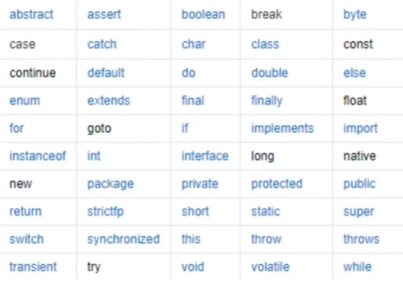
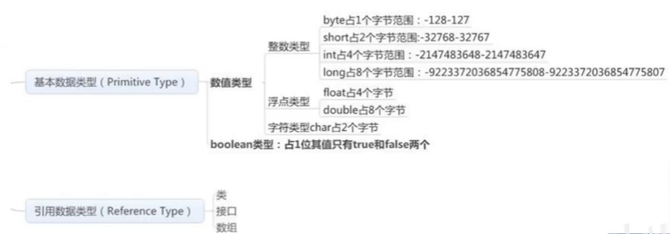

# Java概念

## Java特性和优势

- 简单性

- 面向对象

- 可移植性

- 高性能

- 分布式

- 动态性

- 多线程

- 安全性

- 健壮性

  

## Java三大版本

- **JavaSE：**  标准版（桌面程序，控制台开发）

- **JavaME：**嵌入式开发（手机，小家电）

- **JavaEE：**企业级开发（web端，服务器开发）

  

## JDK、JRE、JVM

- **JDK:** Java Development Kit

- **JRE:** Java Runtime Environment

- **JVM:** Java Virtual Machine

  

## 编译型和解释型语言

计算机是不能理解高级语言的，更不能直接执行高级语言，它只能直接理解机器语言，所以使用任何高级语言编写的程序若想被计算机运行，都必须将其转换成计算机语言，即'`机器码`

而这种转换方式有两种：

1. 编译
2. 解释


### 编译型语言

使用专门的编译器，针对特定的平台，将高级语言源代码一次性的编译成可被该平台硬件执行的机器码，并包装成该平台所能识别的可执行性程序的格式。

#### 特点

在编译型语言习得程序执行之前，需要一个专门的编译过程，把源代码编译成及其语言的文件，如exe格式的文件，以后要再运行时，直接使用编译结果即可，如直接运行exe文件。因为只需要编译一次，以后运行时不需要编译，所以编译型语言执行效率高。

#### 总结

		1. 一次性的编译成平台相关的机器语言文件，运行时脱离开发环境，运行效率高；
  		2. 与特定平台相关，一般无法移植到其他平台；
  		3. 现有的C、C++、Objective等都属于编译型语言。


### 解释型语言

使用专门的解释器对源程序逐行解释成特定平台的机器码并立即执行，是代码在执行时才被解释器一行行动态翻译和执行，而不是在执行之前就完成翻译。

#### 特点

解释型语言不需要事先编译，其直接将源代码解释成机器码并立即执行，所以只要某一平台提供了相应的解释器即可运行改程序。

#### 总结

		1. 解释型语言每次运行都需要将源代码解释成机器码并执行，效率较低；
  		2. 只要平台提供相应的解释器，就可以运行源代码，所以可以方便源程序移植。


### 编译型与解释型两者利弊

前者由于程序执行速度快，同等条件下对系统要求较低，因此像开发操作系统、大型应用程序、数据库系统等时都采用它，像C/C++、Pascal/Object Pascal(Delphi)等都是编译语言，而一些网页脚本、服务器脚本及辅助开发接口这样的对速度要求不高、对不同系统平台间的兼容性有一定要求的程序则通常使用解释型语言，如Java、JavaScript、VBScript、Perl、Python、Ruby、Matlab等。


### 关于Java

Java和其他语言不太一样。因为Java针对不同的平台有不同的JVM，实现了跨平台。所以Java语言有一次编译到处运行的说法。

1. **你可以说它是编译型的：**因为所有的Java代码都是要编译的，.java不经过编译就没有用
2. **你可以说它是解释型的：**因为Java代码编译后不能直接运行，它是解释运行在JVM上的，所以它是解释运行的。
3. 但是，现在的JVM为了效率，都有一些JIT优化。它又会把.class的二进制代码编译为本地的代码直接运行，**所以，又是编译的**。

#### 总结

Java是解释型的语言，因为虽然Java也需要编译，编译成.class文件，但是并不是机器可以识别的语言，而是字节码，最终还是需要JVM的解释，才能在各个平台执行，这同时也是Java跨平台的原因。所以可以说java是编译型的，也是解释型的。

>以上内容参考博客
>
>https://www.jianshu.com/p/54e2aeca013b


## 标识符

### 关键字



==Java所有的组成部分都需要名字，类名、变量名以及方法名都被称为标识符==


### 标识符注意点

- 所有的标识符都应该以字母（A-Z或者a-z），美元符（$）、或者下划线（_）开始

- 首字符之后可以是字母（A-Z或者a-z），美元符（$）、下划线（_）或数字的任何字符组合

- ==不能使用关键字作为变量名或方法名==

- 标识符是==大小写敏感的==

- 合法的标识符举例：age、$salary、_value、__1_value

- 非法标识符举例：123abc、-salary、#abc

- ==可以使用中文命名，但是一般不建议，很low==

  ```java
  public static void main(String[] args){
      String 王者荣耀 = "最强王者"
          System.out.println(王者荣耀);
  }
  ```

  

## 数据类型

### 强类型语言

要求变量的使用要严格符合规定，所有变量都必须先定义后才能使用


### 弱类型语言

要求变量的使用要符合规定


### Java的数据类型分为两大类

- **基本类型**（primitive type）
- **引用类型**（reference type）




### 什么是字节

- **位（bit）：**是计算机`内部数据`存储的最小单位，11001100是一个八位二进制数；

- **字节（byte）:**是计算机`数据处理`的基本单位，习惯上用大写B来表示；

- **1B（byte，字节）= 8bit（位）**

- **字符：**是指计算机中使用的字母、数据、字和符号

- 1bit表示1个位

- 1Byte表示一个字节1B=8b

- 1024B=1KB

- 1024KB=1M

- 1024M=1G

  >思考：电脑的32位和64位的区别是什么？
  >
  >32位、64位都是说明了计算机的寻址能力
  >
  >32位只能寻址4G，而64位能寻址128G，因此32位操作系统只支持4G内存


### 类型转换

- 由于Java是强类型语言，所以要进行有些运算的时候，需要用到类型转换。

  >低 --------------------------------------------> 高
  >
  >byte,short,char -> int -> long -> float -> double

- 运算中，不同类型的数据先转化为同一类型，然后进行运算


## 变量

- 变量就是可以变化的量；

- Java是一种强类型语言，每个变量都必须声明其类型；

- Java变量是程序中最基本的存储单元，其要素包括变量名，变量类型和作用域；

  ```java
  type varName [=value] [{,varName[=value]}];
  // 数据类型 变量名 = 值；可以使用逗号隔开来声明多个同类型变量
  ```

#### **注意事项：**

- 每个变量都有类型，类型可以是基本类型，也可以是引用类型；

- 变量名必须是合法的标识符；

- 变量名称是一条完整的语句，因此每一个声明都必须以分号结束。

  

### 变量作用域

- 类变量

- 实例变量

- 局部变量

  ```java
  public class Demo {
      // 类变量 static
      // 类变量是从属与这个类的，随着类一起出来一起消失
      static double salary = 2500;
      
      // 属性：变量
      // 实例变量：从属于对象；如果不自行初始化，这个类型将自动初始化为默认值
      // 整数初始化为0，浮点数初始化为0.0，布尔值初始化为false
      // 除了基本类型，其余的默认值都是null
      String name;
      int age;
      
      public static void main(String[] args) {
          // 局部变量，必须声明和初始化值
          int i = 10;
          System.out.println(i);
          
          // 实例变量的使用
          // 变量类型 变量名字 = new Demo();
          Demo demo = new Demo();
          System.out.println(demo.age); // 0，默认值
          System.out.println(demo.name); // null，默认值
          
          // 类变量的使用 static
          System.out.println(salary);
      }
      
      // 其他方法
      public void add() {
          // 无法使用局部变量
          // System.out.println(i);
      }
  }
  ```


### 变量的命名规范

- 所有变量、方法、类名：==见名知意==

- 类成员变量：首字母小写和驼峰原则：monthSalary 除了第一个单词以外，后面的单词首字母大写 lastName

- 局部变量：首字母小写和驼峰原则

- 常量：大写字母和下划线：MAX_VALUE

- 类名：首字母大写和驼峰原则：Man，GoodMan

- 方法名：首字母小写和驼峰原则：run()，runRun()

  

## 常量

- 常量（Constant）：初始化（initialize）后不能再改变值！不会变动的值；

- 所谓常量可以理解成一种特殊的变量，它的值被设定后，在程序运行过程中不允许被改变。

  ```java
  final 常量名 = 值;
  final double PI = 3.14;
  ```

- 常量名一般使用大写字母

  ```java
  public class Demo06 {
      // 修饰符，不存在先后顺序
      static final double PI = 3.14;
  
      public static void main(String[] args) {
          System.out.println(PI);
      }
  }
  ```


## 运算符

### Java语言支持如下运算符

- **算数运算符：**+，-，*，/，%，++，--

- **赋值运算符：**=

- **关系运算符：**>，<，>=，<=，==，!=, instanceof

- **逻辑运算符：**&&，||，！

- **位运算符：**&，|，^，~，>>，<<，>>>

- **条件运算符：**?  :

- **扩展赋值运算符：**+=，-=，*=，/=

  ```java
  public class Demo01 {
      public static void main(String[] args) {
          //二元运算符
          //Ctrl+D 复制当前行到下一行
          int a = 10;
          int b = 20;
          int c = 25;
          int d = 25;
          
          System.out.println(a+b); //30
          System.out.println(a-b); //-10
          System.out.println(a*b); //200
          System.out.println(a/(double)b); //0.5
      }
  }
  ```

  ```java
  public class Demo02 {
      public static void main(String[] args) {
          long a = 1231451521313L;
          int b = 123;
          short c = 10;
          byte d = 8;
  
          System.out.println(a + b + c + d); //Long
          System.out.println(b + c + d); //Int
          System.out.println(c + d); //Int
      }
  }
  ```

  ```java
  public class Demo03 {
      public static void main(String[] args) {
          int a = 10;
          int b = 20;
          int c = 23;
  
          //关系运算符返回的结果：正确，错误 布尔值
          System.out.println(a > b); //false
          System.out.println(a < b); //true
          System.out.println(a == b); // false
          System.out.println(a != b); // true
          //取余，模运算
          System.out.println(c%a); // 23/10=2 ... 3
      }
  }
  ```

  ```java
  public class Demo04 {
      public static void main(String[] args) {
          //++ -- 自增,自减 一元运算符
          int a = 3;
          System.out.println(a); // 3
          int b = a++;
          int c = ++a;
          System.out.println(b); // 3
          System.out.println(c); // 5
          System.out.println(a); // 5
          
           //幂运算，很多运算，我们会使用一些工具类来操作
          double pow = Math.pow(2, 3);
          System.out.println(pow);
      }
  }
  ```


>**逻辑运算符&& （短路与）**
>
>**特点：**只要碰到了false或者等价于false就短路，只要短路了就不会继续往后执行了。如果短路了，得到造成短路的这个值，如果不短路，得到的是第二个值
>
>##### 逻辑运算符 || （短路或）
>
>**特点**：只要碰到了true或者等价于true的就短路，只要短路了就不会继续往后执行了。如果短路了，得到造成短路的这个值，如果不短路，得到的是第二个值

```java
//逻辑运算符
public class Demo05 {
    public static void main(String[] args) {
        //与(and) 或(or) 非(取发!)
        boolean a = true;
        boolean b = false;

        System.out.println("a && b :" + (a && b));
        System.out.println("a || b :" + (a || b));
        System.out.println("!(a && b) :" + !(a && b));


        //短路运算,短路与 和 短路或
        int c = 5;
        boolean d = (c < 4) && (c++ < 4);
        System.out.println(d);//c<4不满足,则后面就不计算了
        System.out.println(c); //c没有变成6

        int e = 5;
        boolean f = (e > 4) || (e++ < 4);
        System.out.println(e); //e没有变成6
        System.out.println(f);
    }
}
```

```java
public class Demo06 {
    public static void main(String[] args) {
        //  A  = 0011 1100
        //  B  = 0000 1101
        // =================
        // A&B = 0000 1100
        // A|B = 0011 1101
        // A^B = 0011 0001
        // ~B  = 1111 0010

        /*
        面试题: 2*8如何计算的更快
        思路 2*2*2*2,采用左移右移，因为直接采用底层二进制操作,效率极高!
        左移 << *2
        右移 >> /2
        0000 0000        0
        0000 0001        1
        0000 0010        2
        0000 0100        4
        0000 1000        8
        0001 0000        16
         */
        System.out.println(2 << 3); // 16
    }
}
```

```java
public class Demo07 {
    public static void main(String[] args) {
        int a = 10;
        int b = 20;
        a += b; //a=a+b
        System.out.println(a); //30
        a -= b; //a=a-b
        System.out.println(a); //10

        //字符串连接符 + , String
        System.out.println("" + a + b); //1020,先转换为字符串，然后完成拼接工作
        System.out.println(a + b + ""); //30,先计算结果再转换为字符串
    }
}
```


### Java运算符优先级

| 优先级 |                       运算符                       |  结合性  |
| :----: | :------------------------------------------------: | :------: |
|   1    |                     ()、[]、{}                     | 从左向右 |
|   2    |                 !、+、-、~、++、--                 | 从右向左 |
|   3    |                      *、/、%                       | 从左向右 |
|   4    |                        +、-                        | 从左向右 |
|   5    |                    <<、>>、>>>                     | 从左向右 |
|   6    |              <、<=、>、>=、instanceof              | 从左向右 |
|   7    |                       ==、!=                       | 从左向右 |
|   8    |                         &                          | 从左向右 |
|   9    |                         ^                          | 从左向右 |
|   10   |                         \|                         | 从左向右 |
|   11   |                         &&                         | 从左向右 |
|   12   |                        \|\|                        | 从左向右 |
|   13   |                        ? :                         | 从右向左 |
|   14   | =、+=、-=、*=、/=、&=、\|=、^=、~=、<<=、>>=、>>>= | 从右向左 |


## 包机制

- 为了更好地组织类，Java提供了包机制，用于区别类名的命名空间；

- 包语句的语法格式为：

- ```java
  package pkg1[. pkg2[. pkg3...]];
  ```

- ==一般利用公司域名倒置作为包名==；如 com.oddlife.blog

- 为了能够使用某一个包的成员，我们需要在Java程序中明确导入该包。使用"import"语句可以完成此功能

- ```java
  import package1[.package2 ...].(classname|*); // *代表通配符，导入包下所有的类
  ```

- <u>==**重点：一定要学习阿里巴巴开发手册上的规则**==</u>


## JavaDoc

- JavaDoc命令是用来生成自己API文档的

- 参数信息

  - @author 作者名
  - @version 版本号
  - @since 指明需要最早使用的jdk版本
  - @param 参数名
  - @return 返回值情况
  - @throws 异常抛出情况

  ```java
  /**
   * @author oddlife
   * @version 1.0
   * @since 1.8
   */
  public class Doc {
      String name;
  
      /**
       * @param name
       * @return
       * @throws Exception
       */
      public String test(String name) throws Exception {
          return name;
      }
  
      /*
      通过命令行 javadoc 参数 java文件生成doc
      学会查找使用IDEA生成JavaDoc文档!
       */
  }
  ```