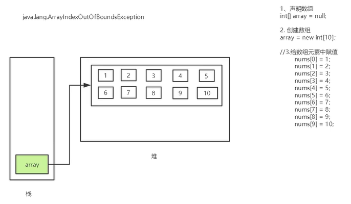
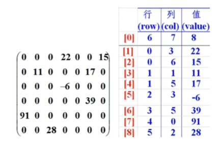

# Java数组

## 数组的定义

- 数组是相同类型数据的有序集合；
- 数组描述的是相同类型的若干数据，按照一定的先后次序排列组合而成；
- 其中，每一个数据称作一个数组元素，每个数组元素可以通过一个下标来访问它们。


## 数组的声明创建

- 首先必须声明数组变量，才能在程序中使用数组。声明数组的语法：

```java
dataType[] arrayRefVar; //首选的方法
dataType arrayRefVar[]; //效果相同，但不是首选方法
```

- `Java`语言使用`new`操作符来创建数组，语法如下：

```java
dataType[] arrayRefVar = new dataType[arraySize];
```

- 数组的元素是通过索引访问的，数组索引从0开始；
- 获取数组的长度：`arrays.length`

```java
//例子
int[] nums; // 1.声明一个数组
nums = new int[10]; //2.创建一个数组

//3.给数组元素赋值
nums[0] = 1;
nums[1] = 2;

System.out.println(nums[10]);//发生数组索引越界问题！
```


## Java内存分析

### Java内存

- #### 堆
  - 存放`new`的对象和数组
  - 可以被所有的线程共享，不会存放别的对象引用

- #### 栈
  - 存放基本变量类型（会包含这个基本类型的具体数值）
  - 引用对象的变量（会存放这个引用在堆里面的具体地址）

- #### 方法
  - 可以被所有的线程共享
  - 包含了所有的`class`和`static`变量

- #### 其他

  

### **数组的内存分析：**




## 数组三种初始化

### 静态初始化

```java
int[] a = {1,2,3};
Man[] mans = {new Man(1,1), new Man(2,2)};
```

### 动态初始化

```java
int[] a = new int[2];
a[0] = 1;
a[1] = 2;
```

### 数组的默认初始化

数组是引用类型，它的元素相当于类的实例变量，因此数组一经分配空间，其中的每个元素也被按照实例变量同样的方式被隐式初始化。

```java
public class ArrayDemo01 {
    public static void main(String[] args) {
        //静态初始化：创建+赋值
        int[] a = {1, 2, 3, 4, 5, 6, 7, 8};
        System.out.println(a[0]); //1

        //动态初始化
        int[] b = new int[10];
        b[0] = 10;
        System.out.println(b[0]); //10
        System.out.println(b[1]); //0
    }
}
```


## 数组的四个基本特点

- 其长度是确定的。数组一旦被创建，它的大小就是不可以改变的；
- 其元素必须是相同类型，不允许出现混合类型；
- 数组中的元素可以是任何数据类型，包括基本类型和引用类型；
- 数组变量属于引用类型，数组也可以看成是对象，数组中的每个元素相当于该对象的成员变量；
- 数组本身就是对象，**Java中对象是在堆中**的，因此数组无论保存原始类型还是其他对象类型，**数组对象本身是在堆中的**


## 数组边界

- 下标的合法区间：`[0, length -1]`，如果越界就会报错；

```java
public static void main(String[] args){
    int[] a = new int[2];
    System.out.println(a[2]);
}
```

- **<u>*常见错误：ArrayIndexOutOfBoundsException：数组下标越界异常！*</u>**
- 数组是相同数据类型（数据类型可以为任何类型）的有序集合
- 数组也是对象。数组元素相当于对象的成员变量；
- 数组长度是确定的，不可变的。如果越界，则报：`ArrayIndexOutOfBounds`。


## 数组使用

- `for-each`循环

```java
public class ArrayDemo02 {
    public static void main(String[] args) {
        int[] arrays = {1, 2, 3, 4, 5};

        //打印全部的数组元素
        for (int i = 0; i < arrays.length; i++) {
            System.out.println(arrays[i]);
        }
        System.out.println("================");

        //计算所有元素的和
        int sum = 0;
        for (int i = 0; i < arrays.length; i++) {
            sum += arrays[i];
        }
        System.out.println("sum = " + sum);
        System.out.println("================");

        //查找最大元素
        int max = arrays[0];
        for (int i = 1; i < arrays.length; i++) {
            if (max < arrays[i]) {
                max = arrays[i];
            }
        }
        System.out.println("max = " + max);
    }
}
```

```java
//jdk1.5，增强型for循环，没有下标
public class ArrayDemo03 {
    public static void main(String[] args) {
        int[] arrays = {1, 2, 3, 4, 5};

        for (int array : arrays) {
            System.out.println(array);
        }
    }
}
```

- 数组作方法入参
- 数组作返回值

```java
public class ArrayDemo04 {
    public static void main(String[] args) {
        int[] arrays = {1, 2, 3, 4, 5};
        printArray(arrays);
        changeArray(arrays);
        printArray(arrays);
        int[] result = reverse(arrays);
        printArray(result);
    }

    //数组作为入参
    public static void printArray(int[] arrays) {
        for (int i = 0; i < arrays.length; i++) {
            System.out.println(arrays[i] + "");
        }
        System.out.println("================");
    }

    //数组作为返回值
    public static int[] changeArray(int[] arrays) {
        for (int i = 0; i < arrays.length; i++) {
            arrays[i] += i;
        }
        return arrays;
    }

    //反转数组
    public static int[] reverse(int[] arrays) {
        int[] result = new int[arrays.length];

        //反转的操作
        for (int i = 0, j = result.length - 1; i < arrays.length; i++, j--) {
            result[j] = arrays[i];
        }

        return result;
    }
}
```


## 多维数组

- 多维数组可以看成是数组的数组，比如二维数组就是一个特殊的一维数组，其每一个元素都是一个一位数组；
- 二维数组：`int a[][] = new int[2][5];`
- 解析：以上二维数组a可以看成一个两行五列的数组；
- 多维数组的使用：`num[1][0];`

```java
public class ArrayDemo05 {
    public static void main(String[] args) {
        int[][] array = {{1, 2, 3}, {2, 3, 4}, {3, 4, 5}, {4, 5, 6}};

        //遍历数组方法1
        for (int i = 0; i < array.length; i++) {
            printArray(array[i]);
        }
        System.out.println("================");

        //遍历数组方法2
        for (int i = 0; i < array.length; i++) {
            for (int j = 0; j < array[i].length; j++) {
                System.out.print(array[i][j]);
            }
            System.out.println();
        }
        System.out.println("================");

        //遍历数组方法3 for each
        for (int[] index : array) {
            printArray(index);
        }
        System.out.println("================");

        //打印数组长度
        System.out.println(array.length);//包含几个数组
        System.out.println(array[0].length);//每个数组的长度
    }

    public static void printArray(int[] arrays) {
        for (int i = 0; i < arrays.length; i++) {
            System.out.print(arrays[i] + "");
        }
        System.out.println();
    }
}
```


## Arrays类

- 数组的工具类`java.util.Arrays`；
- 由于数组对象本身并没有什么方法可以供我们调用，但API中提供了一个工具类`Arrays`供我们使用，从而可以对数据进行一些基本的操作；
- 查看`JDK`帮助文档；
- `Arrays`类中的方法都是`static`修饰的静态方法，在使用的时候可以直接使用类名进行调用，而"不用"使用对象来调用（注意是"不用"而不是"不能"）

- **具有以下常用功能：**
  - **给数组赋值：**通过`fill`方法；
  - **对数组排序：**通过`sort`方法，按升序；
  - **比较数组：**通过`equals`方法比较数组中元素值是否相等；
  - **查找数组元素：**通过`binarySearch`方法能对排序好的数组进行二分查找法操作。


## 稀疏数组

**产生原因：**有些情况下二维数组的很多值是默认值0，因此记录了很多没有意义的数据；

**解决方法：**通过稀疏数组；

- 当一个数组中大部分元素为0，或者为同一值得数组时，可以使用稀疏数组来保存该数组；
- 稀疏数组的处理方式是：
- 记录数组一共有几行几列，有多少个不同值；
- 把具有不同值得元素和行列及值记录在一个小规模的数组中，从而缩小程序的规模；
- 如下图：左边是原始数组，右边是稀疏数组



```java
public class ArrayDemo06 {
    public static void main(String[] args) {
        //1.创建一个二位数组 11*11 0:没有棋子 1:黑棋 2:白棋
        int[][] array1 = new int[11][11];
        array1[1][2] = 1;
        array1[2][3] = 2;
        //输出原始的数组
        System.out.println("输出原始的数组");

        for (int[] ints : array1) {
            for (int anInt : ints) {
                System.out.print(anInt + "\t");
            }
            System.out.println();
        }

        //转换为稀疏数组保存
        //获取有效值的个数
        int sum = 0;
        for (int i = 0; i < 11; i++) {
            for (int j = 0; j < 11; j++) {
                if (array1[i][j] != 0)
                    sum++;
            }
        }
        System.out.println("有效值的个数: " + sum);

        //2.创建一个稀疏数组的数组
        int[][] array2 = new int[sum + 1][3];
        array2[0][0] = 11;
        array2[0][1] = 11;
        array2[0][2] = sum;

        //遍历二维数组，将非零的值，存放稀疏数组中
        int count = 0;
        for (int i = 0; i < array1.length; i++) {
            for (int j = 0; j < array1[i].length; j++) {
                if (array1[i][j] != 0) {
                    count++;
                    array2[count][0] = i;
                    array2[count][1] = j;
                    array2[count][2] = array1[i][j];
                }
            }
        }

        //输出稀疏数组
        System.out.println("输出稀疏数组");
        for (int i = 0; i < array2.length; i++) {
            System.out.println(array2[i][0] + "\t"
                    + array2[i][1] + "\t"
                    + array2[i][2] + "\t");
        }

        System.out.println("===================");
        System.out.println("根据稀疏数组还原成原数组");
        //1.读取稀疏数组
        int[][] array3 = new int[array2[0][0]][array2[0][1]];
        //2.给其中的元素还原给它的值
        for (int i = 1; i < array2.length; i++) {
            array3[array2[i][0]][array2[i][1]] = array2[i][2];
        }
        //3.打印
        System.out.println("输出还原的数组");
        for (int[] ints : array3) {
            for (int anInt : ints) {
                System.out.print(anInt + "\t");
            }
            System.out.println();
        }
    }
}
```

