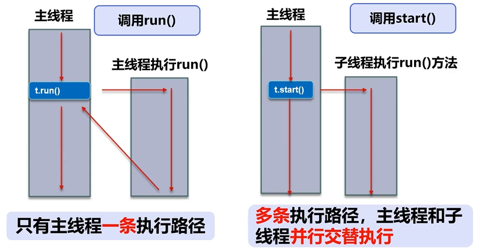

# Java.Thread

## 普通方法调用 & 多线程




## Process & Thread

- 说起进程，就不得不说下**程序**。程序是指令和数据的有序集合，其本身没有任何运行的含义，是一个静态的概念；
- 而**进程**则是执行程序的一次执行过程，它是一个动态的概念，是系统资源分配的单位；
- 通常在一个进程中可以包含若干个线程，当然一个进程中至少有一个线程，不然没有存在的意义。线程是`CPU`调度和执行的单位。

>**注意：**很多多线程是模拟出来的,真正的多线程是指有多个`CPU`，即多核，如服务器。如果是模拟出来的多线程，即在一个`CPU`的情况下，在同一个时间点，`CPU`只能执行一个代码，因为切换的很快，所以就有同时执行的错觉。

#### 概念

- 线程就是独立的执行路径；
- 在线程运行时，即使没有自己创建线程，后台也会有多个线程，如主线程，`GC`线程；
- `main()`称之为主线程，为系统的入口，用于执行整个程序；
- 在一个进程中，如果开辟了多个线程，线程的运行由调度器安排调度，调度器是与操作系统紧密相关的，先后顺序是不能人为干预的；
- 对同一份资源操作时，会存在资源抢夺的问题，需要加入并发控制；
- 线程会带来额外的开销，如`CPU`调度时间，并发控制开销；
- 每个线程在自己的工作内存交互，内存控制不当会造成数据不一致；


## 线程创建

### 线程的三种创建方式

#### Thread class(继承Thread类)

##### Thread创建步骤

- 自定义线程类继承`Thread`类
- 重写`run()`方法，编写线程执行体
- 创建线程对象，调用`start()`方法启动线程

```java
//示例代码
public class StartThread1 extends Thread {
    //线程入口点
    @Override
    public void run() {
        //线程体
        for (int i = 0; i < 20; i++) {
            System.out.println("我在听课=====");
        }
    }
}

public static void main(String[] args) {
    //创建线程对象
    StartThread1 t = new StartThread1();
    t.start();
}
```

```java
//创建线程方式一：继承Thread类，重写run()方法，调用start开启线程
//注意：线程不一定立即执行，CPU安排调度
public class TestThread extends Thread {
    @Override
    public void run() {
        //run方法线程体
        for (int i = 0; i < 200; i++) {
            System.out.println("thread run" + i);
        }
    }

    public static void main(String[] args) {
        //main线程,主线程
        //创建一个线程对象
        TestThread testThread = new TestThread();

        //调用start()方法开启线程
        testThread.start();

        for (int i = 0; i < 1000; i++) {
            System.out.println("main线程" + i);
        }
    }
}
```

##### 下载图片案例Thread

```java
import org.apache.commons.io.FileUtils;

import java.io.File;
import java.io.IOException;
import java.net.URL;

//练习Thread,实现多线程同步下载图片
public class TestThread2 extends Thread {
    private String url; //网络图片地址
    private String name; //保存的文件名

    public TestThread2(String url, String name) {
        this.url = url;
        this.name = name;
    }

    //下载图片的执行体
    @Override
    public void run() {
        WebDownloader webDownloader = new WebDownloader();
        webDownloader.downloader(url, name);
        System.out.println("下载了文件名为:" + name);
    }

    public static void main(String[] args) {
        TestThread2 testThread1 = new TestThread2("图片1url", "1.jpg");
        TestThread2 testThread2 = new TestThread2("图片2url", "2.jpg");
        TestThread2 testThread3 = new TestThread2("图片3url", "3.jpg");

        testThread1.start();
        testThread2.start();
        testThread3.start();
        /*
        output:
            下载了文件名为:1.jpg
            下载了文件名为:3.jpg
            下载了文件名为:2.jpg
         注意：不一定是按顺序下载，因为采用的是线程，同时运行
         */
    }
}

//下载器
class WebDownloader {
    //下载方法
    public void downloader(String url, String name) {
        try {
            FileUtils.copyURLToFile(new URL(url), new File(name));
        } catch (IOException e) {
            e.printStackTrace();
            System.out.println("IO异常,downloader方法出现问题");
        }
    }
}
```

#### Runnable接口(实现Runnable接口)

##### Runnable创建

- 定义`MyRunnable`类实现`Runnable`接口
- 实现`run()`方法，编写线程执行体
- 创建线程对象，调用`start()`方法启动线程
- **<u>*注意：推荐使用Runnable对象，因为Java单继承的局限性*</u>**

```java
//示例代码
public class StartThread3 implements Runnable {
    @Override
    public void run() {
        //线程体
        for (int i = 0; i < 20; i++) {
            System.out.println("我在听课=====");
        }
    }
}

public static void main(String[] args) {
    //创建实现类对象
    StartThread3 st = new StartThread3();
    //创建代理类对象
    Thread thread = new Thread(st);
    //启动
    thread.start();
} 
```

```java
//创建线程方式2：实现runnable接口，重写run方法，执行线程需要丢入runnable接口实现类，调用start方法
public class TestThread3 implements Runnable {
    @Override
    public void run() {
        //run方法体线程
        for (int i = 0; i < 200; i++) {
            System.out.println("thread run" + i);
        }
    }

    public static void main(String[] args) {
        //创建runnable接口的实现类对象
        TestThread3 testThread3 = new TestThread3();

        //创建线程对象，通过线程对象来开启线程，以下的thread为代理
//        Thread thread = new Thread(testThread3);
//        thread.start();
        //以上两句话可以用下面一句话代替
        new Thread(testThread3).start();

        for (int i = 0; i < 1000; i++) {
            System.out.println("main " + i);
        }
    }
}
```

##### 下载图片案例Runnable

```java
//练习Thread,实现多线程同步下载图片
public class TestThread3 implements Runnable {
    private String url; //网络图片地址
    private String name; //保存的文件名

    public TestThread3(String url, String name) {
        this.url = url;
        this.name = name;
    }

    //下载图片的执行体
    @Override
    public void run() {
        WebDownloader webDownloader = new WebDownloader();
        webDownloader.downloader(url, name);
        System.out.println("下载了文件名为:" + name);
    }

    public static void main(String[] args) {
        TestThread2 testThread1 = new TestThread2("图片1url", "1.jpg");
        TestThread2 testThread2 = new TestThread2("图片2url", "2.jpg");
        TestThread2 testThread3 = new TestThread2("图片3url", "3.jpg");

        //只需改成如下三行即可
        new Thread(testThread1).start();
        new Thread(testThread2).start();
        new Thread(testThread3).start();
    }
}

```

##### Thread & Runnable比较

###### 继承Thread类

子类继承Thread类具备多线程能力；

启动线程：子类对象.start();

不建议使用：避免OOP单继承局新型

###### 实现Runnable接口

实现接口Runnable具体多线程能力

启动线程：传入目标对象+Thread对象.start()

推荐使用：避免单继承局限性，灵活方便，方便同一个对象被多个线程使用


#### Callable接口（实现Callable接口）