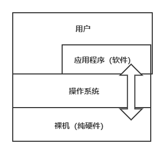
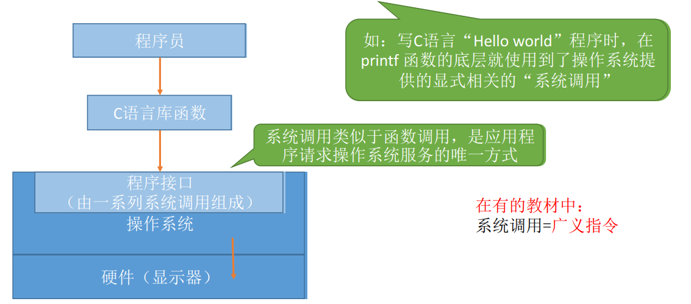
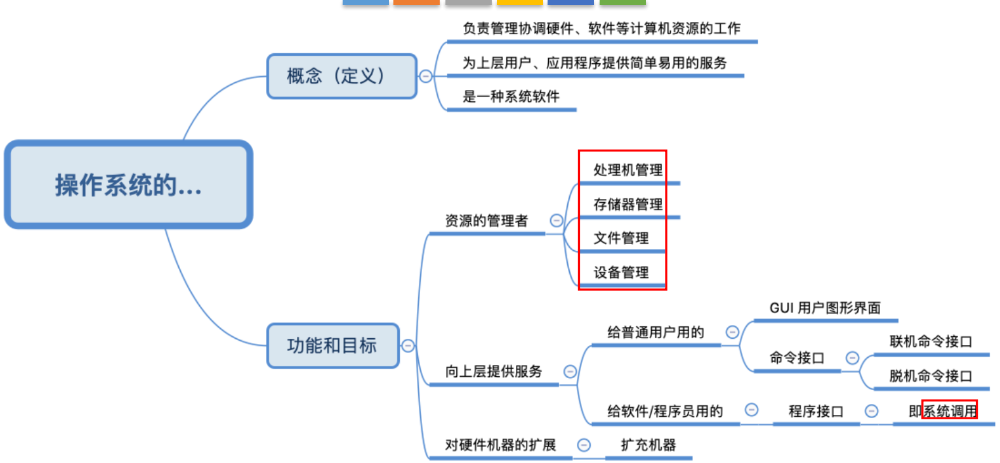

## 操作系统简单概述

- **操作系统**（Operating System，OS）是指控制和**管理**整个计算机系统的**硬件和软件**资源，并合理地组织调度计算机的工作和资源的分配。以**提供给用户和其他软件方便的接口和环境**。它是计算机系统中最基本的**系统软件**；

- 操作系统是系统资源的管理者；
- 操作系统向上层（用户）提供方便易用的服务；
- 操作系统是最接近硬件的一层软件；

### 一、操作系统的功能和目标 —— 作为系统资源的管理者

- 用QQ和朋友视频聊天的过程：
  - STEP1: 在各个文件夹中找到QQ安装的位置（如D:/Tencent/QQ/Bin）。逐层打开文件夹，找到QQ.exe这个程序（可执行文件）的存放位置。这是操作系统的**文件管理**功能；
  - STEP2: 双击打开QQ.exe。需要把该程序相关数据放入内存。注意：执行一个程序前**需要将改程序放到内存中**，才能被CPU处理。这是操作系统的**存储器管理**功能；
  - STEP3: QQ程序正常运行。对应的进程被处理机（CPU）处理。这是操作系统的**处理机管理**功能；
  - STEP4: 开始和朋友视频聊天。需要将摄像头设备分配给进程。这是操作系统的**设备管理**功能；

- **操作系统作为系统资源的管理者**：
  - 提供的功能：
    - 处理机管理
    - 存储器管理
    - 文件管理
    - 设备管理
  - 目标
    - 安全、高效

### 二、操作系统的功能和目标 —— 向上层提供方便易用的服务

- **裸机（纯硬件）**：硬件只听得懂二进制指令，如：010101001110001，硬件对外暴露了"丑陋"、不友好的交互接口；

- **操作系统**：在硬件之上安装了操作系统，操作系统对外暴露了"美丽"、友好的交互接口；

- **操作系统封装思想**：操作系统把一些丑陋的硬件功能封装成简单易用的服务，使用户能更方便地使用计算机，用户无需关心底层硬件的原理，只需要对操作系统发出命令即可；

- **操作系统提供的简单易用的服务**：

  - GUI：图形化用户接口（Graphical User Interface），用户可以使用形象的图形界面进行操作，而不再需要记忆复杂的命令、参数；
  - 联机命令接口：联机命令接口=交互式命令接口，即Win+R，cmd。特点：用户说一句，系统会跟着做一句；
  - 脱机命令接口：脱机命令接口=批处理命令接口，如.bat文件。特点：用户说一堆，系统跟着做一堆；
  - 程序接口：可以在程序中进行**系统调用**来使用程序接口。普通用户不能直接使用程序接口，只能通过程序代码**间接**使用；

  

### 三、操作系统的功能和目标 —— 作为最接近硬件的层次

- 需要实现对**硬件机器的扩展**；
  - 类比汽车：
    - 发动机只会转，轮胎只会滚；
    - 在原始的硬件机器上覆盖一层传动系统——让发动机带着轮着转——使原始的硬件机器得到了扩展；
  - 操作系统对硬件机器的扩展：
    - 将CPU、内存、磁盘、显示器、键盘等硬件合理地组织起来，让各种硬件能够相互协调配合，实现更多更复杂的功能；
    - 普通用户无需关心这些硬件在底层是怎么组织起来工作的，只需直接使用操作系统提供的接口即可；
- 没有任何软件支持的计算机称为**裸机**。在裸机上安装的操作系统，可以提供资源管理功能和方便用户的服务功能，将裸机改造成功能更强、使用更方便的及其；
- 通常把覆盖了软件的及其称为**扩充机器**，又称为**虚拟机**；

## 知识点

