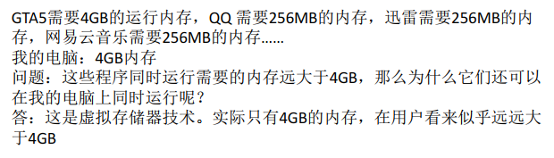
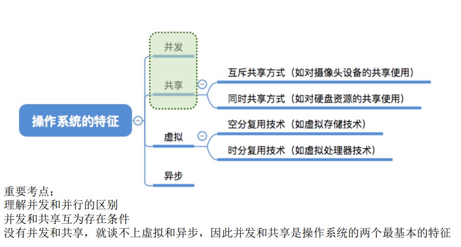

## 操作系统的四个特征

### 一、知识总览

### 二、操作系统的特征 —— 并发

- **并发**：指两个或多个事件在同一时间间隔发生。这些事件宏观上是同时发生的，但微观上是交替发生的；
- **并行**：指两个或多个事件在同一时刻同时发生

- **操作系统的并发性**指计算机系统中"同时"运行着多个程序，这些程序宏观上看是同时运行着的，而微观上看是交替运行的；
- 操作系统就是伴随着"多道程序技术"而出现的。因此，**操作系统和程序并发是一起诞生的**；
- **单核CPU**同一时刻只能执行**一个程序**，各个程序只能**并发**地执行；
- 多核CPU同一时刻可以同时执行**多个程序**，多个程序可以**并行**地的执行；
  - 比如Intel的第八代i3处理器就是**4核CPU**，意味着可以**并行地执行4个程序**；
  - 即使是对于4核CPU来说，只要有4个以上的程序需要"同时"运行，那么并发性依然是必不可少的，因此**并发性是操作系统一个最基本的特性**；

### 三、操作系统的特征 —— 共享

- **共享**即资源共享，是指系统中的资源可供内存中多个并发执行的进程共同使用；
- 两种资源共享方式：
  - 互斥共享方式：
    - 系统中的某些资源，虽然可以提供给多个进程使用，但**一个时间段内只允许一个进程访问该资源**；
  - 同时共享方式：
    - 系统中的某些资源，**允许一个时间段内由多个进程"同时"对它们进行访问**；
- 所谓的"同时"往往上是宏观上的，而在微观上，这些进程可能是交替地对该资源进行访问的（即分时共享）；
- 生活实例：
  - 互斥共享方式：使用QQ和微信视频。同一时间段内摄像头只能分配给其中一个进程；
  - 同时共享方式：使用QQ发送文件A，同时使用微信发送文件B。宏观上看，两边都在同时读取并发送文件，说明两个进程都在访问硬盘资源，从中读取数据。微观上看，两个进程是交替着访问硬盘的；

### 四、操作系统的特征 —— 并发和共享的关系

- **并发性**指计算机系统中同时存在着多个运行着的程序；
- **共享性**是指系统中的资源可供内存中多个并发执行的进程共同使用；

- 并发与共享的关系例子：使用QQ发送文件A，同时使用微信发送文件B
  - 两个进程正在并发执行（**并发性**）
    - 如果失去并发性，则系统中只有一个程序正在运行，则共享性失去存在的意义；
  - 需要共享地访问硬盘资源（**共享性**）
    - 如果失去共享性，则QQ和微信不能同时访问硬盘资源，就无法实现同时发送文件，也就无法并发；
- 因此并发性和共享性**互为存在条件**；

### 五、操作系统的特征 —— 虚拟

- **虚拟**是指把一个物理上的实体变为若干个逻辑上的对应物。物理实体（前者）是实际存在的，而逻辑上对应物（后者）是用户感受到的；

- **一个程序需要放入内存并给它分配CPU才能执行**；
- 虚拟技术中的"**空分复用技术**"：

- 虚拟技术中的"**时分复用技术**": 微观上处理机在各个微小的时间段内交替着为各个进程服务；

- **虚拟技术**
  - 空分复用技术（如虚拟存储器技术）
  - 时分复用技术（如虚拟处理器）
- 显然，如果失去了并发性，则一个时间段内系统中只需运行一道程序，那么就失去了实现虚拟性的意义了。因此，**没有并发性，就谈不上虚拟性**；

### 五、操作系统的特征 —— 异步

- **异步**：在多道程序环境下，允许多个程序并发执行，但由于资源有限，进程的执行不是一贯到底的，而是走走停停，以不可预知的速度向前推进，这就是进程的异步性；
- 只有系统有并发性，才有可能导致异步性；

## 知识点

