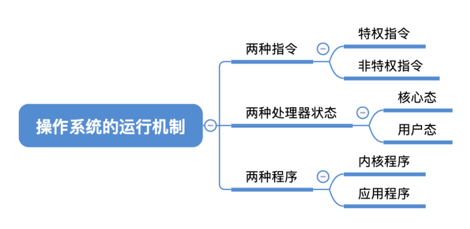
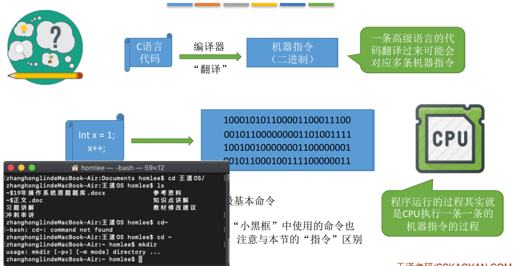
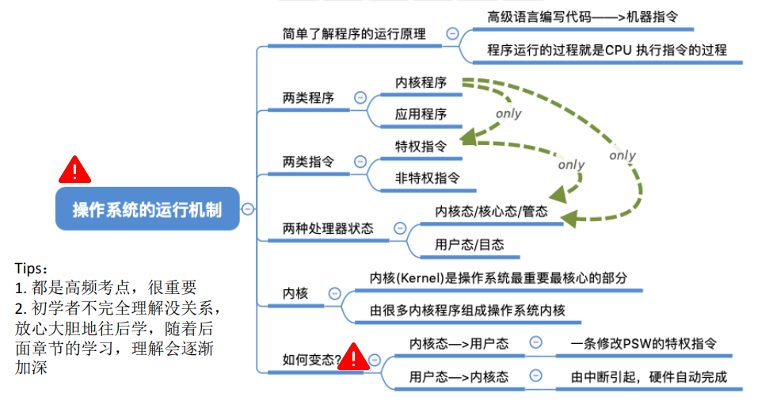

## 操作系统的运行机制

### 一、知识总览

### 二、程序是如何运行的？

- 一条高级语言的代码翻译过来可能会对应多条机器指令；
- 程序运行的过程其实就是CPU执行一条一条的机器指令的过程；
- "指令"就是处理器（CPU）能识别、执行的最基本命令；
- 注意：很多人习惯把Linux、Windows、MacOS的terminal中使用的命令称为"指令"，其实这是"交互式命令接口"，与这里讲到的"指令"不同，这里的"指令"指**二进制机器指令，只有CPU能够识别、执行**；

### 三、内核程序 v.s. 应用程序

- 我们普通程序员写的程序就是"应用程序"；
- 微软、苹果有一帮人负责实现操作系统，他们写的是"**内核程序**"；
- 由很多内核程序组成了"**操作系统内核**"，或简称"**内核(Kernel)**"；
- **内核**是操作系统最重要最核心的部分，也是**最接近硬件的部分**。甚至可以说，一个操作系统只要有内核就够了（eg：Docker -> 仅需Linux内核）；
- 操作系统的功能未必都在内核中，如图形化用户界面GUI；

### 四、特权指令 v.s. 非特权指令

- **应用程序**只能使用"**非特权指令**"，如：加法指令、减法指令等；
- **操作系统内核**作为"管理者"，有时会让CPU执行一些"**特权指令**"，如：内存清零指令。这些指令影响重大，**会影响其他程序的运行**，因此只允许"管理者" —— 即操作系统内核来使用；
- 在**CPU设计和生产的时候就划分了特权指令和非特权指令**，因此CPU执行一条指令前就能判断出其类型；

### 五、内核态 v.s. 用户态

<u>CPU能判断出指令类型，但它是怎么区分此时正在运行的是内核程序or应用程序？</u>

- CPU有两种状态，"**内核态**"和"**用户态**"；
  - 处于**内核态时**，说明此时正在**运行的是内核程序**，此时**可以执行特权指令**；
  - 处于**用户态时**，说明此时正在**运行的是应用程序**，此时**只能执行非特权指令**；
- CPU中有一个寄存器叫**程序状态字寄存器（PSW）**，其中有一个二进制位，1表示"内核态"，0表示"用户态"；
- 内核态 = 核心态 = 管态；
- 用户态 = 目态；

<u>CPU如何实现状态的切换？</u>

- 一个案例步骤：
  1. 刚开始机时，CPU为"**内核态**"，加载操作系统使系统初始化，操作系统内核程序先上CPU运行。此时CPU执行内核程序；
  2. 开机完成后，用户可以启动某个应用程序，在启动前CPU正在运行内核程序，处于内核态；
  3. 操作系统内核程序在合适的时候主动让出CPU，让该应用程序上CPU运行。即操作系统内核在让出CPU之前，会**用一条特权指令把PSW的标志位设置为"用户态"**；
  4. 如果此时，有一位猥琐黑客在应用程序中植入了一条特权指令，企图破坏系统，
  5. CPU在读入指令的时候，它已经能判断接下来要执行的这条指令是特权指令，但是它发现自己处理"用户态"，就知道现在执行的是应用程序，而不是内核程序。一个应用程序竟然想用特权指令，这个事情是必须禁止的；
  6. 因此这样的非法事件会引发一个**中断信号**，当**CPU检测到中断信号后**，会立即**变成"核心态"**，并停止运行当前的应用程序，**转而运行处理中断信号的内核程序**；
  7. 接着"中断"使操作系统再次夺回CPU的控制权；

- **内核态 -> 用户态**：执行一条**特权指令** —— **修改PSW**的标志位为"用户态"，这个动作意味着操作系统将主动让出CPU使用权；

- **用户态 -> 内核态**：由"**中断**"引发，**硬件自动完成变态过程**，触发中断信号意味着操作系统将强行夺回CPU的使用权；
- 除了非法使用特权指令之外，还有很多事情会出发中断信号。一个共性是，**但凡需要操作系统介入的地方，都会触发中断信号**；

## 知识点

