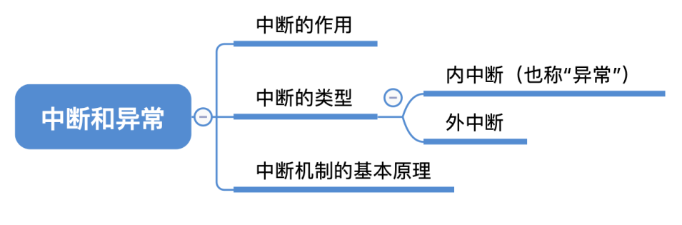
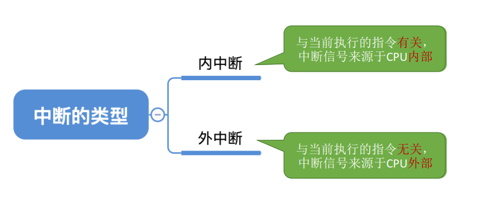
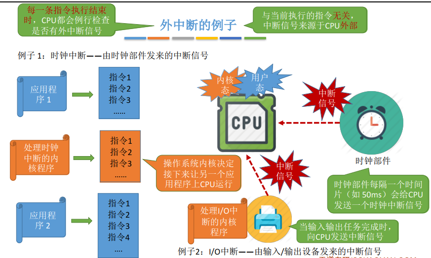
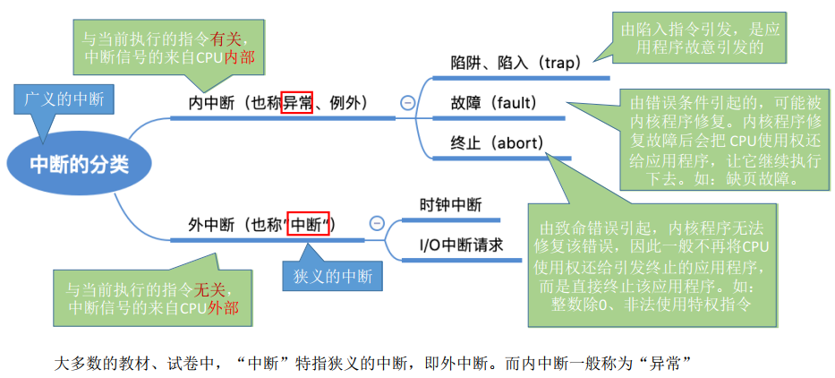
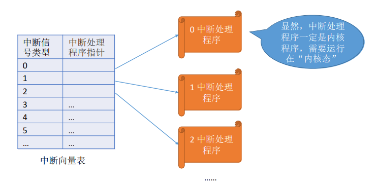
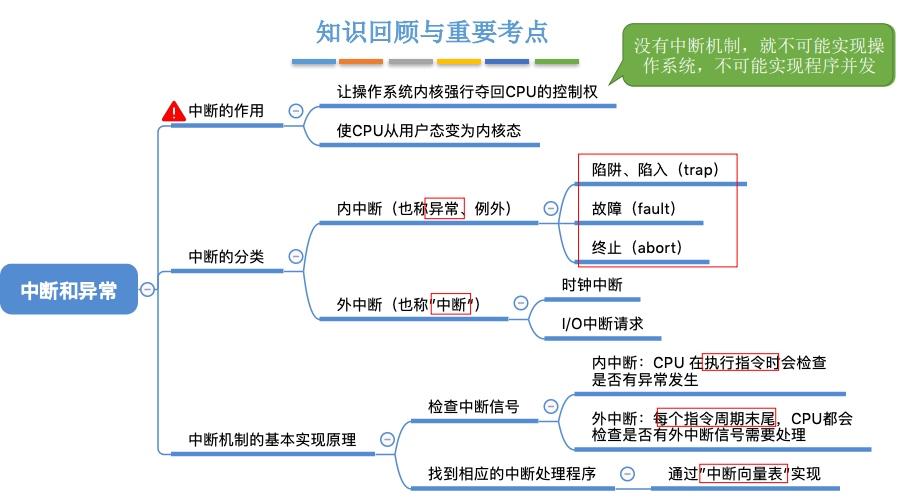

## 中断和异常

### 一、知识总览

### 二、中断的作用

- CPU上会运行两种程序，一种是**操作系统内核程序**（整个系统的管理者），一种是**应用程序**；
- **中断的作用**："中断"会使CPU由用户态变为内核态，使操作系统重新夺回对CPU的控制权（在合适的情况下，操作系统内核会把CPU的使用权主动让给应用程序）；
- "中断"是**让操作系统内核夺回CPU使用权**的唯一途径；
- **如果没有"中断"机制**，那么一旦应用程序上CPU运行，CPU就会一直运行这个应用程序。因此何来**并发**？
- **内核态 -> 用户态**：执行一条特权指令 —— 修改PSW的标志位为用户态，这个动作意味着操作系统将主动让出CPU使用权；
- **用户态 -> 内核态**：由"中断"引发，硬件自动完成变态过程，触发中断信号意味着操作系统将强行夺回CPU的使用权；

### 三、中断的类型

### 四、内中断

- 内中断与当前执行的指令**有关**，中断信号来源于CPU**内部**；
- 内中断例子（若当前执行的指令是非法的，则会引发一个中断信号）：
  - 如试图在用户态下执行特权指令；
  - 如执行除法指令时发现除数为0；
  - 有时候应用程序想请求操作系统内核的服务，此时会执行**一条特殊的指令—— 陷入指令**，该指令会引发一个内部中断信号；
- 执行"陷入指令"，意味着应用程序主动地将CPU控制权还给操作系统内核。"系统调用"就是通过陷入指令完成的，**陷入指令并不是特权指令，因为它是在用户态下的指令**；

### 五、外中断

- 外中断：与当前执行的指令**无关**，中断信号来源于CPU**外部**。**且每一条指令执行结束时**，CPU都会例行检查是否有外中断信号；

- 例子1：时钟中断——由时钟部件发来的中断信号
  - 时钟部件每隔一个时间片（如50ms）会给CPU发送一个时钟中断信号；
  - 如应用程序1执行了50ms，这时时钟部件就会发出中断信号，应用程序1停止转而运行**处理时钟中断的内核程序**，**操作系统内核决定接下来让另一个应用程序上CPU运行**，接着应用程序2开始执行，50ms后，....；
- 例子2：I/O中断——由输入/输出设备发来的中断信号

### 六、中断的分类

### 七、中断机制的基本原理

- **不同的中断信号，需要用不同的中断处理程序来处理。**当CPU检测到中断信号后，会根据中断信号的类型去查询"**中断向量表**"，以此来找到相应的中断处理程序在内存中的存放位置；
- 中断处理程序一定是**内核程序**，需要运行在"**内核态**"；

## 知识点

- 中断是让CPU从用户态变为内核态的唯一方式；
- 中断是让操作系统内核强行夺回CPU的控制权的一种方式，这样才能让操作系统正常工作，让多个程序并发的执行；

