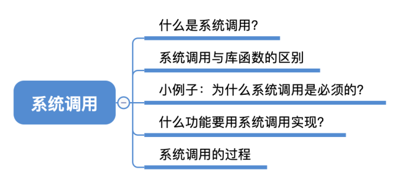
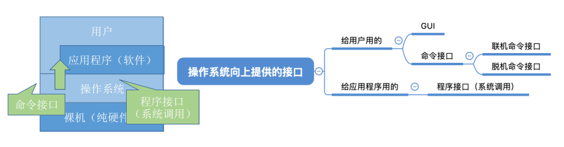
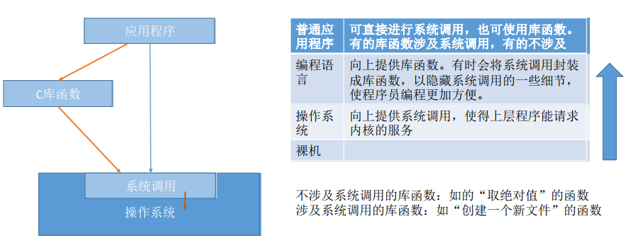
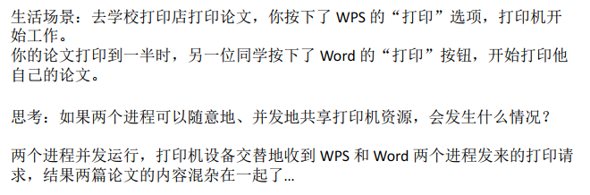
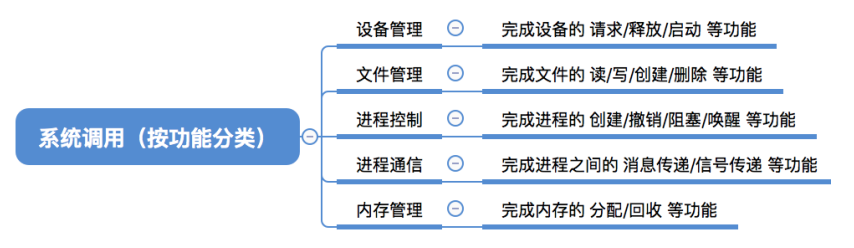
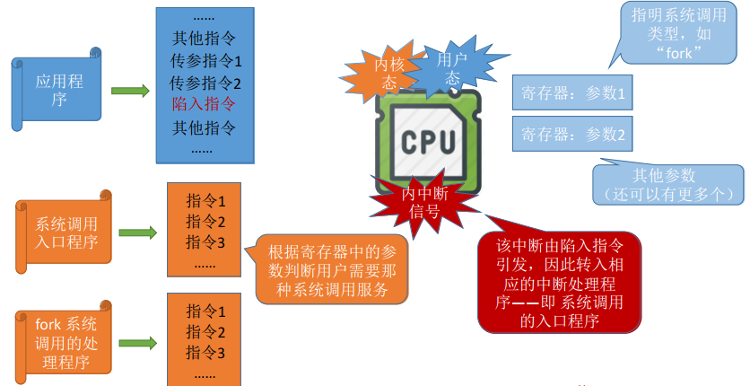
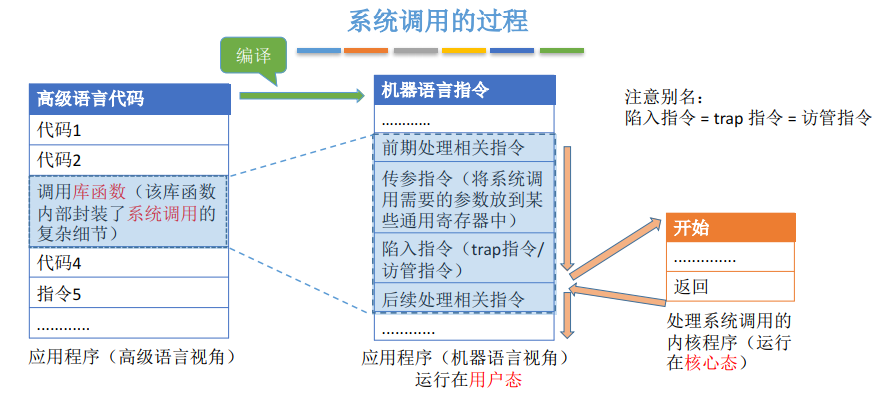
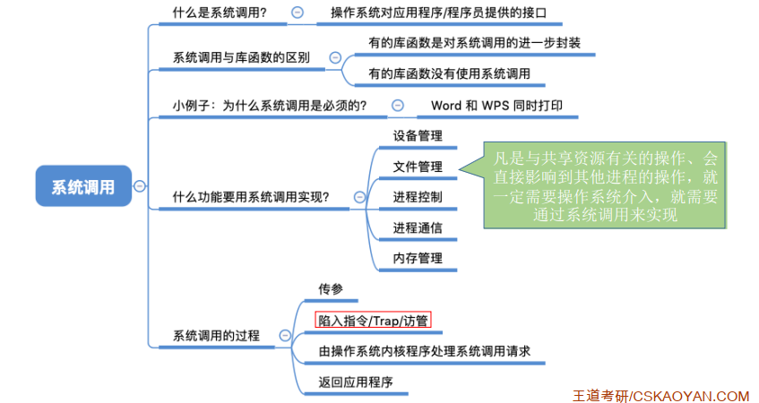

## 系统调用

### 一、知识总览

### 二、什么是系统调用，有何作用？

- 操作系统作为用户和计算机硬件之间的接口，需要向上提供一些简单易用的服务。主要包括命令接口和程序接口。其中，程序接口由一组**系统调用**组成；
- "系统调用"是操作系统提供给应用程序（程序员/编程人员）使用的接口，可以理解为一种可供应用程序调用的特殊函数，**应用程序可以通过系统调用来请求获得操作系统内核的服务**；

### 三、系统调用与库函数的区别

- 库函数既有系统调用的函数，也有不涉及系统调用的函数；

### 四、为什么系统调用是必须的？

- 由于系统当中有各种各样并发的进程，而这些并发的进程有需要共享得使用打印机设备这样的共享资源，但是这样的共享资源是需要**各个进程互斥的共享**的，**如何实现互斥共享**？
- **解决方法**：由操作系统内核对共享资源进行统一的管理，并向上提供"系统调用"，用户进程想要使用打印机这种共享资源，只能通过系统调用向操作系统内核发出请求。内核会对各个请求进行协调处理；

### 五、什么功能要用到系统调用？

- 应用程序通过**系统调用**请求操作系统的服务。而系统中的各个共享资源都由操作系统内核统一掌管，因此**凡是与共享资源有关的操作**（**如存储分配、I/O操作、文件管理等**），**都必须通过系统调用的方式向操作系统提出服务请求**，由操作系统内核代为完成。这样**可以保证系统的稳定性和安全性**，防止用户进行非法操作；

### 六、系统调用的过程

1. 一个应用程序运行在用户态， 它通过了传参指令来给CPU某个寄存器传参数， 如参数1，指明了系统调用时哪种类型的。传参指令可能有多条，主要看系统调用需要传递几个参数，操作系统会根据应用程序提供的参数来判断它想要的到底是哪种类型的服务；
2. 当参数都放到了寄存器里后，应用程序就会执行一条特殊的指令——**陷入指令**，陷入指令的执行会引发一个内中断，CPU检测内中断信号类型后，它发现这是中断信号是由Trap指令引起的，于是CPU就会暂停执行应用程序，转而去处理陷入指令的程序，而这个程序就是系统调用入口程序，这是内核程序，所以要在**内核态**下运行；
3. 接下里系统调用入口程序会检查CPU寄存器里的参数，根据寄存器中的参数判断用户需要那种系统调用服务。如检查到参数1，发现是fork系统调用程序，因此就让fork系统调用的处理程序上CPU执行；
4. 当系统调用处理完后，CPU又会转回用户态，接着执行之前的应用程序；

<u>**库函数系统调用的过程：**</u>

- 传递系统调用参数 -> 执行陷入指令（**用户态**） -> 执行相应的内核请求从程序处理系统调用（**核心态**）-> 返回应用程序；
- **注意**：
  - **陷入指令**是**用户态**执行的，执行陷入指令之后立即引发一个**内中断**，使CPU**进入核心态**；
  - **发出系统调用请求**是在**用户态**，而**对系统调用的相应处理**在**核心态**下进行；
- 陷入指令 = trap指令 = **访管指令**

## 知识点

