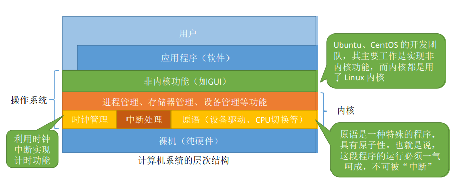
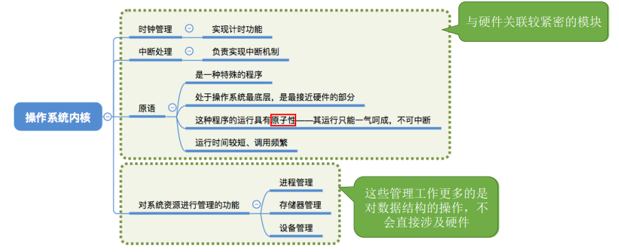
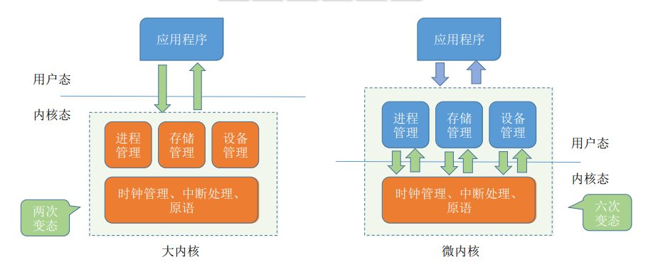
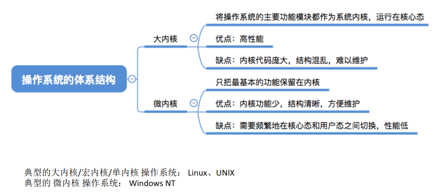

## 操作系统的体系结构

### 一、知识总览

### 二、操作系统的内核

- 操作系统又可分成：非内核功能和内核功能；
- **内核**是操作系统最基本、最核心的部分；
- 实现操作系统内核功能的那些程序就是**内核程序**；

- **时钟管理、中断处理、原语**等这些与硬件关联较紧密的模块属于内核程序；
- **进程管理、存储器管理、设备管理**等这些管理工作更多的是对数据结构的操作，不会直接涉及硬件，因此属于非内核程序；
- **注意：**
  - 操作系统的**内核**需要运行在**内核态**；
  - 操作系统的**非内核**功能运行在**用户态**；
- 因此引出了**两种内核设计方法**：
  - 把所有功能包含在操作系统内核当中的，这种结构称为**大内核**；
  - 如果内核当中只保留与硬件关系最紧密的部分，这种结构称为**微内核**；

### 三、操作系统的体系结构

假设现在应用程序想要请求操作系统的服务，这个服务的处理同时涉及到进程管理、存储管理、设备管理；

- 采用**大内核**，整个处理过程只需要**两次**变态；
- 采用微内核，整个处理过程需要**六次**变态；

- 注意：CPU**的状态转换的过程是有成本的**，要消耗不少时间，**频繁地变态会降低系统性能**；

## 知识点

