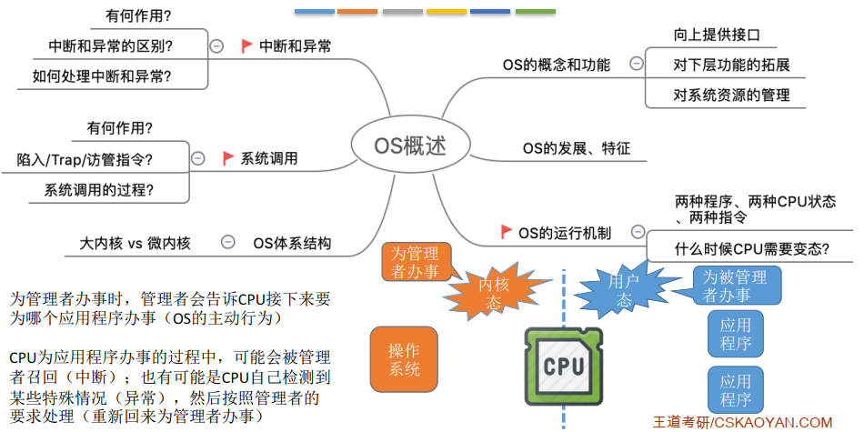

## 操作系统概述知识点总结

### 一、知识回顾

- 为管理者办事时，管理者会告诉CPU接下来要为哪个应用程序办事（操作系统的主动行为）；
- CPU为应用程序办事的过程中，可能会被管理者召回（中断）。也有可能是CPU自己检测到某些特殊情况（异常），然后按照管理者的要求处理（重新回来为管理者办事）；
- 用户态下不可执行特权指令；
- 内核态下即可执行特权指令，也可执行非特权指令；
- 操作系统通过"进程调度"选择让某个应用程序上CPU运行；
- 系统调用入口程序：确认系统调用类型、参数；
- 应用程序通过系统调用主动地请求操作系统的服务，会使用"陷入指令/Trap/访管"主动引发一个异常，主动放弃CPU使用权；