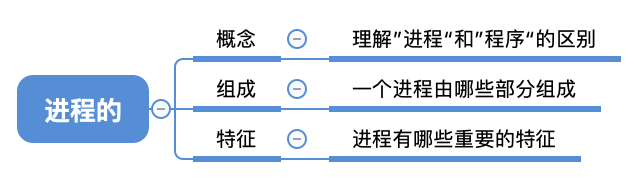
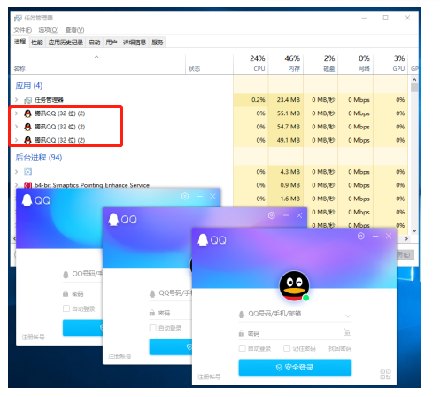
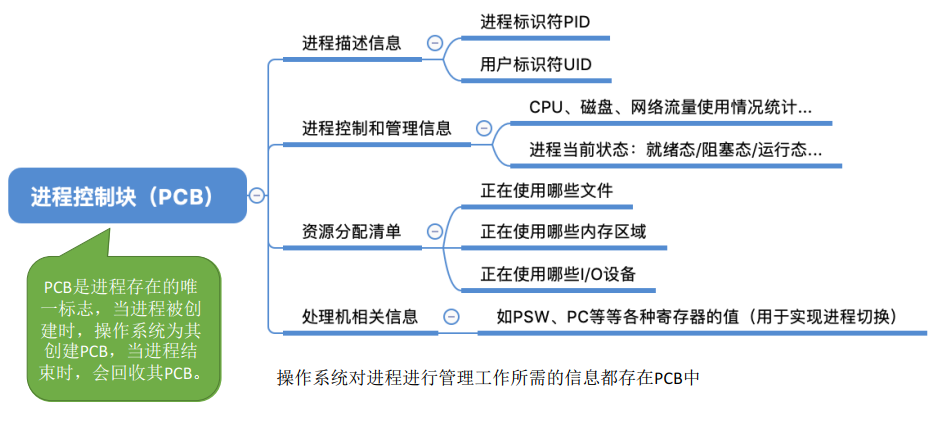
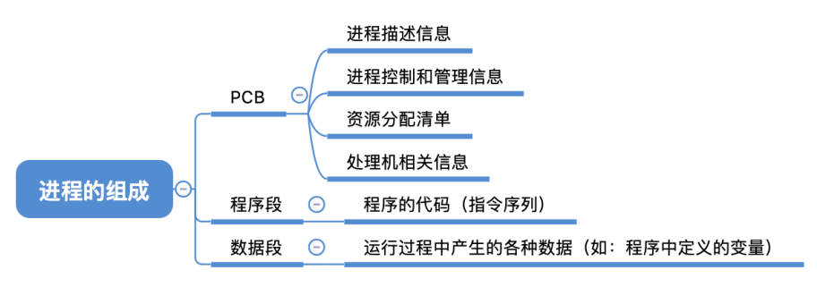
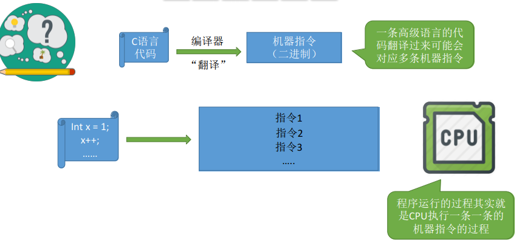
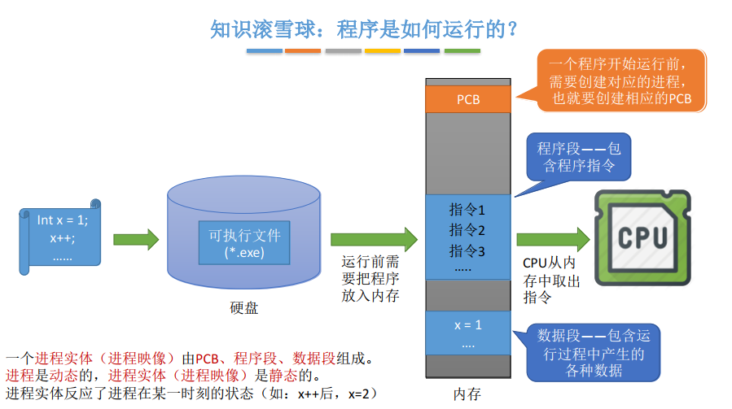
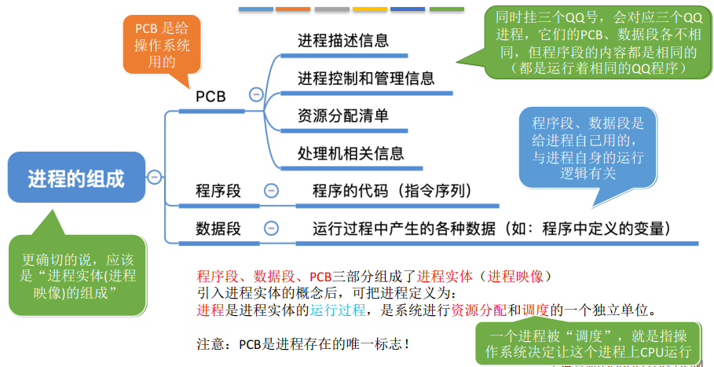
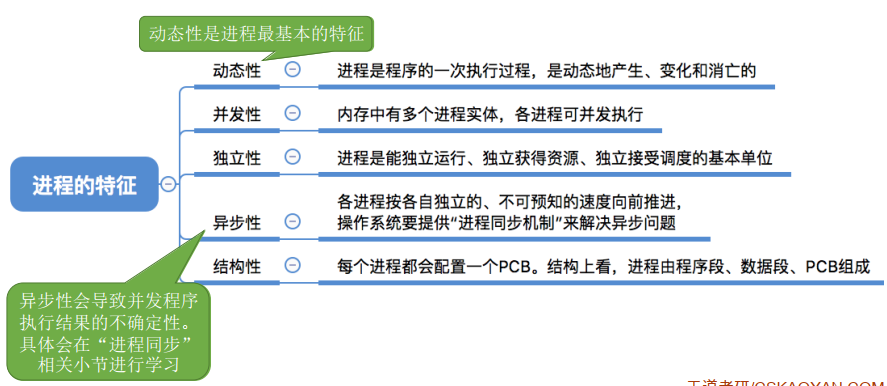
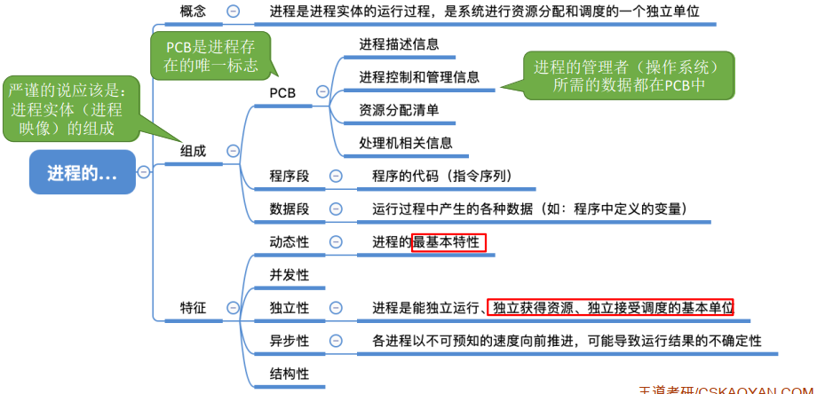

## 进程的概念、组成、特征

### 一、知识总览

### 二、进程的概念

- **程序**：是**静态的**，就是个存放在磁盘里的可执行文件，就是一系列的指令集合；

- **进程（Process）**：是**动态的**，是程序的一次执行过程；
- 同一个程序多次执行会对应多个进程；
- <u>操作系统是这些进程的管理着，它要怎么区分各个进程？</u>

### 三、进程的组成——PCB

操作系统是这些进程的管理着，它要怎么区分各个进程？

- 当进程被创建时，操作系统会为该进程分配一个**唯一的、不重复**的"身份证号"——**PID**（Process ID，进程ID）
- 操作系统要记录PID、进程所属用户ID（UID）等信息，即基本的进程描述信息，可以**让操作系统区分各个进程**；
- 操作系统还要记录给进程分配了哪些资源（如：分配了多少内存、正在使用哪些I/O设备、正在使用哪些文件），可**用于实现操作系统对资源的管理**；
- 操作系统还要记录进程的运行情况（如：CPU使用时间、磁盘使用情况、网络流量使用情况等），可**用于实现操作系统对进程的控制、调度**；
- 以上这些信息都被保存在一个**数据结构PCB**（Process Control Block）中，即**进程控制块**；
- 操作系统需要对各个并发运行的进程进行管理，**但凡管理时所需要的信息，都会被放在PCB中**；

- **PCB是进程存在的唯一标志**，当进程被创建时，操作系统为其创建PCB，当进程结束时，会回收其PCB；

### 四、进程的组成——程序段、数据段

- **PCB**是**给操作系统用的**；
- **程序段**、**数据段**是**给进程自己用的**；

### 五、程序是如何运行的？

- 一个**进程实体**（**进程映像**）由**PCB、程序段、数据段**组成；
- **进程**是**动态**的，**进程实体**（**进程映像**）是**静态**的；
- 进程实体反应了进程在某一时刻的状态；

### 六、进程的组成

- **进程的组成**：PCB、程序段、数据段。更确切的说，应该是**"进程实体（进程映像）**的组成"；
- 引入进程实体的概念后，可以把进程定义为：**进程**是进程实体的**运行过程**，是系统进程**资源分配**和**调度**的一个独立单位；
  - **调度**：一个进程被"调度"，就是指操作系统决定让这个进程上CPU运行；
- **PCB是给操作系统用的**；
  - 假如同时挂三个QQ号，会对应三个QQ进程，它们的PCB、数据段各不相同，但程序段的内容都是相同的（都是运行着相同的QQ程序）；
  - **PCB是进程存在的唯一标志**；
- **程序段、数据段是给进程自己用的**，与进程自身的运行逻辑有关；

### 七、进程的特征

程序是静态的，进程是动态的，相比于程序，进程拥有以下特征：

- 进程的**动态性**是进程最基本的特征；
- 进程是一个独立获得资源、独立接受调度的基本单位。而在引入线程后，进程就不是接受调度的基本单位，但进程仍旧是独立获得资源的基本单位；

## 知识点

