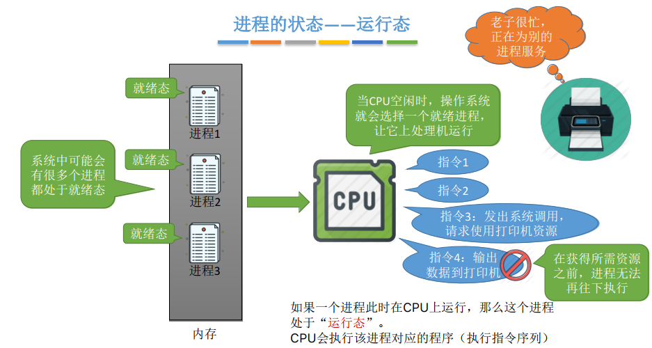

## 进程状态与转换

### 一、知识总览

### 二、进程的状态——创建态、就绪态

- 进程正在被创建时，它的状态是"**创建态**"，在这个阶段操作系统会为进程分配资源、初始化PCB；
- 当进程创建完成后，便进入"**就绪态**"，处于就绪态的进程已经具备运行条件，但由于没有空闲CPU，没法为这个进程服务，所以就暂时不能运行；

### 三、进程的状态——运行态

- 系统中可能会有多个进程都处于就绪态，一旦CPU空闲时，操作系统就会根据一定策略选择一个就绪就成，让它上处理机运行；
- 如果一个进程此时在CPU上运行，那么这个进程处于"**运行态**"，CPU会执行该进程对应的程序（即执行它的指令序列）；
- 如果这个进程在运行中发出系统调用，需要外部资源，比如打印机，而打印机此时处于忙碌状态，无法处理进程的请求，这样进程在获得所需资源之前，进程无法再往下执行。如果一直让这个进程处于运行态，占用处理机资源，那是不合理的，因此引出**阻塞态**；

### 四、进程的状态——阻塞态

-  在进程运行的过程中，可能会**请求等待某个时间的发生**（如等待某种系统资源的分配，或者等待其他进程的响应）。在这个事件发生之前，进程无法继续往下执行，此时操作系统会让这个进程下CPU，并让它进入"**阻塞态**"；
- 当CPU空闲时，又会选择另一个"**就绪态**"进程上CPU运行；

- 当忙碌的打印机空闲时，就可以把打印机资源分配给进程2，此时进程2等待的事件就已经发生了，此时操作系统会让进程2从阻塞态转换到就绪态，这样进程2就又有了上处理机的条件；

### 五、进程的状态——终止态

- 假设在处理器上运行的进程1已经运行结束了，在它运行结束的时候，它会发出一个**exit系统调用**，**这个系统调用请求系统终止该进程**。此时这个进程的状态就会进入"**终止态**"，操作系统会让该进程下CPU，并回收内存空间等资源，最后还要回收该进程的PCB。当终止进程的工作完成之后，这个进程就彻底消失了（进程1）；

### 六、进程状态的转换

- **运行态到阻塞态之间的转换**是一种**进程自身**做出的**主动行为**；（一般都是进程通过**系统调用**的方式申请某种系统资源，或者请求等待某个事件发生）
- **阻塞态到就绪态之间的转换**不是进程自身能控制的，是一种**被动行为**；
- **注意**：**一个进程不可能由阻塞态直接转换为运行态，也不能由就绪态直接转换为阻塞态**（因为阻塞态是进程主动请求的，必然需要进程在CPU上运行时才能发出这种请求）；

- 有时候运行态也可直接转换成就绪态，如一个时钟中断的时间片到了；

### 七、进程的状态

- **运行态、就绪态、阻塞态是进程的基本状态**，进程的整个生命周期中，大部分时间都处于三种基本状态；

- 在单CPU的情况下，同一时刻只会有一个进程处于运行态。多核CPU情况下，可能有多个进程处于运行态；
- **操作系统是如何记录这些状态的？**
  - 在进程的PCB中，会有一个变量state来表示进程的当前状态。如：1表示创建态、2表示就绪态、3表示运行态....
- **就绪态**：进程已经拥有了除处理机之外所有需要的资源，一旦获得处理机，即可立即进行运行态开始运行。即：万事俱备，只欠CPU；
- **阻塞态**：如等待操作系统分配打印机、等待读磁盘操作的结果。CPU是计算机中最昂贵的部件，为了提高CPU的利用率，需要先将其他进程需要的资源分配到位，才能得到CPU的服务；
- **终止态**：进程运行结束（或者由于BUG导致进程无法继续执行下去，比如数组越界错误），需要撤销进程。操作系统需要完成撤销进程相关的工作。完成将分配给进程的资源回收，撤销进程PCB等工作；

### 八、进程的组织

- 在一个系统中，通常有数十、数百乃至数千个PCB。为了能对它们加以有效的管理，应该用适当的方式把这些PCB组织起来；
- **进程的组成和进程的组织区别**：
  - 进程的**组成**讨论的是一个**进程内部**由哪些部分构成的问题；
  - 进程的**组织**讨论的是**多个进程之间**的组织方式问题；

- 进程的组织——**链接方式**：

- 进程的组织——**索引方式**：

## 知识点

