## 进程控制

### 一、什么是进程控制？

- 进程控制的主要功能是对系统中的所有进程实施有效的管理，它具有创建新进程、撤销已有进程、实现进程状态转换等功能。简化理解：反正**进程控制就是要实现进程状态转换**；

### 二、知识总览

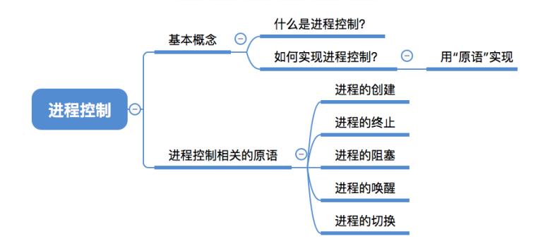

### 三、如何实现进程控制

-  实现进程控制需要用"**原语**"来实现；

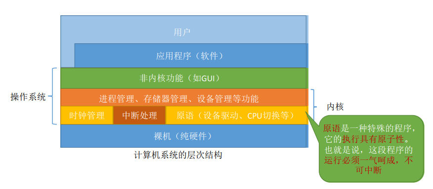

- **原语**是一种特殊的程序。它的执行具有原子性。即这段程序的**运行必须一气呵成，不可中断**；

- 原语的执行具有"原子性"，一气呵成，那<u>为什么进程控制（状态转换）要"一气呵成"?</u>

  - 例子：假设PCB中的变量state表示进程当前所处状态，1表示就绪态，2表示阻塞态...

    - 如果一个进程处于就绪态，即state=1，那个这个进程的PCB肯定是要挂在就绪队列里的。如果一个进程处于阻塞态，即state=2，那么这个进程的PCB挂在阻塞队列里；

    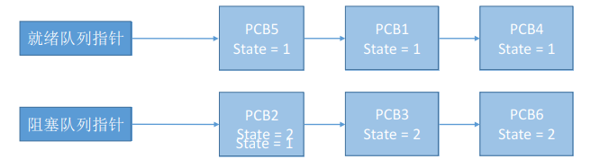

    - 假设此时进程2等待的事件发生（即将要发生**阻塞态 -> 就绪态**），则操作系统中，负责进程控制的内核程序至少需要做这两件事：（**这是正常情况下**）
      1. 将PCB2的state设为1；
      2. 将PCB2从阻塞队列放到就绪队列；
    - 如果完成了第一步后收到了中断信号，那么PCB2的state=1，但是它却被放在阻塞队列里，这就导致了PCB2变量所处的状态和PCB2所处的队列这两者发生了矛盾；

  - 因此如果不能"一气呵成"，就有可能导致操作系统中某些关键数据结构信息不统一的情况，这会影响操作系统进行别的管理工作，可能会让系统出错，所以进程控制的过程需要"一气呵成"；

  - 而原语具有这样"一气呵成"，不能中断的性质，所以可以用原语来实现；

### 四、如何实现原语的"原子性"

- **原语**的执行具有**原子性**，即执行过程只能一气呵成，期间**不允许被中断**；
- 可以用"**关中断**指令"和"**开中断**指令"这两个**特权指令**实现**原子性**；
- 进程正常执行时如果碰到**外部中断信号**时（即正常情况下）：
  - CPU每执行完一条指令都会例行检查是否有中断信号需要处理，如果有，则暂停运行当前这段程序，转而执行相应的中断处理程序；

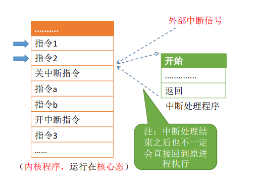

- 如果碰到关中断指令：CPU执行了**关中断指令**之后，就不再例行检查中断信号，直到执行**开中断指令**之后才会恢复检查。如上图即关中断指令执行后，执行指令a，指令b，再开中断指令；
- 如果在指令a处有一个外部中断信号，系统不会去处理这个外部中断信号，而是等CPU执行了开中断指令后，它才会恢复之前的正常情况（每执行完一条指令就检查中断）。因此CPU执行了开中断指令之后，它发现之前有一个外部中断信号还没处理，就会处理这个外部中断信号；

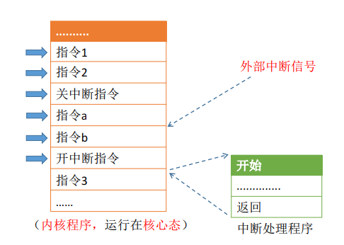

- 这样，关中断、开中断之间的这些指令序列就是不可被中断的，这样就实现了"原子性"；

- <u>问：如果这两个特权指令允许用户程序使用的话，会发生什么情况？</u>
  - 即应用程序可以在开头就植入一个关中断指令，在程序末尾植入一个开中断指令，即只要应用程序上CPU了，那么它会一直霸占着CPU，显然这种情况是不允许的；
  - 因此**开中断、关中断属于特权指令**，只能让内核程序使用，而不能让普通用户使用；

### 五、进程控制相关的原语

#### 5.1 进程的创建（创建原语）

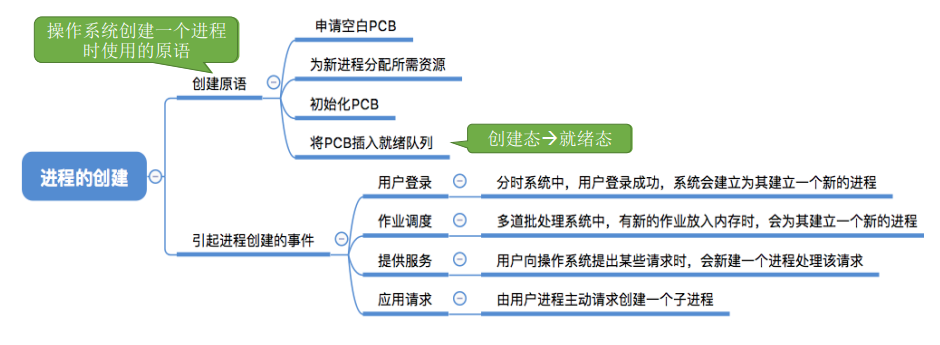

- 申请空白PCB：创建对应的PCB，因为PCB是进程存在的唯一标志；
- 初始化PCB：分配PID、设置UID等；
- 将PCB插入就绪队列：即从创建态转换成就绪态；
- **作业**是什么：作业就是此时还放在外存里还没有投入运行的程序；
- 作业调度：从外存中挑选一个程序把它放入内存让他运行；

#### 5.2 进程的终止（撤销原语）

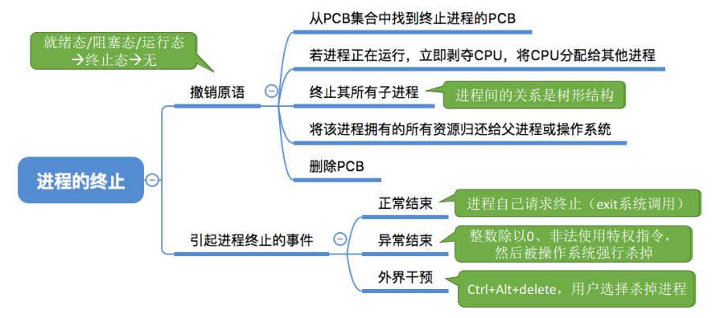

- 操作系统中的各个进程间的关系时**树形结构**；

#### 5.3 进程的阻塞和唤醒（阻塞原语、唤醒原语）

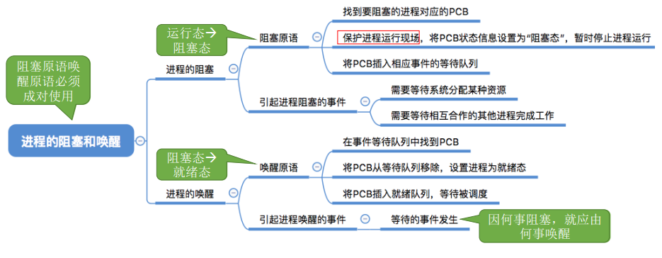

- 进程的阻塞：运行态 -> 阻塞态；
- 进程的唤醒：阻塞态 -> 就绪态；
- 注意：**进程因何事而阻塞，就应由何事而唤醒**；
- 因此**阻塞原语、唤醒原语必须成对使用**；

#### 5.4 进程的切换（切换原语）

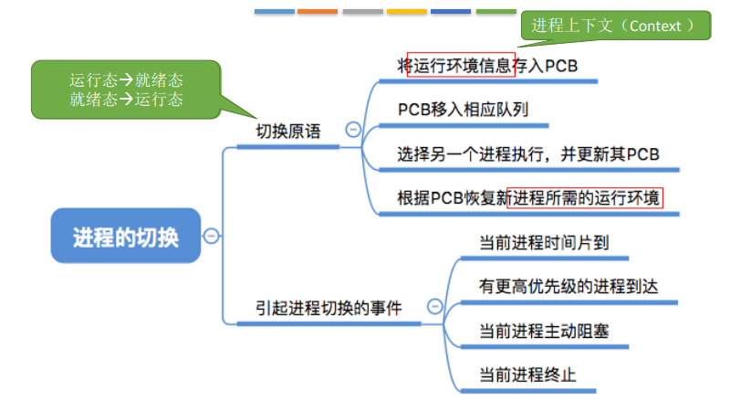

- 切换原语：
  1. 让此时正处于运行态的进程下处理机，回到就绪队列；
  2. 然后从就绪队列中选择一个就绪态的进程，让它上处理机运行；

### 六、程序是如何运行的？

- CPU中会设置很多"**寄存器**"，用来存放程序运行过程中所需的某些数据；

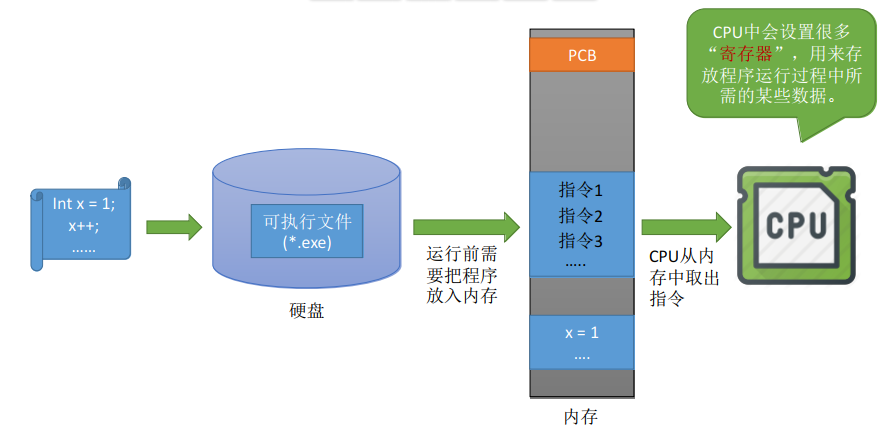

- **PSW**：程序状态字寄存器；
- **PC**：程序计数器，存放下一条指令的地址；
- **IR**：指令寄存器，存放当前正在执行的指令；
- **通用寄存器**：其他的一些必要信息；

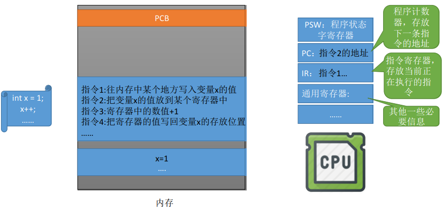

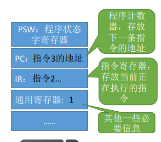

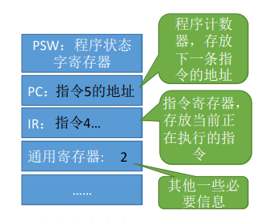

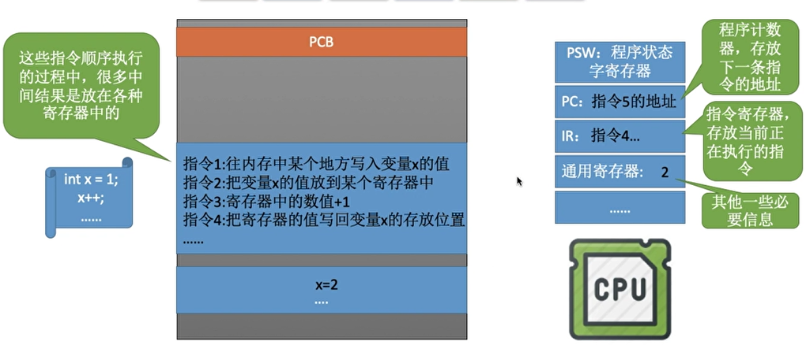

- 类似x++，这类的中间结果其实是存放在寄存器中；

- 注意PSW、PC、IR、通用寄存器等并不是这个进程所独属的，如果其他进程上CPU运行，那么这些寄存器也会为其他进程所使用；
- <u>思考问题：执行完指令3后，另一个进程开始上CPU运行？</u>
  - 另一个进程在运行过程中会使用各个寄存器，会把原先进程的中间结果覆盖掉；
  - <u>因此之后还怎么切换回之前的进程？</u>
    - 解决方法：在进程切换时**先在PCB中保存这个进程的运行环境**（保存一些**必要的**寄存器信息）；
    - 当原来的进程再次投入运行时，可以**通过PCB恢复它的运行环境**；

- **保存进程的运行环境**（进程上下文Context）：它就是进程在运行过程当中，在寄存器中存储的中间结果，当一个进程需要下处理机的时候，需要把它的运行环境存到自己的PCB当中；
- **恢复进程的运行环境**：当一个进程需要重新运行的时候，就可以从**PCB中恢复进程所需的运行环境**；

## 知识点

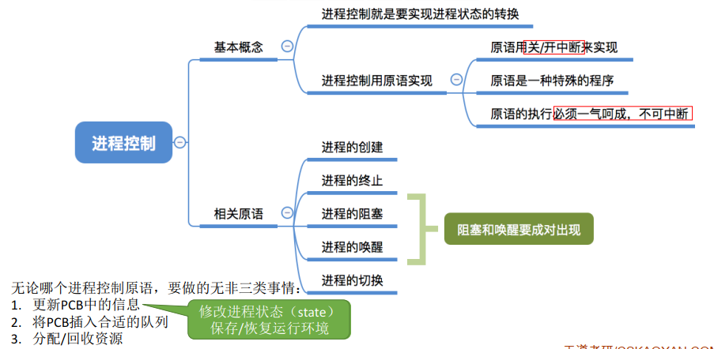

- 进程控制会导致进程状态的切换。无论哪个进程控制原语，要做的无非是三类事情：

  1. 更新PCB中的信息（修改进程状态（state）保存/恢复运行环境）；

     a. 所有的进程控制原语一定都会修改进程状态标志；

     b. 剥夺当前运行进程的CPU使用权必然需要保存其运行环境；

     c. 某进程开始运行前必然要恢复其运行环境；

  2. 将PCB插入合适的队列；

  3. 分配/回收资源；

- <u>如何实现进程控制？</u>

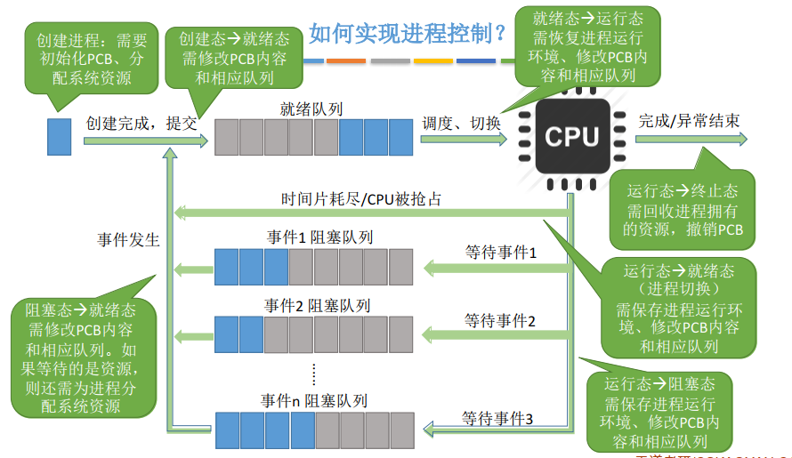