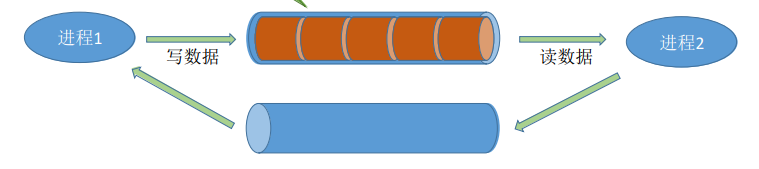

## 进程通信

### 一、知识总览

### 二、什么是进程通信？

- 进程通信就是指进程之间的信息交换；
- 进程是分配系统资源的单位（包括内存地址空间），因此**各进程**拥有的**内存地址空间相互独立**；

- 为了保证安全，**一个进程不能直接访问另一个进程的地址空间**，如上进程1可以随便访问进程2的地址，就可以修改进程2的数据，这样就会造成很大的安全隐患；
- 但是进程之间的信息交换又是必须实现的。为了保证进程间的安全通信，操作系统提供了一些方法：

### 三、进程通信——共享存储

- 两个进程对共享空间的**访问**必须是**互斥**的（互斥访问通过操作系统提供的工具实现）。进程1在共享空间中写数据的时候，进程2是不允许访问共享空间的，只有进程1把共享空间的访问释放了，进程2才能访问；

- **共享存储**：
  - **基于数据结构**的共享：
    - 共享空间里只能存放固定的结构，如共享空间里只能放一个长度为10的数组；
    - 这种共享方式速度慢、限制多，是一种**低级通信**方式；
  - **基于存储区**的共享：
    - 在内存中划出一块共享存储区，而共享空间的数据的形式、存放在什么位置都由进程来决定，而不是操作系统来决定；
    - 这种共享方式更加自由，速度更快，是一种**高级通信**方式；

### 四、进程通信——管道通信

- "管道"是指用于连续读写进程的一个共享文件，又名pipe文件。其实就是在内存中开辟一个大小固定的缓冲区，这个缓冲区大小一般和内存页面是一样的，如Linux的一个缓冲区的大小即4KB；

- 管道只能采用**半双工通信**，<u>某一时间段内只能实现单向的传输</u>。如果要实现**双向同时通信**，则**需要设置两个管道**；
- 各个进程要**互斥**地访问管道；
- 如何通信？进程1会先往管道中写数据，直到写满后，进程2才开始读数据，而只有数据全部被读出后，进程1才能往管道写数据；
- **管道通信的特点**：
  - 数据以**字符流**的形式写入管道；
  - 当**管道写满**时，**写进程**的write()系统调用将被**阻塞**，等待读进程将数据取走；
  - 当读进程将数据全部取走后，**管道变空**，此时**读进程**的read()系统调用将被**阻塞**；
  - **如果没有写满，就不允许读。如果没有读空，就不允许写**；
  - 管道中的数据一旦被读出，就从管道中被抛弃，这就意味着**读进程最多只能有一个**，否则可能会有读错数据的情况。因为如果有两个以上进程读，每个进程读走的数据就不会在回来了，这样导致进程数据会读乱；

### 五、进程通信——消息传递

- 进程间的数据交换以**格式化的消息**（Message）为单位。进程通过操作系统提供的"**发送消息/接受消息**"两个**原语**进程数据交换；

- 消息格式：消息头、消息体；
- 消息头包含：发送进程ID、接收进程ID、消息类型、消息长度等格式化的信息；

- 消息传递：

  - **直接通信方式**：消息直接挂到接收进程的消息缓冲队列上；
    - 如下图进程1首先生成自己的消息，然后通过发送原语将信息发送的进程2的消息缓冲队列，随机进程2通过接收原语将消息缓冲队列的消息读取；

  

  - **间接通信方式**：消息要先发送到中间实体（又称信箱）中，因此也称"信箱通信方式"；
    - 如下图，具体消息是由谁发送、由谁接收，这些都是在消息头里定义好的，并不需要担心这些消息被取错；

  

## 知识点

