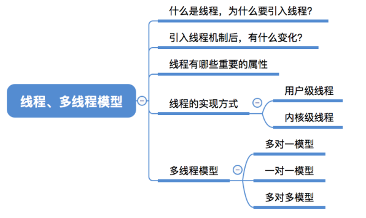
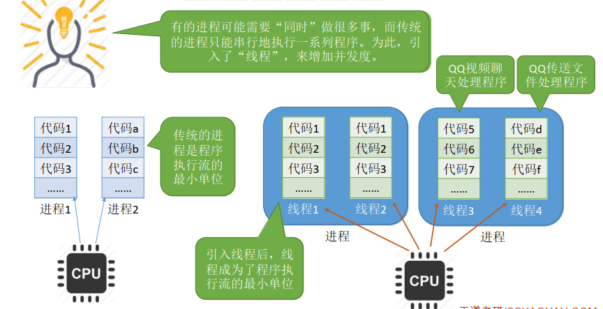
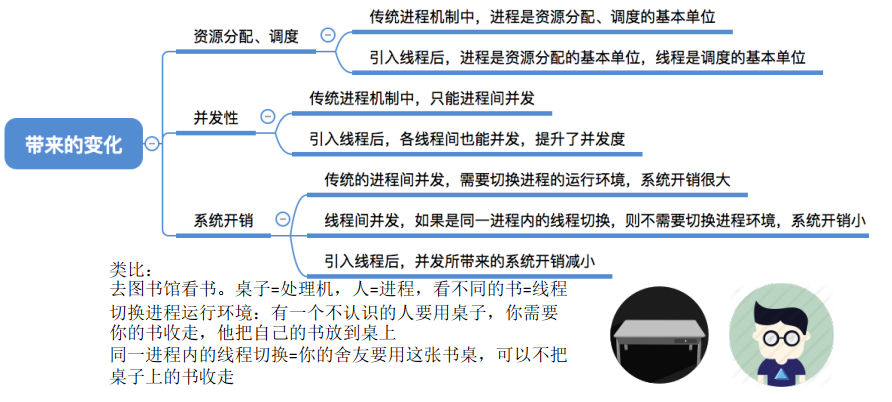
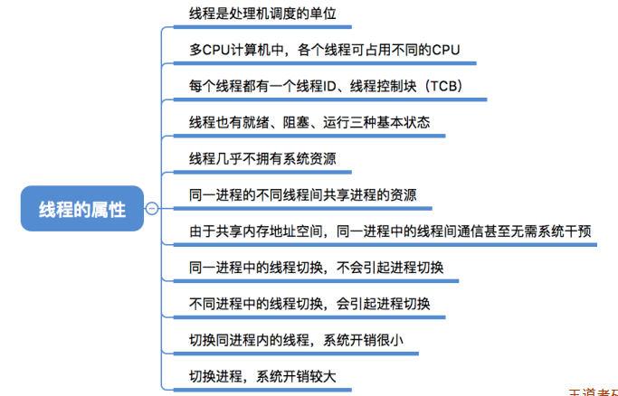

## 线程概念多线程模型

### 一、知识总览

### 二、什么是线程，为什么要引入线程？

- 在还没引入进程之前，系统中各个程序只能串行执行；
- 进程是程序的一次执行。但这些功能显然不可能是由一个程序顺序处理就能实现的。如QQ的视频聊天、文件传输、聊天这些功能，对于我们用户来说是同时进行的，这并不是顺序处理就能实现的；
- 有的进程可能需要"同时"做很多事，而传统的进程只能串行地执行一系列程序。为此，引入了"**线程**"，来增加并发度；

- 在传统的进程机制中，CPU是轮流给每个进程服务，因此**传统的进程**是程序执行流的**最小单位**；
- 引入了"线程"之后，CPU的调度对象就不再是进程，而是进程当中的线程，每个进程会包括多个线程，CPU会用一定的算法轮流的为这些线程进行服务。因此引入线程后，**线程**称为了程序执行流的**最小单位**；
- 线程可以理解为"轻量级的进程"；
- **线程**是一个**基本的CPU执行单元**，也是**程序执行流的最小单位**；
- 引入线程之后，不仅是进程之间可以并发，进程内的**各线程之间**也可以**并发**，从而进一步**提升了系统的并发度**，使得一个进程内也可以并发处理各种任务（如QQ视频、文字聊天、传文件）；
- 引入线程后，**进程**只作为**除CPU之外的系统资源的分配单元**（如打印机、内存地址空间等都是分配给进程的）。**线程**作为**处理机的分配单元**；

### 三、引入线程机制后，有什么变化？

- 上例中书就代表运行环境；

## 知识点

- 因为系统资源是分配给进程的，所以线程几乎不拥有系统资源。且同一个进程的不同线程间共享进程的资源；