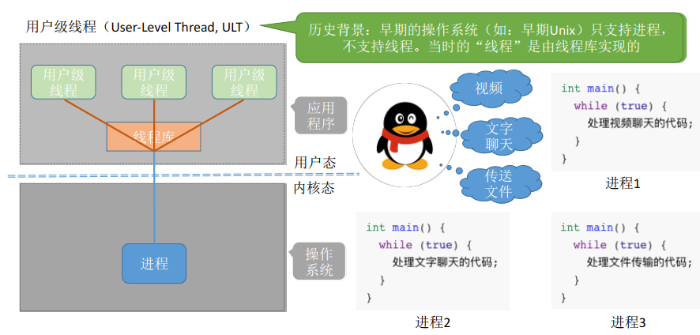

## 线程的实现方式多线程模型

### 一、知识总览


### 二、线程的实现方式——用户级线程



- **用户级线程**（User-Level Thread，ULT）：

  - 历史背景：早期的操作系统（如：早期Unix）只支持进程，不支持线程。当时的"线程"是由线程库实现的。那个时候操作系统的视角只能看到进程，但是程序员写的应用程序中可以使用线程库来实现多个线程并发的处理；

  ```c
  /* 早期QQ进程该怎么实现同时有视频、文字聊天、传送文件 */
  int main() {
      int i = 0;
      while (true) {
          if (i==0) {处理视频聊天的代码};
          if (i==1) {处理文字聊天的代码};
          if (i==2) {处理文件传输的代码};
          i = (i+1)%; // i的值0,1,2,0,1,2,....
      }
  }
  ```

  - 即从代码的角度看，线程其实就是一段代码逻辑。上述三个if代表三段代码，逻辑上可以看作三个"线程"。while循环就是一个最弱智的"线程库"，线程库完成了对线程的管理工作（如调度）；
  - 很多编程语言提供了强大的线程库，可以实现线程的创建、销毁、调度等功能；

- <u>问题1：用户级线程的管理工作由谁来完成？</u>
  - 应用程序通过线程库完成的，并不是操作系统负责的。

- <u>问题2：线程切换是否需要CPU变态？</u>
  - 线程切换是通过自己写的线程库实现的，在用户态下就可以完成线程的切换工作，不需要CPU变态；
- <u>问题3：操作系统是否能意识到用户级线程的存在？</u>
  - 操作系统只知道进程是一坨代码，这坨代码里又分为多个线程，所以操作系统是意识不到用户级多个线程的存在。在用户看来，是有多个线程。但是在操作系统内核看来，并意识不到线程的存在。"**用户级线程**"就是"**从用户视角看能看到的线程**"；
- <u>问题4：用户级线程的优缺点？</u>
  - 优点：用户级线程的切换在用户空间即可完成，不需要切换到核心态，线程管理的系统开销小，效率高；
  - 缺点：当一个用户线程被阻塞后，整个进程都会被阻塞，并发度不高。**多个线程不可在多核处理机上并行运行**，因为用户级线程的CPU调度单位依然是进程，操作系统是给进程分配CPU，即便电脑是多核处理机，也只能被分配一个核心，所以这些线程并不能并行的运行；

### 三、线程的实现方式——内核级线程

- 内核级线程（Kernel-Level Thread，KLT，又称"内核支持的线程"），由操作系统支持的线程；
- 大多数现代操作系统都实现了内核级线程，如Windows、Linux


- <u>问题1：线程的管理工作由谁来完成？</u>
  - **内核级线程的管理工作**由**操作系统内核**完成；
- <u>问题2：线程切换是否需要CPU变态？</u>
  - 线程调度、切换等工作都由内核负责，因此**内核级线程的切换**必然需要在**核心态**下才能完成；
- <u>问题3：操作系统是否能意识到内核级线程的存在？</u>
- <u>问题4：这种线程的实现方式有什么优点和缺点？</u>
  - 优点：当一个线程被阻塞后，别的线程还可以继续执行，并发能力强。多线程可在多核处理机上并行执行；
  - 缺点： 一个用户进程会占用多个内核级线程，线程切换由操作系统内核完成，需要切换到核心态，处理完成后，还需要从核心态切换到用户态，因此线程管理的成本高，开销大；

### 四、多线程模型

- 在支持内核级线程的系统中，根据用户级线程和内核级线程的映射关系，可以划分为几种多线程模型：

  - **一对一模型**：

    - 一个用户级线程映射到一个内核级线程。每个用户进程有与用户级线程同数量的内核级线程；
    - 优点：当一个线程被阻塞后，别的线程还可以继续执行，并发能力强。多线程可在多核处理机上并行执行；
    - 缺点：一个用户进程会占用多个内核级线程，线程切换由操作系统内核完成，需要切换到核心态，因此线程管理的成本高，开销大；

    

  - **多对一模型**：

    - 多个用户级线程映射到一个内核级线程。且一个进程只被分配一个内核级线程；
    - 优点：用户级线程的切换在用户空间即可完成，不需要切换到和核心态，线程管理的系统开销小，效率高；
    - 缺点：当一个用户级线程被阻塞后，整个进程都会被阻塞，并发度不高。多个线程不可在多核处理机上并行运行；
    - <u>注意：操作系统只"看得见"内核级线程，因此只有内核级线程才是处理机分配的单元</u>；

    

  - **多对多模型**：

    - n个用户级线程映射到m个内核级线程(n>=m)。每个用户进程对应的m个内核级线程；
    - 优点：克服了多对一模型并发度不高的缺点（一个阻塞全体阻塞），又克服了一对一模型中一个用户进程占用太多内核级线程，开销太大的缺点；

    

  - **模型理解**：

    - 用户级线程：可以理解为"**代码逻辑**"的载体；
    - 内核级线程：可以理解为"**运行机会**"的载体。因为操作系统分配处理机CPU资源时是以内核级线程为单位进行分配；
    - **内核级线程才是处理机分配的单位**。例如：多核CPU环境下，上图这个进程最多能被分配两个核；
    - 一段"**代码逻辑**"只有获得了"**运行机会**"才能被CPU执行；
    - 上图中内核级线程中可以运行任意一个有映射关系的用户级线程代码，只有两个内核级线程中正在运行的代码逻辑都阻塞时，这个进程才会阻塞；

## 知识点

