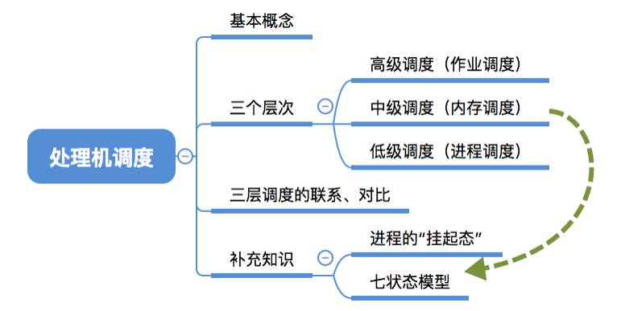
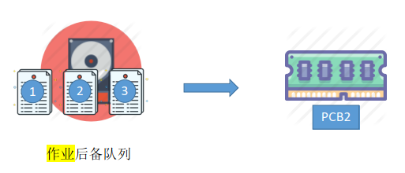
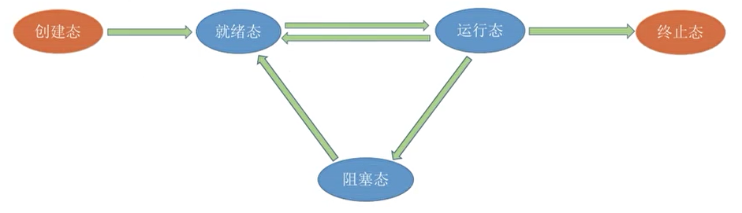
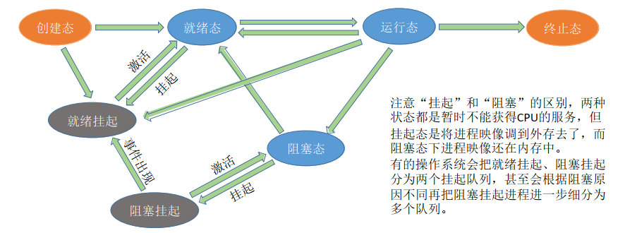
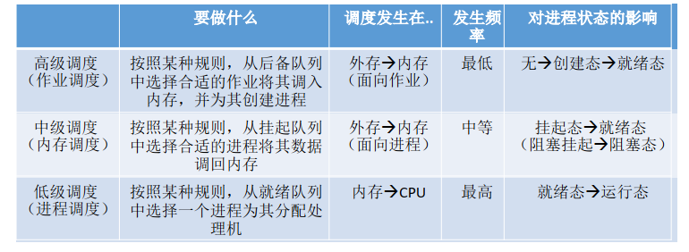
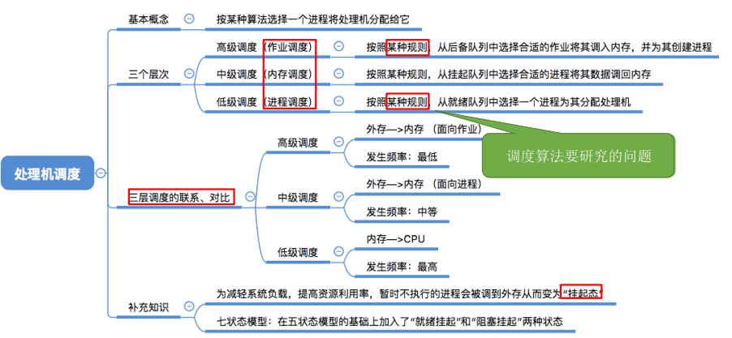

## 处理机调度概念、层次

### 一、知识总览

### 二、调度的基本概念

- 当有一堆任务要处理时，但由于资源有限，这些事情没法同时处理。这就需要确定**某种规则**来**决定**处理这些任务的**顺序**，这就是"调度"研究的问题；

### 三、调度的三个层次——高级调度（作业调度）

- 作业：一个具体的任务；

- 用户向系统提交了一个作业 ≈ 用户让操作系统启动一个程序（来处理一个具体的任务）；

- 有一种情况，<u>由于内存空间有限，有时无法将用户提交的作业全部放入内存</u>，这样我们给操作系统提交的作业，有可能没办法马上把它们放入内存启动，这个时候操作系统就会采用**高级调度**来解决；

- **高级调度（作业调度）**：

  - 简化理解：好几个程序需要启动，到底先启动哪个；
  - 按一定的原则从外存的作业后备队列中挑选一个作业调入内存，并创建进程。**每个作业只调入一次，调出一次**。作业调入时会创建PCB，调出时才撤销PCB；

  

### 四、调度的三个层次——低级调度（进程调度/处理机调度）

- **低级调度（进程调度/处理机调度）**：
  - 按照某种策略从就绪队列中选取一个进程，将处理机分配给它；
  - 进程调度是操作系统中最基本的一种调度，在一般的操作系统中都必须配置进程调度；
  - 进程调度的频率很高，一般几十毫秒一次。因为只有高频率的进程调度，才能让用户在宏观上看好像各个进程是同时执行的；

### 五、调度的三个层次——中级调度（内存调度）

- 内存不够时，可将某些进程的数据调出外存。等内存空闲或者进程需要运行时在重新调入内存；
- 暂时调到外存等待的进程状态为**挂起状态**。被挂起的进程PCB会被组织成**挂起队列**；
- **中级调度（内存调度）**：—— 按照某种策略决定将哪个处于挂起状态的进程重新调入内存；

- 一个进程可能会多次调出、调入内存，因此**中级调度**发生的**频率**要比高级调度**更高**；

### 六、进程的挂起态与七状态模型

- 暂时调到外存等待的进程状态为**挂起状态**（**挂起态，suspend**）；
- 挂起态又可进一步细分为**就绪挂起**、**阻塞挂起**两种状态；
- **五状态模型**：

- 五状态模型 -> **七状态模型**：
  - 注意"挂起"和"阻塞"的区别，两种状态都是暂时不能获得CPU的服务，但**挂起态**是将进程映像调到**外存**去了，而**阻塞态**下进程映像还在**内存**中；
  - 有的操作系统会把就绪挂起、阻塞挂起分为两个挂起队列，甚至会根据阻塞原因不同再把阻塞挂起进程进一步分为多个队列；

 

### 七、三层调度的联系、对比

## 知识点

