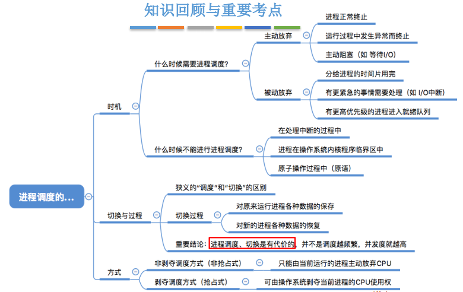

## 进程调度的时机、切换与过程调度方式

### 一、知识总览

### 二、进程调度的时机

- **进程调度**（低级调度），就是按照某种算法从就绪队列中选择一个进程为其分配处理机；

- <u>问：什么时候**需要进行**进程调度与切换？</u>
  - 当前运行的进程**主动放弃**了处理机；
    - 如进程正常终止；
    - 如运行过程中发生异常而终止；
    - 如进程主动请求阻塞（如等待I/O）；
  - 当前运行的进程**被动放弃**了处理机；
    - 如分给进程的时间片用完；
    - 如有更紧急的事需要处理（如I/O中断）；
    - 如有更高优先级的进程进入就绪队列；
- **不能进行**进程调度与切换的情况：
  1. 在**处理中断的过程中**。中断处理过程复杂，与硬件密切相关，很难做到在中断处理过程中进行进程切换；
  2. 进程在**操作系统内核程序临界区**中；
  3. 在原子操作过程中（原语）。原子操作不可中断，要一气呵成（如修改PCB中进程的状态标志，并把PCB放到相应队列，如果不一气呵成，就会导致中间结果被修改，导致进程的数据错乱，出错等情况）；

- 进程在**操作系统内核程序临界区**中不能进行调度与切换（<u>正确</u>表述 ✔ ）；

  - 临界资源：一个时间段内只允许一个进程使用的资源。各进程需要**互斥地**访问临界资源；

  - 临界区：访问临界资源的那段代码，因此各个进程只能**互斥地**进入临界区，**互斥地**执行这段代码；

  - **内核程序的临界区**一般是用来访问**某种内核数据结构**的，比如进程的就绪队列（由各就绪进程的PCB组成）

  - 示例1

    - 如果一个进程处于内核程序临界区，此时它要访问就绪队列，在访问之前，它会把就绪队列上锁，如下图；

    

    - 如果这个进程当前还没有退出内核程序临界区（还没解锁），即就绪队列这个临界资源并没有被解锁，就进行进程调度，但是进程调度相关的程序也需要访问就绪队列（即从就绪队列中挑选一个进程让它上处理机），但此时就绪队列被锁住了，因此无法顺利进行进程调度；
    - 内核程序临界区访问的临界资源如果不尽快释放的话，极有可能影响到操作系统内核的其他管理工作。因此在访问内核程序临界区期间不能进行调度与切换；

- 进程处于**临界区**时**不能**进行处理机调度（<u>错误</u>表述 ❌ ）；
  - 示例2

    

    - 在打印机打印完成之前，进程一直处于临界区内，临界资源不会解锁。但打印机又是慢速设备，此时如果一直不允许进程调度的话就会导致CPU一直空闲；
    - 普通临界区访问的临界资源不会直接影响操作系统内核的管理工作。因此在访问普通临界区时可以进行调度与切换；

- 有的系统中，只允许进程主动放弃处理机，而不允许进程在运行的过程中被迫的被剥夺处理机资源；

- 有的系统中，进程可以主动放弃处理机，当有更紧急的任务需要处理时，也会强行剥夺处理机（被动放弃）；

- 根据当前运行的进程是否可以强行地被剥夺处理机资源这个问题引出了**进程调度方式**；

### 三、进程调度的方式

- **进程调度的方式**：
  - **非剥夺调度方式（又称非抢占方式）**：
    - 只允许进程主动放弃处理机。在运行过程中即便有更紧迫的任务到达，当前进程依然会继续使用处理机，直到该进程终止或主动要求进入阻塞态；
    - 特点：实现简单，系统开销小但是无法及时处理紧急任务，适合于早期的批处理系统；
  - **剥夺调度方式（又称抢占方式）**：
    - 当一个进程正在处理机上执行时，如果有一个更重要或更紧迫的进程需要使用处理机，则立即暂停正在执行的进程，将处理机分配给更重要紧迫的那个进程；
    - 特点：可以优先处理更紧急的进程，也可实现让各进程按时间片轮流执行的功能（通过时钟中断）。适合于分时操作系统、实时操作系统；

### 四、进程的切换与过程

- "狭义的进程调度"与"进程切换"的区别：
  - **狭义的进程调度**指的是从就绪队列中**选中一个要运行的进程**。（这个进程可以是刚刚被暂停执行的进程，也可能是**另一个进程**，后一种情况就需要**进程切换**）；
  - **进程切换**是指一个进程让出处理机，由另一个进程占用处理机的过程；
- **广义的进程调度**包含了选择一个进程和进程切换两个步骤；

- 进程切换的过程主要完成了：
  - 对原来运行进程各种数据的保存（即将处理机现场信息保存到PCB进程控制块）；
  - 对新的进程各种数据的恢复（即将PCB进程控制块中的现场信息读取出来）；
  - （如：程序计数器、程序状态字、各种数据寄存器等处理机现场信息，这些信息一般保存在进程控制块）；
- 注意：进程切换不是一瞬间能完成的，**进程的切换是要付出时间代价的**，因此如果**过于频繁**的进行进程**调度、切换**，必然会使整个**系统的效率降低**，使系统大部分时间都花在了进程切换上，而真正用于执行进程的时间减少。<u>所以不能认为进程的切换越频繁，系统的并发度就越高</u>；

## 知识点

