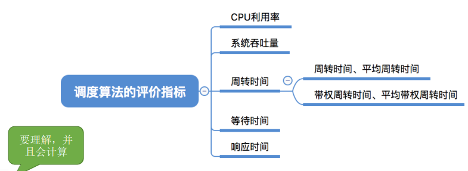
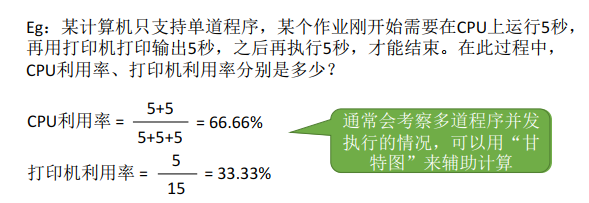
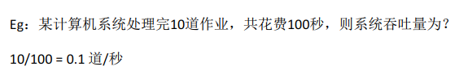
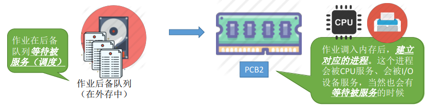
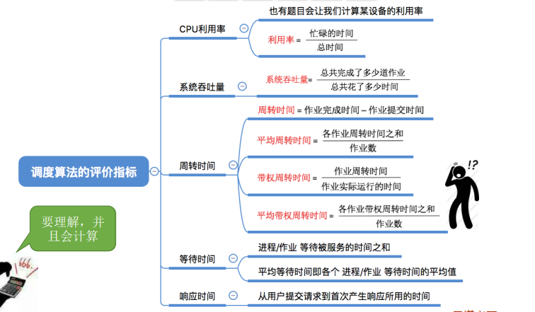

## 调度算法的评价指标

### 一、知识总览

### 二、CPU利用率

- 由于早期的CPU造假极其昂贵，因此人们会**希望让CPU尽可能多地工作**；

- **CPU利用率**：指CPU"忙碌"的时间占总时间的比例；
- 利用率 = 忙碌的时间 / 总时间；

### 三、系统吞吐量

- 对于计算机来说，希望能用尽可能少的时间处理完尽可能多的作业；
- 系统吞吐量：单位时间内完成作业的数量；
- 系统吞吐量 = 总共完成了多少道作业 / 总共花了多少时间；

### 四、周转时间

-  对于计算机的用户来说，他很关心自己的作业从提交到完成花了多少时间，这个时间花得越少越好；
- **周转时间**：是指从**作业被提交给系统开始**，到**作业完成为止**的这段时间间隔；
- 周转时间包括四个部分：作业在外存后备队列上等待作业调度（**高级调度**）的时间、进程在就绪队列上等待进程调度（**低级调度**）的时间、进程在CPU上执行的时间、进程等待I/O操作完成的时间。后三项在一个作业的整个处理过程中，可能发生多次；
- 对于用于来说，更关心 自己的单个作业的周转时间，因此有**（作业）周转时间**；
- （作业）**周转时间** = 作业完成时间 - 作业提交时间；
- 对于操作系统来说，更关心系统的整体表现，因此更关心**所有作业周转时间的平均值**；
- 平均周转时间 = 各作业周转时间之和 / 作业数；
- 思考：有的作业运行时间短，有的作业运行时间长，因此在周转时间相同的情况下，运行时间不同的作业，给用户的感觉肯定是不一样的。
  - 运行时间更长的作业，给用户的感觉更好；
  - 比如排队上厕所，你只需要使用1分钟，但是排队要10分钟，用户的感觉就会比较差。相反你要10分钟，只要等1分钟，感觉就比较好；

- **带权周转时间** = 作业周转时间 / 作业实际运行的时间 = （作业完成时间 - 作业提交时间）/ 作业实际运行的时间；
  - 对于周转时间相同的两个作业，实际运行时间长的作业在相同时间内被服务的时间更多，带权周转时间更小，用户满意度更高；
  - 对于实际运行时间相同的两个作业，周转时间短的带权周转时间更小，用户满意度更高；
  - **带权周转时间必然 ≥ 1**；
  - **带权周转时间与周转时间都是越小越好**；

- **平均带权周转时间** = 各作业带权周转时间之和 / 作业数；

### 五、等待时间

- 计算机的用户希望自己的作业尽可能少的等待处理机；
- **等待时间**，指进程/作业**处于等待处理机状态时间之和**，等待时间越长，用户满意度越低；

- 对于**进程**来说，等待时间就是指进程在内存中建立后**等待被服务的时间之和**。注意在等待I/O完成的期间其实进程也是在被I/O服务的，所以这段等待时间是不计入等待时间的；
- 对于**作业**来说，不仅要考虑**在内存中建立进程后的等待时间，还要加上作业在外存后备队列中等待的时间**；

- 一个作业总共需要被CPU服务多久，被I/O设备服务多久一般是确定不变的，因此调度算法其实只会影响作业/进程的等待时间。当然，与前面指标类似，也有"**平均等待时间**"来评价整体性能；

- **平均等待时间**就是把所有作业/进程的等待时间加起来然后除以作业的数量；

### 六、响应时间

- 对于计算机用户来说，会希望自己提交的请求（比如通过键盘输入了一个调试命令）**尽早**地开始被系统服务、回应；
- **响应时间**：指从用户**提交请求**到**首次产生响应**所用的时间；

## 知识点

