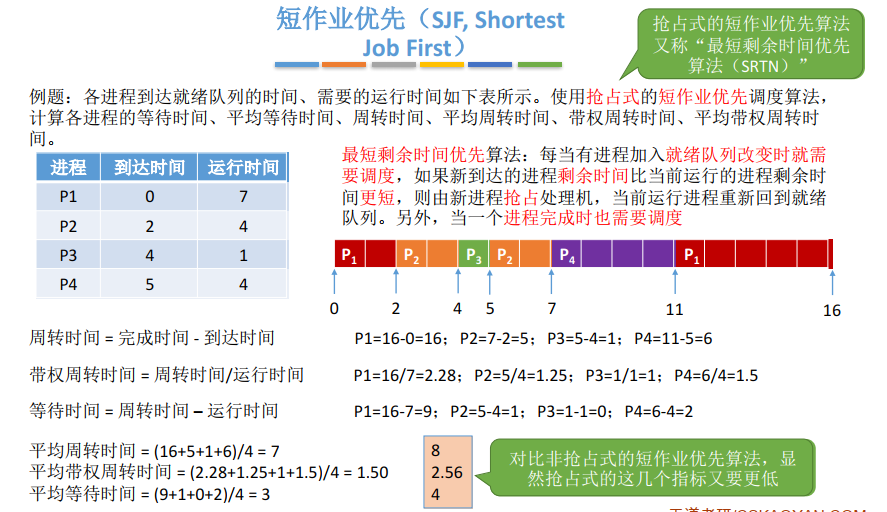

## 调度算法上

### 一、知识总览

### 二、先来先服务（FCFS，First Come First Serve）

- **算法思想**：主要从"公平"的角度考虑（类似我们生活中排队买东西的例子）；
- **算法规则**：按照作业 / 进程到达的先后顺序进行服务；
- **用于作业调度时**：考虑的是哪个作业先到达后备队列，后备队列是在外存中的；
- **用于进程调度时**：考虑的是哪个进程先到达就绪队列，就绪队列是在内存中的；
- **是否可抢占？**：FCFS是**非抢占式的算法**，即对于当前正在占用处理的进程/作业，只有进程/作业主动的放弃处理机的时候，才会进行调度；

- **先来先服务调度算法**：按照到达的先后顺序调度，事实上就是等待时间越久的越有限得到服务；

- **优缺点**：
  - 优点：公平、算法实现简单；
  - 缺点：如P3的带权周转时间可见排在长作业（进程）后面的段作业需要等待很长时间，带权周转时间太大，对短作业来说用户体验不好。即FCFS算法**对长作业有利，对短作业不利**（Eg：排队买奶茶）；

- **是否会导致饥饿？（即某进程/作业长期得不到服务）**：不会导致饥饿；

### 三、短作业优先（SJF，Shortest Job First）

- **算法思想**：追求最少的平均等待时间，最少的平局周转时间、最少的平均带权周转时间；
- **算法规则**：最短的作业/进程优先得到服务（所谓"最短"，是指要求服务时间最短）

- **用于作业时**：称为短作业优先调度算法；
- **用于进程时**：称为短进程优先（SPF，Shortest Process First）算法；
- **是否可抢占？**：SJF和SPF是**非抢占式**算法。但是**也有抢占式的版本——最短剩余时间优先算法（SRTN，Shortest Remaining Time Next）**；

- SPF例子（非抢占式）：

  - 短作业/进程优先调度算法：每次调度时选择**当前已到达**且**运行时间最短**的作业/进程；

  

- SRTN例子（抢占式）：

  - **最短剩余时间优先**算法：每当有进程加入**就绪队列发生改变时就需要调度**，如果新到达的进程**剩余时间**比当前运行的进程剩余时间**更短**，则由新进程**抢占**处理机，当前运行进程重新回到就绪队列。另外，当一个**进程完成时也需要调度**；

  

  

- 注意几个细节：
  1. 如果**未特别说明**，所提到的"短作业/进程优先算法"默认是**非抢占式**的；
  2. 很多书上都会说"SJF调度算法的平均等待时间、平均周转时间**最少**"
     - 严格来说，这个表述是 ❌ 的，不严谨的。之前的例子表明，最短剩余时间优先算法得到的平均等待时间、平均周转时间还要更少；
     - 应该加上一个条件"在**所有进程同时可运行**时，采用SJF调度算法的平均等待时间、平均周转时间最少"；
     - 或者说"在**所有进程都几乎同时到达时**，采用SJF调度算法的平均等待时间、平均周转时间最少"。为什么说是几乎，因为进程的到达有先后顺序，只不过在宏观上看起来好像都是同时到达，但微观上还是有先后顺序的；
     - 如果不加上述前提条件，则应该说"**抢占式**的短作业/进程优先调度算法（**最短剩余时间优先，SRNT算法**）的平均等待时间、平均周转时间最少"；
  3. 虽然严格来说，SJF的平均等待时间、平均周转时间并不一定最少，但相比于其他算法（如FCFS），SJF依然可以获得较少的平均等待时间、平均周转时间；
- **短作业优先优缺点**：
  - 优点："最短的"平均等待时间、平均周转时间（最短的表述不严谨，毕竟还有SRTN）；
  - 缺点：不公平。对短作业有利，长作业不利。如果有源源不断的有更短的作业到来，那么就会导致长作业饥饿现象。另外，作业/进程的运行时间是由用户提供的，并不一定真实，不一定能做到真正的短作业优先；
- **是否会导致饥饿**：会，如果源源不断地有短作业/进程到来，可能使长作业/进程长时间得不到服务，产生"**饥饿**"现象。如果一直得不到服务，则称为"**饿死**"；

### 四、对FCFS和SJF两种算法的思考

- **FCFS算法**是在每次调度的时候选择一个等待时间最长的作业（进程）为其服务。但是没有考虑到作业的运行时间，因此**导致了对短作业不友好的问题**；
- **SJF算法**是选择一个执行时间最短的作业为其服务。但是又完全不考虑各个作业的等待时间，因此导致了**对长作业不友好的问题，甚至还会造成饥饿问题**；

- 因此能不能设计一个算法，既考虑到各个作业的等待时间，又能兼顾运行时间？
  - 引出**高响应比优先算法**；

### 五、高响应比优先（HRNN，Highest Response Ratio Next）

- **算法思想**：要综合考虑作业/进程的等待时间和要求服务的时间；
- **算法规则**：在每次调度时先计算各个作业/进程的**响应比**，选择**响应比最高**的作业/进程为其服务；
- **响应比** = (等待时间 + 要求服务时间) / 要求服务时间；
- 响应比必然 ≥ 1；
- **即可用于作业调度，也可用于进程调度**；
- **是否可抢占？**：**非抢占式**的算法，因此只有当前运行的作业/进程主动放弃处理机时，才需要调度，才需要计算响应比；

- HRRN例子：

  - **高响应比优先算法**：**非抢占式**的调度算法，只有当前运行的进程**主动放弃CPU**时（正常/异常完成，或主动阻塞），才需要进行调度，调度时**计算所有就绪进程的响应比**，**选响应比最高的**进程上处理机；

  

- **优缺点**：
  - 综合考虑了等待时间和运行时间（要求服务时间）
  - 等待时间相同时，要求服务时间短的优先（SJF的优点）；
  - 要求服务时间相同时，等待时间长的优先（FCFS的优点）；
  - 对于长作业来说，随着等待时间越来越久，其响应比也会越来越大，从而避免了长作业饥饿的问题；
- **是否会导致饥饿？**：不会

## 知识点

- **即FCFS、SJF/SPF、HRRN主要用于早期的批处理系统，不适合交互式系统**；