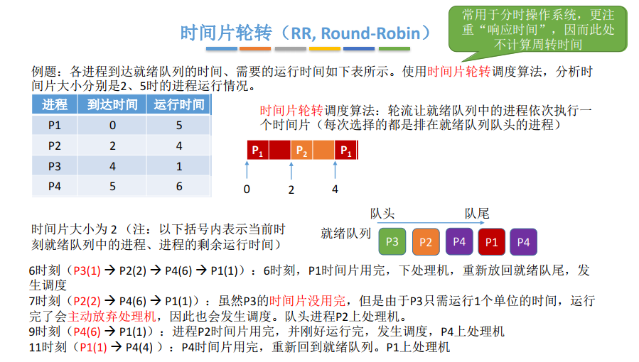

## 调度算法下

### 一、知识总览

### 二、时间片轮转（RR，Round-Robin）

- **算法思想**：公平地、轮流地为各个进程服务，让每个进程在一定时间间隔内都可以得到响应；
- **算法规则**：按照各进程到达就绪队列的顺序，轮流让各个进程执行一个**时间片**（如100ms）。若进程未在一个时间片内执行完，则剥夺处理机，将进程重新放到就绪队列**队尾**重新排队；

- **时间片轮转**一般用于**进程调度**，所谓时间片指的是处理机的时间片，只有作业放入内存建立了相应的进程后，才能被分配处理机时间片，因为进程才是处理机执行的基本单位；

- **是否可抢占？**：若进程未能在时间片内运行完，将被强行剥夺处理机使用权，因此时间片轮转调度算法属于**抢占式**的算法。由时钟装置发出**时钟中断**来通知CPU时间片已到；

- RR例子：

  - 时间片大小为2的情况：
    - **时间片轮转调度算法**：轮流让就绪队列中的进程依次执行一个时间片（每次选择的都是排在就绪队列队头的进程）

  

  

  